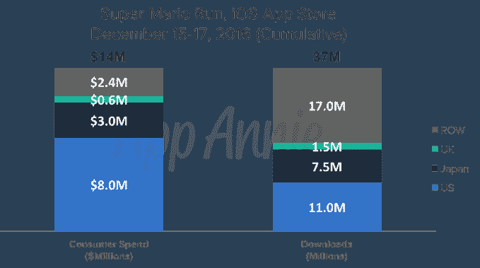
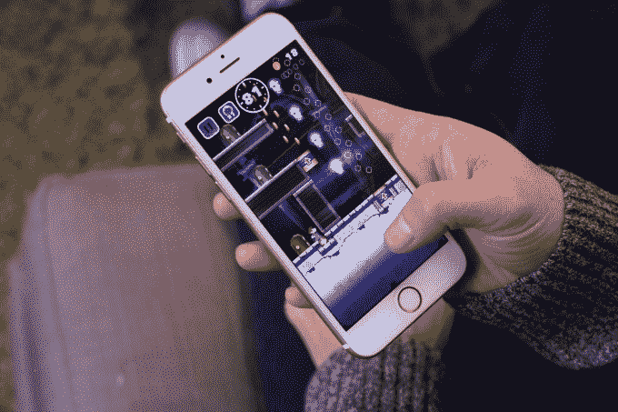
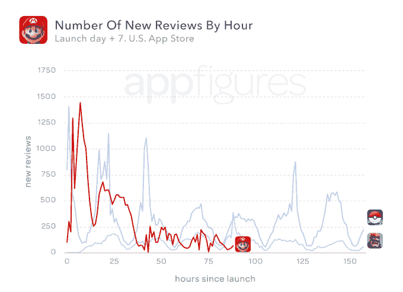

# 《超级马里奥快跑》前三天下载量达到 3700 万次，收入 1400 万美元

> 原文：<https://web.archive.org/web/https://techcrunch.com/2016/12/20/super-mario-run-sees-37-million-downloads-14-million-in-revenue-in-first-3-days/>

任天堂的投资者对新的 iPhone 游戏“超级马里奥快跑”的表现并不满意，由于对游戏支付模式的担忧，这导致了股价的下跌。然而，根据应用智能公司 App Annie 的新数据，这款游戏的下载量和收入份额仍然相当可观。回顾这款游戏上市的前三天，App Annie 报告称，马里奥在全球范围内获得了 3700 万次下载，1400 万美元的收入。

根据 2016 年 12 月 15 日至 17 日这三天的数据，美国是这 3700 万次下载的主要贡献者，占总数的 1100 万次。App Annie 说，英国的下载量为 150 万次，日本为 750 万次，世界其他地区增加了 1700 万次。

美国消费者也贡献了 800 万美元，全球总支出为 1400 万美元，日本以 300 万美元位居第二。英国花费了 60 万美元，世界其他国家又增加了 240 万美元。

另一家公司 Sensor Tower[也指出](https://web.archive.org/web/20230318113012/https://sensortower.com/blog/super-mario-run-25-million-downloads)马里奥是下载量达到 2500 万次的最快手机游戏。

在为期四天的首映周末(2016 年 12 月 15 日至 18 日)，马里奥的收入超过 2100 万美元。然而，值得注意的是，应用分析公司[经常得出彼此非常不同的数字](https://web.archive.org/web/20230318113012/https://techcrunch.com/2016/12/16/super-mario-run-sees-2-85-million-downloads-on-day-one-but-half-reviews-are-just-one-star/)。

如果马里奥没有将其应用程序定价为 9.99 美元的话，这些数字会更高吗？这才是真正的问题。

尽管消费者对像 iPhone 上的马里奥这样的经典任天堂游戏有着被压抑的需求，但这款 10 美元的手机游戏《超级马里奥 Run》提供的内容有限(并且[没有增加更多](https://web.archive.org/web/20230318113012/http://www.gamespot.com/articles/nintendo-not-planning-super-mario-run-dlc-as-compa/1100-6446382/)的计划)，已经激怒了一些消费者。

再加上免费层只提供几个级别的游戏，以及游戏要求永远在线的互联网连接，许多 iPhone 用户转向应用商店，留下一星评论。

一份早期报告指出，发布当天大约一半的评论来自失望的顾客，事实上只剩下一星评级。Sensor Tower 指出，现在超过 63%的日本用户评级为一星，美国用户的评级为 57%。价格是这些评论中提到最多的关键词。

来自 [appFigures](https://web.archive.org/web/20230318113012/http://blog.appfigures.com/super-mario-run/) 的一份相关报告支持这一观点，认为全球 58%的评论是一星评论。(在美国，53%的评论是一星评论。)

然而，并不是每个人都讨厌这个游戏。应用程序分析公司 appFigures 的首席执行官阿里尔·米凯利(Ariel Michaeli)表示，马里奥的用户群在评论上似乎相当分裂。有些人喜欢这个游戏，有些人不喜欢这个游戏的费用和在线要求。

有趣的是，苹果似乎已经为马里奥成为应用商店的热门产品做好了准备，但事实可能并非如此。

Michaeli 发现苹果推迟了 App Store 上的评论，比正常情况下推迟了很多时间。

“早期，我们看到了大约 40 个小时的延迟，这比我们看到的 8 到 12 个小时的标准延迟要长得多，”他指出，这归因于苹果方面过于激进的缓存，以确保 iTunes 不会崩溃。他说，到昨天，这种延迟开始出现，但仍在 30 小时左右。

然而，越来越明显的是，超级马里奥 Run 用户留下的评论比 Pokémon Go 用户少。(见上图)。在发布的这个时候，Pokémon Go 在美国应用商店有 30，247 条评论，而 Mario 只有 27，721 条评论。

这可能是游戏未能吸引相同水平用户的早期迹象。

当然,《超级马里奥快跑》是一款完全不同于《精灵宝可梦 Go》的游戏，后者将用户送到现实世界中去捕捉和战斗他们的迷你怪物。它在游戏中充分利用了 iPhone 的传感器和摄像头。相比之下，马里奥是一个单手跑者，可以很快被击败。

鉴于反弹和随后的股价下跌，如果任天堂决定在游戏转向 Android 时调整战略，或者至少在未来的任天堂智能手机产品上调整战略，这并不令人惊讶。