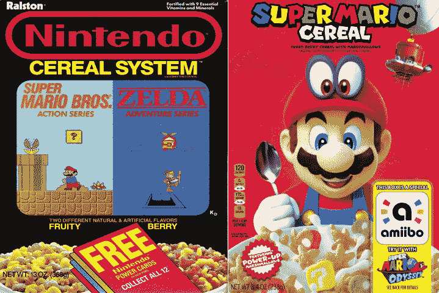

# 超级马里奥与一种新的早餐麦片进行了一次糖的冒险 

> 原文：<https://web.archive.org/web/https://techcrunch.com/2017/11/30/super-mario-takes-a-sugar-odyssey-with-a-new-breakfast-cereal/>

# 超级马里奥用一种新的早餐麦片进行了一次糖的冒险

上次马里奥[吃早餐麦片](https://web.archive.org/web/20230205022357/https://en.wikipedia.org/wiki/Nintendo_Cereal_System)的时候，他不得不和林克分摊账单。我敢打赌，这就是最后加入披头士的感觉。从最近一系列高调的游戏中高飞——包括《马里奥快跑》和《奥德赛》——卡通水管工[终于有了一个属于自己的麦片盒子](https://web.archive.org/web/20230205022357/http://www.businesswire.com/news/home/20171130005668/en/Super-Mario-Cereal-Kellogg%E2%80%99s%C2%AE-Breakfast-Playful-Experience)，加入了史蒂夫·厄克尔和*小精灵*小发明的精英行列。

家乐氏制作的食品看起来有一种非常幸运的魅力式振动，混合了充满活力的棉花糖和五谷杂粮，用一种叫做“混合浆果风”的东西调味当然，所有标准的含糖早餐谷物食品，但这里有一个 2017 年的转折，以一个盒子的形式，兼作 Amiibo 的配件。

在马里奥的新任天堂 Switch 游戏中，这基本上是打开金币和红心的盒子上的作弊代码。从它的外观来看，如果你吃了足够的限量版麦片，你还会得到一次去看牙医的机会。

这种谷物“最早”将于 12 月 11 日在美国上架。与此同时，让我们花点时间来欣赏一下基于视频游戏的艺术品在过去 30 年里走了多远。

