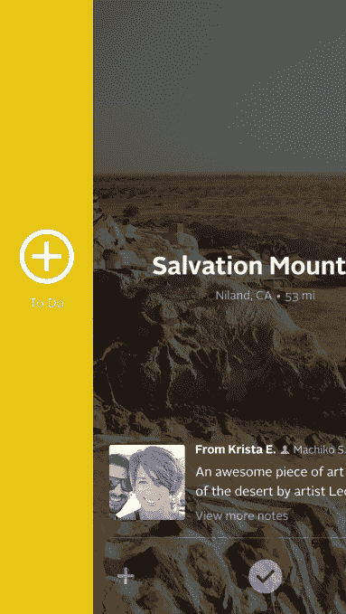
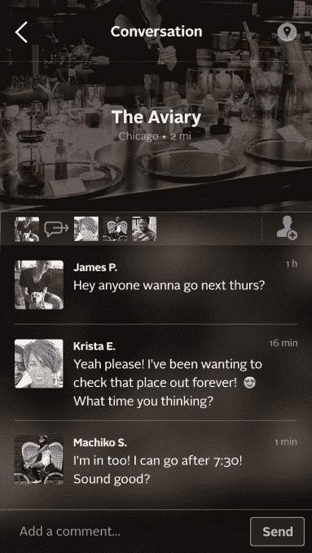

# Superb For iPhone 旨在将社交网络带入线下世界 

> 原文：<https://web.archive.org/web/https://techcrunch.com/2014/04/16/superb-for-iphone-aims-to-take-social-networking-to-the-offline-world/>

由 Y Combinator 支持的社交餐饮初创公司 Grubwithus 的创始人开发的新应用 Superb T1 今天发布，旨在帮助人们在离线世界建立联系。本质上是对当地场所的“热门或不热门”，用户刷过一系列场所建议，包括餐馆、酒吧、博物馆、公园等，注册他们的兴趣。之后，他们可以看到他们的朋友、朋友的朋友以及其他人当中谁也想去同一个地方，然后可以协调郊游。

如今已是 Superb 的联合创始人陆耀靖解释说，这个想法与该公司早期创业的目标并没有太大区别，后者于去年年底正式关闭了店铺。(他说，由于早期的 750 万美元融资，该公司还有“多年的跑道”。)

 Grubwithus 的目标是[让朋友和陌生人一起去一家新餐厅](https://web.archive.org/web/20221225153235/https://techcrunch.com/2012/05/30/grubwithus-munches-on-5m/)，通过在一张固定价格的账单下以预定数量的座位的形式给商家保证生意，但它也面临着让人们从在线互动转向线下连接的挑战。

该公司在关闭时，已经为美国和世界其他地方的 100，000 多名用户提供了服务。

同样，Superb 的团队也希望实现同样的总体目标，让人们再次在现实世界中互动。

**工作原理**

这个应用程序本身使用起来相当简单。如上所述，在用户体验中有一个类似热不热或易燃物的元素。注册后，你会看到一些地方的图片。(我们被告知，该公司从 Foursquare 上获取场地建议，从 Instagram 上获取照片。)然后你向一个方向滑动以表示你的兴趣，或者如果这个地方不适合你，就向另一个方向滑动。

这个地方的名片上没有太多信息，但如果你说你有兴趣去那个地方，你就会看到一个屏幕，显示你的社交网络中其他想去的人。

然后，你可以在应用程序中与一个或多个感兴趣的人聊天。

“脸书和 Foursquare 要么是‘我现在在这里’，要么是‘这是我过去做的事情’，我们都是关于未来的意图，”陆解释说，这是 Superb 与其他社交网络不同的地方。

例如，虽然这个概念与 Meetup 有一些重叠，但陆说，这个想法是为了提供更轻量级的体验。他说，Meetup 需要更多的工作和参与——你必须加入团体，回复活动邀请，然后当你到达时，有时只有一半说要去的人会真正出现。与此同时，Superb 将规划过程留给了您。

“最大的用例是将你与你有联系的人联系起来，但对于 Grubwithus 时尚来说，如果你想结识新朋友，并与他们谈论新的地方，你可以这样做，”卢补充道。

最终，假设有足够多的用户，公司将通过利用这些“意图”数据或提供赞助活动来产生收入。

在实践中，我发现这个界面更好地表达了兴趣，但并没有真正消除最初与朋友的朋友或陌生人联系时的尴尬——尽管，当然，由于当今大量的聊天和约会应用，人们对这种事情越来越适应了。然而，*某人*必须是第一个开始聊天的人。

用户——Superb private beta 测试了约 1000 人——已经开始在系统周围创建新的场所，以便他们可以指定特定的活动，比如博物馆的艺术展。因此，该团队将进行改进，以允许在未来的版本中添加特定的活动。

该公司也是由 Daishin Sugano 和 Nikhil Pandit 共同创立的，现在在加州威尼斯有 10 人的团队。投资方包括首轮资本、安德森·霍洛维茨、NEA、SV Angel、亚历克西斯·奥哈尼安、阿什顿·库彻、YC，以及[其他几位天使](https://web.archive.org/web/20221225153235/http://www.crunchbase.com/company/superb)。

Superb 是 iTunes 上的免费下载[。](https://web.archive.org/web/20221225153235/https://itunes.apple.com/us/app/superb/id747302884?mt=8)