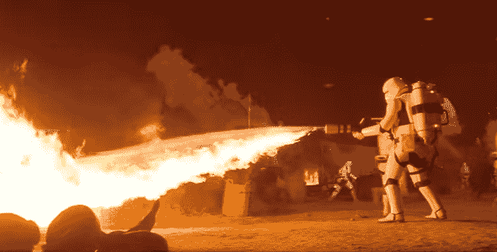

# 惊喜！有一部新的日本《星球大战》预告片，非常精彩，充满了新的镜头 

> 原文：<https://web.archive.org/web/https://techcrunch.com/2015/11/06/surprise-theres-a-new-japanese-star-wars-trailer-and-its-amazing-and-full-of-new-footage/>

# 惊喜！有一个新的日本星球大战预告片，它是惊人的，充满了新的镜头

哇哦。一般来说，一个新的*星球大战:原力觉醒*预告片将在实际上映前几天开始流传。

这一种只是…出现了。我们甚至不用假装关心周一晚上的足球比赛就能看到它！

https://youtu.be/SdAUiyeJMFQ

这部国际预告片在华特·迪士尼工作室的 YouTube 页面上首次亮相，几乎没有任何宣传，它不是你的标准，“以不同的方式重新剪辑相同的镜头”。

这里有新东西。很多，还有*很多*的新东西。事实上，我要说这部比迄今为止发布的其他电影更具剧透性——它展示了更多重大的高潮动作时刻——所以如果你担心这些事情，就要小心行事。

话虽如此:BB8 trilling in Droidspeak (0:27)！芬恩和雷伊相遇(0:56)！C-3PO (1:03)！朱伊炸屎(1:20)！

让传统的无休止的重新观看开始吧！