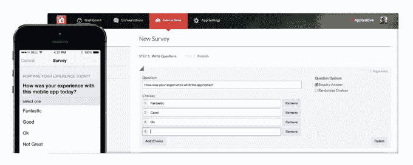

# SurveyMonkey 进行首笔投资，领投移动应用 CRM 解决方案提供商 Apptentive 的 530 万美元 A 轮 

> 原文：<https://web.archive.org/web/https://techcrunch.com/2014/09/25/surveymonkey-makes-its-first-investment-leads-apptentives-5-3m-series-a/>

[Apptentive](https://web.archive.org/web/20230130235958/http://www.apptentive.com/) ，一家[提供应用内反馈工具](https://web.archive.org/web/20230130235958/https://techcrunch.com/2012/12/10/apptentive/)的公司，允许开发者与应用的用户互动，直接交流，请求评论等等，现在已经完成了 530 万美元的首轮融资。不同寻常的是，新一轮融资部分由 SurveyMonkey 牵头，SurveyMonkey 的企业发展和战略副总裁达蒙·克朗基(Damon Cronkey)将加入 Apptentive 的董事会。

这笔资金似乎是 SurveyMonkey 的一项战略举措，因为该公司现在将与 Apptentive 合作，为两家公司的客户提供“技术和产品互动”，包括财富 500 强企业品牌。

Apptentive 联合创始人兼首席执行官 Robi Ganguly 指出:“这一轮的独特之处在于，SurveyMonkey 处于领先地位，这是他们第一次投资一家公司。”“我们认为这证明了我们迄今为止在帮助公司与移动客户沟通和听取他们的意见方面所取得的成就。这对我们公司来说是一个非常激动人心的里程碑，”他说。

他告诉我们，SurveyMonkey 的资金来源于两个团队就如何提供更好的产品进行了一段时间的讨论。Ganguly 说，Apptentive 在移动领域的专业知识是 SurveyMonkey 在网络领域的一个很好的补充。

“SurveyMonkey 的领导团队棒极了，建立了一家我们非常钦佩的公司，”他补充道。

参与这轮融资的还有之前的投资者、Founders Co-op 和 Golden Venture Partners，以及 Apptentive 的创始人。此外，总部位于芝加哥的 Origin Ventures 也与 SurveyMonkey 一起领先。

Apptentive 是利用开发人员对移动应用 CRM 解决方案的需求的几家企业之一，该解决方案允许他们在用户转向应用商店或 Google Play 并在那里留下消息(可能是差评)之前，更好地与他们的应用用户互动。有了移动应用 CRM 解决方案，开发者可以通过直接在应用本身内部发送消息，甚至将那些准备离开一星或两星评论的人重定向到另一个渠道，而不是应用商店，来取代用户对漏洞、功能请求和其他投诉的担忧。

像这样的解决方案也可以用来了解用户喜欢应用程序的什么，以及他们希望在未来的版本中看到什么功能。Apptentive 和类似产品的最终目标是增加客户保留率，同时将用户转化为相关产品的忠实粉丝。

Apptentive 与市场上的主机解决方案竞争，包括来自 Appsfire、Appboy、Helpshift、Mixpanel、Localytics 等的解决方案。它的客户中有几个知名品牌，包括 Concur、AllRecipes、Overstock.com、UrbanSpoon、RealNetworks、Big Fish Games、Glympse、Gamehouse 等。今天，Apptentive 的工具被集成到 iOS 和 Android 上的“数千个”移动应用程序中，其中 100 个是“关键客户”。总计有超过 1.5 亿的最终用户。

根据 Ganguly 的说法，该公司现在每月为超过 500 万次客户对话提供支持，但他拒绝提供收入细节，只是说增长“非常健康，每月都在加速。”

Apptentive 的一个与众不同的特点是它有一个名为“[喜爱分数](https://web.archive.org/web/20230130235958/http://apptentive.com/love-score)的专有衡量标准，它允许应用程序开发者看到他们自己的应用程序与应用程序生态系统的其他应用程序相比有多受欢迎。爱评分报告提供了各种客户洞察，包括应用程序相对于其他应用程序的受欢迎程度、应用程序商店评论的分析、评论者质量和偏见等。

Ganguly 表示，该公司还擅长帮助公司真正与客户在移动设备上交谈——这不是向客户传播信息的单向营销工具，而是公司实际上与应用程序的用户进行*对话*。此外，Apptentive 不会等到客户遇到问题后才与他们接触(这不是一个“支持”渠道)，而是帮助其开发人员找到合适的时间与他们的应用程序用户接触，以收集意见和反馈。

额外的资金将用于进一步的产品开发，以扩展其应用内工具套件，以及销售和营销。Apptentive 还将在工程和销售两方面发展其团队。