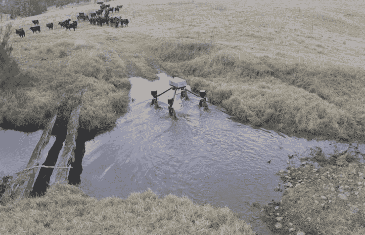

# SwagBot 将自动让它们沿着崎岖的澳大利亚牧场滚动 

> 原文：<https://web.archive.org/web/https://techcrunch.com/2016/07/14/swagbot-will-autonomously-roll-them-little-dogies-along-rough-australian-ranchlands/>

# SwagBot 会自动让它们沿着澳大利亚崎岖的牧场滚动

没有什么是神圣的吗？历史上由牛仔、高乔人、牧场工人以及澳大利亚的流浪汉走过的崎岖小路，现在将由冷酷的计算机器来管理。 [SwagBot](https://web.archive.org/web/20221025224000/http://confluence.acfr.usyd.edu.au/display/AGPub/2016/07/07/First+field+test+of+SwagBot) 是我们即将到来的转向驾驶霸主的先锋，它的独立四轮驱动不小心搅动着曾经让我们的男性祖先[和他们的鼻息费](https://web.archive.org/web/20221025224000/https://www.youtube.com/watch?v=uBpzgEEiugI)辛苦劳作的泥浆。

其实挺酷的。SwagBot 是由澳大利亚野外机器人中心创建的全地形机器人车辆平台，其目标是最终在澳大利亚乡村的广阔牧场和农田中自主巡逻。滚一边去。

[https://web.archive.org/web/20221025224000if_/https://www.youtube.com/embed/TxAWlhRlQ9U?feature=oembed](https://web.archive.org/web/20221025224000if_/https://www.youtube.com/embed/TxAWlhRlQ9U?feature=oembed)

视频

它有一个很高的行驶高度和巨大的轮子，所以它可以爬过不可避免的树枝和木头，穿过小溪和沼泽地。它上面安装的摄像头可以观察牛群或检查树木和植物，它的平头甚至可以作为同伴无人机的发射平台。

这种电动车辆最终可以监控和放牧牛群，检查入侵植物(并喷洒植物)，检查围栏，甚至在房子周围做些工作，如搬运木柴。

不过现在，SwagBot 必须远程操作；自主部分在后面。该项目的负责人 Salah Sukkarieh[告诉 IEEE Spectrum](https://web.archive.org/web/20221025224000/http://spectrum.ieee.org/automaton/robotics/industrial-robots/swagbot-to-herd-cattle-on-australian-ranches) 明年应该会带来防撞、自动送货、除草和用于动物监测的传感器。我已经要求更多的细节，我会尽快把它们添加到故事中。