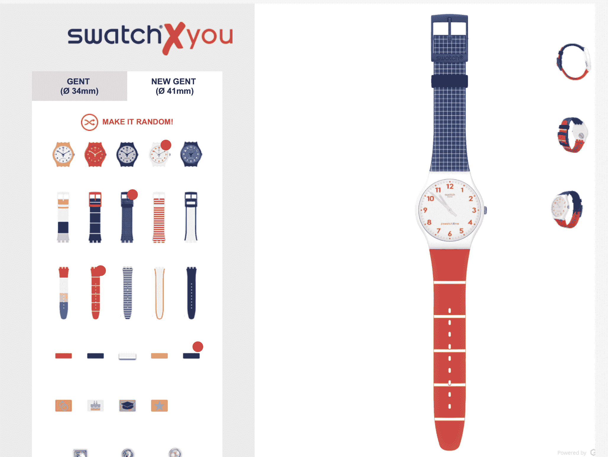

# 斯沃琪推出 Swatch X You，这是一款真正腕表的定制设计系统 

> 原文：<https://web.archive.org/web/https://techcrunch.com/2017/06/20/swatch-launches-swatch-x-you-a-custom-design-system-for-true-watchanistas/>

# 斯沃琪推出 Swatch X You，这是一款为真正的手表爱好者定制的设计系统

面向大众的时尚手表斯沃琪(Swatch)创造了 [Swatch X You](https://web.archive.org/web/20221208110852/http://shop.swatch.com/en_us/collections/swatchxyou-new-gent.html) ，这是一个聪明的在线手表“工厂”，让你选择表盘、表带和额外的装饰，真正定制你的 65 美元到 85 美元的手表。这项服务现已推出，提供 34 毫米和 41 毫米两种尺寸的手表。

我已经询问了斯沃琪集团的意见——我基本上想知道除了机场里无聊的人之外，还有谁在购买斯沃琪——但是在我得到回复之前，我们可以更仔细地看看这个项目。

基本上，你可以从五款颜色各异的基本腕表中进行选择。你可以混搭表带和各种配件，包括系在表带上的小珠宝，甚至可以根据特殊场合或个人喜好修改表带夹。价格从 65 美元左右开始，如果有合适的配件，价格可以超过 100 美元。

斯沃琪[与 Emersya](https://web.archive.org/web/20221208110852/https://emersya.com/en/home) 合作创造了这种体验，然后让你在三维空间旋转手表，看看你创造的宏伟。然后，斯沃琪制造并运输手表。

这种服务是斯沃琪独有的。长期致力于“设计师”作品，可以(也确实)升值这个选择去完全定制是早就应该和非常重要的。[像 Blancier](https://web.archive.org/web/20221208110852/http://www.blancier.com/) 这样的网站长期以来一直以相当可接受的价格提供定制手表，斯沃琪刚刚进入这个市场，这表明它需要扩展到传统斯沃琪客户之外的场合买家——为新毕业生或生日孩子购买定制手表的父母——以及那些认为手表只是时尚配饰的人。不管怎样，对于一家损失惨重的公司来说，这都是一个聪明而重要的举措。