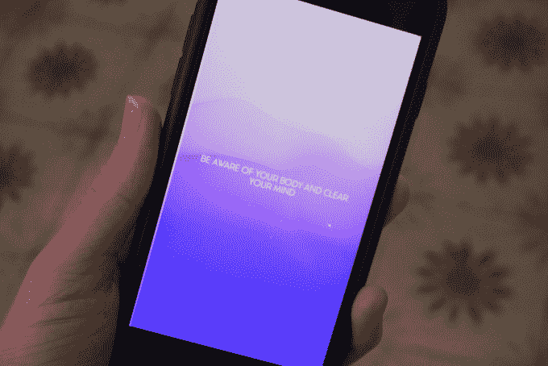

# Sway 是 us two TechCrunch 的另一款互动放松应用

> 原文：<https://web.archive.org/web/https://techcrunch.com/2017/03/29/sway-is-another-interactive-relaxation-app-from-ustwo/>

数字设计工作室[us two](https://web.archive.org/web/20221208173852/https://ustwo.com/)——以其[手机游戏印章](https://web.archive.org/web/20221208173852/https://beta.techcrunch.com/2014/11/13/monument-valley-forgotten-shores-review/)而闻名——近年来加倍努力开发正念和健康应用，推出了第二款“互动冥想”应用，名为 [Sway](https://web.archive.org/web/20221208173852/http://us2.co/getsway) 。

这是继 2015 年 8 月推出的带有认知行为治疗扭曲的日志应用( [Moodnotes](https://web.archive.org/web/20221208173852/https://beta.techcrunch.com/2015/08/06/moodnotes/) )和 2015 年 10 月推出的名为[暂停](https://web.archive.org/web/20221208173852/https://beta.techcrunch.com/2015/10/08/pause-ustwo/)的视觉引导“冥想体验”之后。

这三款应用都是与健康和福祉领域的第三方合作的，ustwo 通过位于洛杉矶的移动应用公司[prosper port](https://web.archive.org/web/20221208173852/https://www.crunchbase.com/organization/thriveport#/entity)为 Moodnotes 带来了心理学专业知识，并与丹麦精神健康公司 [PauseAble](https://web.archive.org/web/20221208173852/http://www.pauseable.com/) 合作——现在还与 Sway 合作。

Sway 在很大程度上是 Pause 背后思想的延续，ustwo 说这是为了借鉴“古代太极和正念练习”该应用程序引导用户触摸设备屏幕，慢慢移动一个无定形的斑点，以此来放慢速度，放松，并获得一两分钟的平静。

有了 Sway，运动元素就不仅仅是屏幕上的运动，而是扩展到全身，用户可以在屏幕上的指令、音乐和移动视觉效果的指导下集中注意力，做出缓慢而温和的运动——这些运动可以是全身运动，也可以只是移动握着手机的手。

Sway 从几分钟的引导“摇摆”开始，逐渐增加每天的时间，直到用户每天运动 20 分钟。随着你的进步，一系列的关卡也被解锁，鼓励一系列不同的运动来放松用户。

除了显示文本指令以开始会话之外，Sway 应用程序的屏幕还提供了舒缓的视觉效果——由柔和色调的渐变颜色组成的起伏山峦的生成性声景，当你来回移动时，这些声景会变形并改变形状和颜色。用户被鼓励戴上耳机，沉浸在宁静的伴奏音乐中。

几分钟后，该应用程序还会指示用户将目光从屏幕上移开，这样就可以在手机完全隐藏在视线之外的情况下继续放松，比如说，在口袋里，只剩下音乐和身体运动。

如果这一切听起来对你的口味来说有点太嬉皮了，ustwo 声称它可以支持其“互动冥想”的理论，这种理论对于放松目的是有效的，并且比基于其委托的一系列研究的音频指导冥想更容易获得——在嘈杂的环境中也更有效。

基本的论点是，你可能能够更容易地将它的“互动冥想”课程之一融入到例如你的日常通勤或办公室环境中，在那里，鉴于你周围所有分散注意力的活动，你可能更难专注于更传统的音频引导的冥想。

日本高知技术大学人类参与计算中心的石翔·任教授进行了这项研究，并将 ustwo 早期的暂停应用程序与音频指导的冥想应用程序 Headspace 进行了比较。

然而，他们只涉及一小部分参与者，并且没有安慰剂对照。“到目前为止，我们只专注于验证其功能效果，还没有进行任何安慰剂对照试验——这是我们肯定会探索的事情，”一位发言人说。

他们也没有专门研究 Sway 的有效性——而是测试它的前身 Pause。尽管如此，ustwo 认为这两个应用程序本质上利用了相同的物理互动方法来鼓励正念和放松。

而且，好吧，在一天结束时，如果一个应用程序最终让一些人感觉更平静，因为他们认为它帮助他们感觉更平静，那么它可以说是在做一些积极的事情(即使不一定是因为所声称的原因)。

与 ustwo 的其他移动健康应用一样，明天发布的 Sway 将是付费下载，这次定价为 2.99 美元。

早期的 Pause 应用程序(1.99 美元)迄今已有约 40 万次下载，而 mood notes(3.99 美元)在 iOS 上的下载量约为 4 万次，Android 版本也将在“几周内”推出

https://www.youtube.com/watch?v=QLVdU5uI8CQ&feature=youtu.be