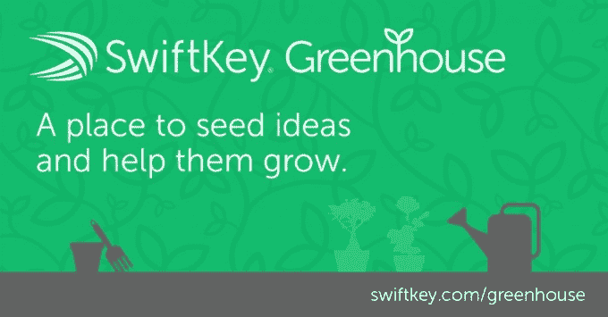

# SwiftKey 首次推出“Clarity”，这是一款具有多词自动更正功能的实验性键盘

> 原文：<https://web.archive.org/web/https://techcrunch.com/2015/04/27/swiftkey-debuts-clarity-an-experimental-keyboard-featuring-multi-word-autocorrect/>

SwiftKey 是一个更受欢迎的 Android 第三方键盘应用程序的制造商，最近又开发了 iOS ，它今天推出了一款新产品——一款“实验性”移动键盘应用程序，名为 [Clarity](https://web.archive.org/web/20230313120509/https://play.google.com/store/apps/details?id=com.swiftkey.clarity.keyboard&referrer=utm_source%3Dwebsite%26utm_medium%3Dsk%26utm_campaign%3Dgreenhouse) 。虽然 SwiftKey 的旗舰产品是一种预测键盘，可以适应你的输入方式，以便智能地建议你可以通过点击选择的单词，但新的 Clarity 键盘会回到你身后检查你输入的最后几个单词，然后追溯纠正它们。

新应用的想法是让移动用户专注于他们正在写的东西，因为他们不再需要停下来点击建议的单词，或者手动修改。相反，Clarity 的“多词自动更正”功能会自动修改你输入的文本，如果输入错误，你可以点击退格键快速撤销自动更正。

您也可以从 SHIFT 键拖移手指来快速访问大写字母，或者从 symbols 键拖移手指来访问符号。然而，SwiftKey Flow(刷卡打字)不是 Clarity 的一部分。

像 SwiftKey 本身一样，该软件通过学习你自己的移动对话中常见的单词、俚语、昵称和短语来适应你自己的打字模式。换句话说，这个应用程序越用越好。

[gallery ids="1149834，1149833，1149831，1149832"]

事后纠正你输入的想法是今天原生键盘做的事情，但在大多数情况下只是纠正拼写错误的单词。Clarity 查看单词的分组，如果做得正确，它可能比传统的自动更正更聪明。它也可能对那些不喜欢预测文本的人有吸引力，因为他们觉得停止打字来选择单词建议实际上会降低他们的速度。

Clarity 有一个干净简单的主题，可以在 Android 4.4 和更高版本上运行，但在发布时它只支持美国英语。

该公司还警告说，这个新的键盘应用程序是“未完成的”，这意味着新测试人员如果选择从 Google Play 下载应用程序，很可能会遇到错误和其他问题。目前，SwiftKey 只是希望对这款软件进行实验，并从早期用户那里获得反馈，了解他们喜欢什么和不喜欢什么，以及他们遇到的问题。

根据 Google Play 对 Clarity 的评论，一些早期采用者已经报告了错误和崩溃，而其他人则表示它的纠正能力非常棒。根据您的特定 Android 设备和操作系统版本，您的里程可能会有所不同。

Clarity 的发布还有一个有趣的地方，那就是它来自公司内部一个名为“ [SwiftKey 温室](https://web.archive.org/web/20230313120509/http://swiftkey.com/en/greenhouse/)”的新部门，它将成为未来其他类似实验的基地。

Greenhouse 基本上是一个面向消费者的 R&D 中心，将为用户提供一个可以尝试新应用的地方，该公司希望在全面公开发布之前测试这些应用。在某些情况下，这可能只是一群专门的测试人员解决新软件中的问题。但在其他情况下，SwiftKey 将使用 Greenhouse 作为一个地方来尝试一些不确定用户会如何反应的想法。

Greenhouse 发布的任何应用都不会保证在出现问题时提供直接支持，所以如果你不习惯成为新产品的测试者，你可能需要谨慎行事。然而，对于那些感兴趣的人，你可以在温室[登陆页面](https://web.archive.org/web/20230313120509/http://swiftkey.com/en/greenhouse/)上注册，以便在即将发布的版本发布时得到通知。

该公司解释说，如果成功，Greenhouse 的想法和实验可能会进入 SwiftKey 的核心产品，而其他产品将留在内部。“SwiftKey 的核心价值是创新——我们喜欢不断挑战我们的假设，”[写道](https://web.archive.org/web/20230313120509/http://swiftkey.com/en/blog/clarity-keyboard-beta-the-swiftkey-greenhouse-an-experiment-in-innovation/)该公司宣布了新的中心。

SwiftKey 的 Clarity 应用程序现已在 Google Play 上免费下载。