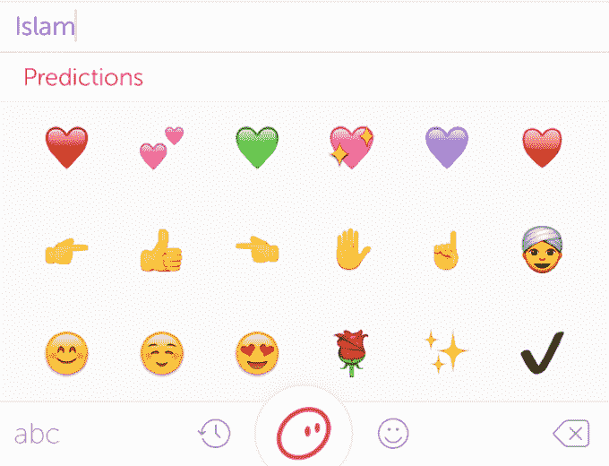

# SwiftKey 正式解封其表情符号预测应用🎁😆💃🔛

> 原文：<https://web.archive.org/web/https://techcrunch.com/2016/07/20/swiftkey-officially-unwraps-its-emoji-prediction-app/>

键盘应用程序制造商 Swiftkey 于 2 月被微软以 2.5 亿美元收购，并正式推出了自收购以来的第一款产品——这是一款表情预测键盘应用程序，名为 Swiftmoji。

我们注意到该公司在 5 月进军表情符号预测[，当时它正在运行 Swiftmoji 作为封闭测试版。这款免费应用现在可以在](https://web.archive.org/web/20221207043624/https://beta.techcrunch.com/2016/05/18/swiftkeys-newest-keyword-app-swiftmoji-suggests-emoji-as-you-type/) [iOS](https://web.archive.org/web/20221207043624/http://swftmj.io/scmf/OrMCe04Lcp0lODnLejxDL2lz3DZ_QUdIEAlBTp--Qq1r7D_Nfjs71xQNOssGRZTJJfu2r5of5VHHupa_BGwtncAmORx2C3Kd/TechCrunchiOS) 和 [Android](https://web.archive.org/web/20221207043624/https://play.google.com/store/apps/details?id=com.touchtype.swiftmoji&referrer=adjust_reftag%3DcUMR436hA67I9%26utm_source%3DPress%26utm_campaign%3DPress%26utm_content%3DLaunch%26utm_term%3DTechCrunch) 上下载。它现在只支持英语语言的使用。

表情符号预测是众包的，基于 Swiftkey 的键盘使用数据，但也会随着时间的推移利用每个用户自己的表情符号偏好。

Swiftmoji 根据用户刚刚输入的内容提供表情符号建议，其想法是加快搜索文本的完美视觉标点——例如，减少在不断扩大的微笑、物体和符号屏幕中寻找难以捉摸的法国国旗的次数。

该应用程序根据你最近的文本提供了一系列潜在的表情符号——点击其中一个就会将其添加到文本中。还有一个名为“表情符号风暴”的功能，如果你按住“Swiftmoji 添加表情符号键”，就会在一条长长的情感线上添加整个表情符号预测。这基本上是过度使用感叹号的表情符号。所以很可能会给你一个非常快速的方法来惹恼你的朋友(取决于你的朋友)。

在 iOS 应用程序上，还有一个常用的表情符号功能，可以将你最喜欢的表情符号轻轻一点。以及一个流行的屏幕，根据 Swiftkey 的使用数据，显示最时尚的表情符号。第三个屏幕将所有可用的表情符号组织成易于导航的类别，如人物、食物和饮料、运动等。

Android 应用有所不同，[正如我们之前提到的](https://web.archive.org/web/20221207043624/https://beta.techcrunch.com/2016/05/18/swiftkeys-newest-keyword-app-swiftmoji-suggests-emoji-as-you-type/)，提供了完整的键盘替换(具有其他快捷键功能)——表情符号预测位于键盘上方的一条线上，以便快速访问。该公司表示，差异源于每个平台管理键盘的框架不同。

iOS 应用程序界面肯定不太精简/更笨拙，需要用户点击 Globe 键在他们喜欢的任何文本输入键盘(可能是 Swiftkey 的键盘应用程序，也可能不是)和 Swiftmoji 之间切换，以便生成和查看表情符号预测。所以它更像是一个键盘插件。

与 Swiftkey 的其他键盘应用一样，iOS 用户也需要获得使用该应用的“完全访问权限”——这意味着该公司提取关于表情符号使用的数据，以了解表情符号的趋势(并为预测提供动力)。(关于 [iOS 键盘应用权限的更多信息，请点击这里阅读我之前的介绍](https://web.archive.org/web/20221207043624/https://beta.techcrunch.com/2014/10/04/everything-you-need-to-know-about-ios-8-keyboard-permissions-but-were-afraid-to-ask/)。)

Android 用户不会向 Swiftkey 的数据库贡献任何英特尔信息，除非他们登录并选择其他 Swiftkey 服务，如备份和同步。

**断断续续的建议**

在发布前对应用进行测试，预测似乎有点站不住脚和/或时不时地出现失误。例如，输入“viva la France”确实会产生法国国旗表情符号作为第一个预测。然而，第二个预言是意大利国旗。很难想象这有什么用。

输入英国前首相大卫·卡梅伦的名字，首先会出现喜极而泣的表情符号，然后是翻白眼的表情符号和一张不确定的脸——因此可以说更准确。(这里也预测到了:两个猪表情符号— [如果你想知道为什么](https://web.archive.org/web/20221207043624/http://www.mirror.co.uk/news/uk-news/david-cameron-finally-comments-publicly-6529563)，请点击这里。)

当输入西班牙城市“巴塞罗那”时，预测中包括一个足球，以及太阳表情符号、弗拉门戈舞者和许多心/爱表情符号。因此，没有什么太偏离滑雪道。

然而，该应用程序也对某些有争议的关键词提出了一些颇具倾向性的建议。例如，输入“纳粹”这个词包括一些非常音盲的建议——比如亲吻脸表情符号(errr)、竖起大拇指的手势(hmm)、双手击掌(ummm)和美国国旗(…)。

当输入“女权主义者”这个词时，预测中包括笑脸的眼泪，睡觉的脸，无动于衷的脸，翻白眼的脸，嗯/思考表情符号和医用口罩脸。所以，总的来说，这是一个相当负面的视觉评价。

然而，总体而言，对各种宗教的表情符号预测似乎没有那么消极，就好像在幕后发生了一些由群众推动的建议——例如:

Swiftkey 所有者微软的一位女发言人证实，该公司已经“努力减少任何使用 Swiftmoji 的人因建议的表情符号预测而被冒犯的机会”，但她补充说，这不会编辑人们自己对表情符号的使用——因此任何强制调整可能主要适用于初始预测。随着时间的推移，该应用程序的使用会向它灌输你自己的表情偏好/偏见。

“我们对我们的用户负有责任，但仍然给人们选择使用他们喜欢的表情符号和他们喜欢的任何方式的权利，”这位女发言人说，并补充说:“Swiftmoji 是一种有趣和简单的使用表情符号的方式——我们不想引起不必要的冒犯。如果您确实遇到了令您不快的事情，请向我们报告。”

显然，Swiftkey 在某些潜在的敏感领域(如宗教)做了更多的工作，以确保其表情符号预测算法不会出现有争议/令人不快的建议。因此，一如既往，闪亮的算法可以绝对反映现有的社会偏见，包括积极的区别对待。

出于好奇，我也尝试了一些真实的名字，这导致了各种各样的建议。TechCrunch 编辑马修·潘扎里诺(Matthew Panzarino)的名字产生了一串表情符号心形、一叠现金、恶作剧的幽灵表情符号和几面旗帜(都不是美国的)。而我自己的名字包括一把枪、一朵粉色的花和两个手牵着手的女孩——没有一个是我会给自己建议的表情符号。与此同时，我的法国同事 Romain Dillet 的表情符号预测涵盖了所有面部表情符号，并以口红(法语？)亲亲。所以有很多随机性，尽管正如你所料，这些都是相对模糊的真实姓名。

该应用程序对名人的表情符号建议看起来更符合逻辑，例如，“泰勒·斯威夫特”包括各种音符表情符号。“唐纳德·特朗普”包括美国国旗和便便表情符号，以及一个头骨和一列火车(让美国再次伟大？)，还有双感叹号。而“金·卡戴珊”则出现了一堆化妆表情符号和一顶公主王冠。

显然，提出表情符号的逻辑永远不会成为一门精确的科学。但是，对于算法的基本工作原理，总会有一些问题要问，这些算法最终会提供、塑造和强化观点。

毕竟，表情符号的设计本身并没有微妙地强化社会刻板印象——例如，通过将女性表情符号描绘成公主、新娘和做头发，而男性表情符号则是侦探、警察和医生，来强化性别角色。因此，向用户推送表情选择至少需要预先考虑你的技术可能鼓励的观点(好的和坏的)。

就这位女发言人所描述的“非常有限”的 Swiftmoji 测试版的早期学习而言，她说近 60%的表情符号来自预测。

虽然最受欢迎的表情符号是哭笑脸，但她补充说，该公司发现人们在使用 Swiftmoji 和 SwiftKey 时会使用更多不同的表情符号。

“我们把这归因于表情符号用户以前没有遇到过的表情符号预测，”她补充道。