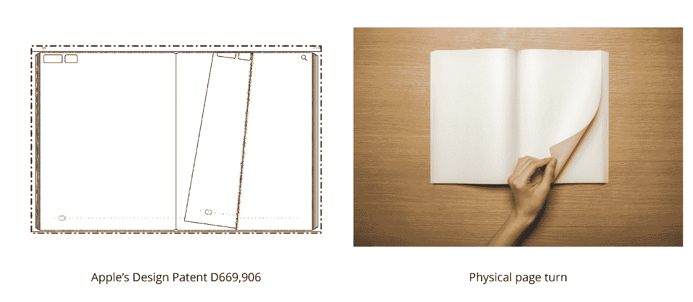
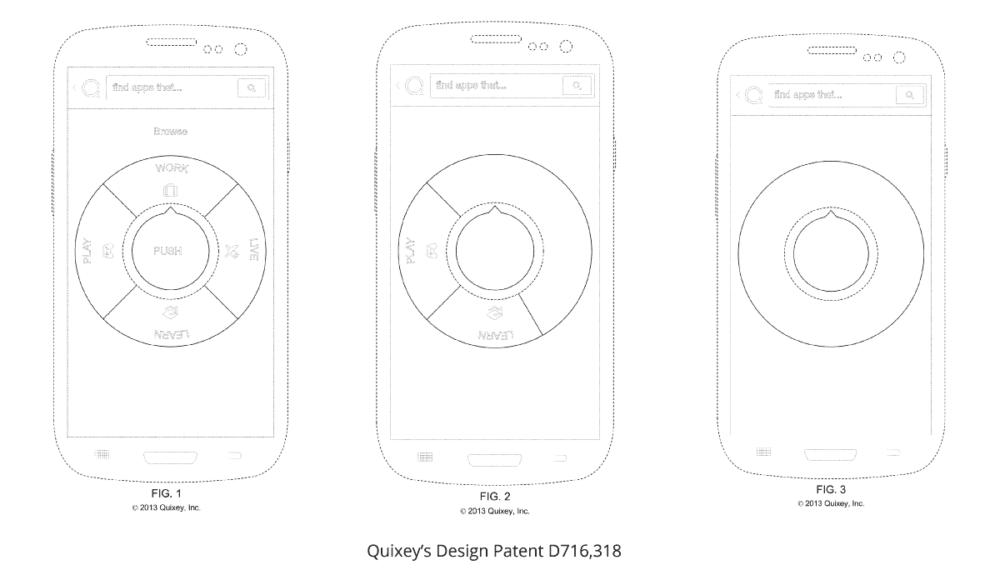
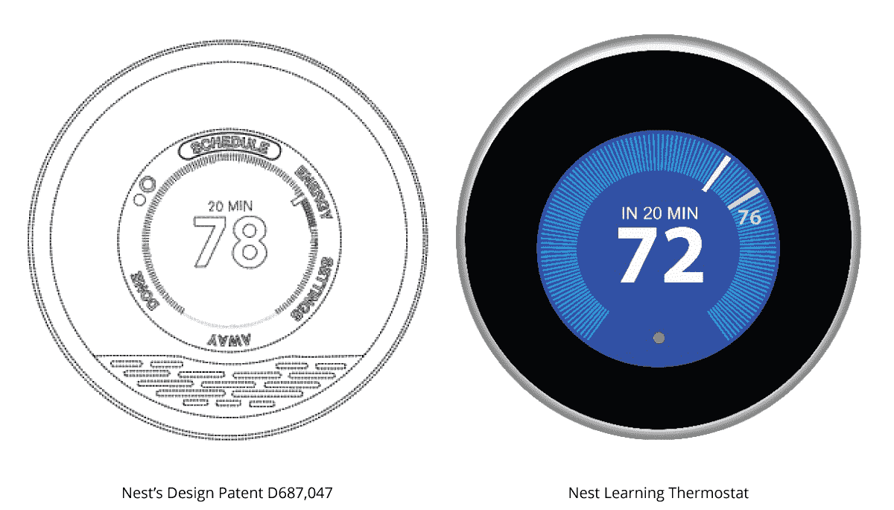
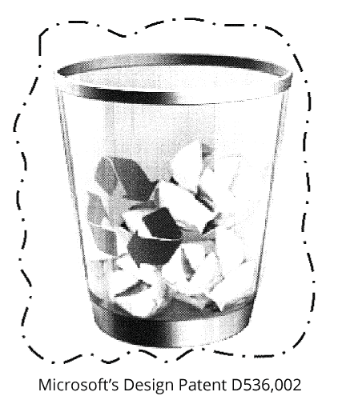

# 浏览专利:用户界面时代的设计专利 

> 原文：<https://web.archive.org/web/https://techcrunch.com/2015/08/03/swipe-to-patent-design-patents-in-the-age-of-user-interfaces/>

贝丝·费里尔是芬尼根知识产权律师事务所的合伙人。

劳伦·德雷耶撰稿人

劳伦·德雷耶是知识产权律师事务所 Finnegan 的合伙人。

埃里克·德雷耶是 GoodShuffle 公司的 UX/用户界面设计师。

John Sanchez 是学院的 UX/UI 设计师。

**编者按:** *这是一场* *问&一场芬尼根的律师贝丝·费里尔和劳伦·德雷耶与古德休夫勒的 UX/UI 设计师埃里克·德雷耶和学院的约翰·桑切斯之间的较量。*

用户体验和用户界面设计是科技行业的一个新兴领域，在专利的法律领域更是如此。(有时这个字段被简称为 UX/UI。)你可能会惊讶地发现，设计专利申请增长最快的领域是 UX/用户界面领域。

过去，制造运动鞋等实物的公司通常会用设计专利来保护他们的设计。对于耐克这样的公司来说，设计专利保护对于防止竞争对手抄袭他们的鞋子设计非常重要。但是，投资 UX/UI 的公司也是如此。

UX/用户界面设计的激增创造了标志性的特征，使消费者立即将设计与特定的品牌联系起来。从手机到遥控器，游戏设备到虚拟现实耳机，现代产品都是以用户为中心精心设计的。

因为一个产品的成功往往取决于这些创造性的设计选择，保护设计是至关重要的，以区分你的产品从竞争对手的产品。

一些 UX/UI 设计专利的顶级申请人包括三星、微软和苹果。随着越来越多的创新发生在非传统数字空间，如可穿戴设备、智能手表甚至家用电器，用户界面和体验正在成为公司整体品牌的一个关键部分，应该被视为其整体知识产权组合的一部分。对于老牌公司和创业公司来说都是如此。

尽管如此，在 UX/用户界面领域仍然存在一些关于设计保护的怀疑和误解。我们坐下来讨论为什么设计专利对 UX/UI 很重要。

贝丝:埃里克，让我们把这个拿出来；你和劳伦都姓德雷耶，这不是巧合吧？

埃里克:不，不是的。我们结婚了，这也是我最初了解到这个话题的原因。但是，对我来说，这似乎也是一个很好的方式来询问我妻子的工作，并回答我的一些问题。

Erik:那么什么是 UX/UI 设计专利呢？

贝丝:外观设计专利可以防止其他人使用图形用户界面、在线图标或其他与你专利中的外观设计非常相似的 UX/用户界面功能。GUI 设计专利要么是静态的(不动的)，要么是动态的(动的)。

覆盖动画图标或界面的设计专利比那些覆盖静态设计的专利少得多。一项动画设计专利基本上是一系列图像，这些图像的元素在观看时会“移动”，就像一本卡通活页本。例如，苹果公司拥有翻页动画的设计专利:

重要的是要明白，这个外观设计专利并不涵盖“翻页”任何一页，而是指苹果在翻页时的外观设计。这是另一项动画设计专利，来自一家名为 Quixey 的初创公司，其应用程序承诺帮助用户在 Google Play 中搜索新应用程序。这个例子展示了“翻页书”的概念:

**约翰:嗯。听起来很有趣。获得外观设计专利的要求是什么？**

劳伦:像所有的专利一样，设计专利只授予新的设计，而不是现有设计的明显版本。虽然基本物品必须有功能(意味着它不是一件艺术品)，但外观设计专利保护设计的装饰方面——这意味着设计不能仅由功能决定。

但是 UX/UI 都是关于功能的，对吗？不一定。判断一个设计是否满足这个测试的一个很好的指标是什么时候有可以提供相同功能的替代设计。例如，智能手机或啤酒瓶的形状有许多不同的装饰设计。同样，UX/用户界面设计专利将涵盖审美，而不是体验的具体功能。让我们以 Nest Labs 的数字恒温器为例。

尽管数字恒温器带有大量功能，但 Nest 获得了一项外观和感觉上的设计专利，即带有旋转时钟状控件的圆形显示器。当然，Nest 也有很多其他的方式来展示和定位它的恒温器。

例如，传统的恒温器通常是矩形的，带有按钮和另一个矩形显示面。因为替代设计提供了相同的功能(控制温度)，Nest 的设计可以作为外观设计专利的主题。

约翰:可以申请专利的东西有限制吗？例如，我看到了这个很酷的 CSS3 动画，我想在上面加入我自己的想法。但是，原版动画不是我的。我能申请专利吗？

劳伦:你当然可以在已经存在的东西上添加你自己的设计特色。大多数设计就是这么做的！只要你的设计是新的，包含现有设计的非显而易见的变化，并涵盖装饰方面，你就可以获得外观设计专利。在审查期间，关键问题将是你的新设计特征是否与现有设计(被称为“现有技术”)有足够的不同，以克服非显而易见性的障碍。

Erik:是否有最低水平的完善性、复杂性、创新性、研发水平等？为了获得外观设计专利？

贝丝:新颖和不明显是主要的指导方针。您设计中的额外复杂性可能最终会使您在检查过程中更容易克服现有技术设计，但这是一把双刃剑。这种额外的复杂性也可能使设计的后续实施更加困难，因为增加的复杂性使得竞争者的设计不太可能被视为侵权(意味着两种设计具有基本相同的整体视觉印象)。

当然，另一件要记住的事情是，你可能希望改变你的商业产品，你可能仍然希望你的设计专利覆盖新的版本。所以你应该试着把重点放在你的 UX/用户界面的基础元素的专利上，而不是放在你将来可能会改变的次要元素上。

外观设计专利申请最重要的特征是图纸。美国专利局将仔细查看你的图纸，以确保它们清晰且相互一致，从而决定该设计是否是新的，而不是现有设计的明显变体。

美国专利局对 UX/用户界面图纸很挑剔——在你提交申请后修改它们可能很困难，甚至是不可能的。您的 UX/UI 设计应用程序可能是一次性的尝试，这意味着在第一轮中获得正确的绘图是至关重要的。

**约翰:如果用户体验是由许多变量决定的，比如一天中的时间、天气、用户情绪等等，你如何为用户体验申请专利？？**

劳伦:如上所述，这是它有助于关注潜在设计概念的另一个原因。例如，GUI 可能在白天以黄色背景为特色，在晚上以蓝色或紫色背景为特色，但是底层设计可能自始至终都是一致的。

关注用户与设计互动的方式，以及用户期望设计如何回应。如果界面变化如此之大，以至于没有太多一致的设计，就有可能在同一产品上获得多项设计专利。

因为设计专利可以要求设计的创新子部分(除了整个设计之外)，设计师通常发现为每个产品获得一个以上的设计专利是有用的——覆盖单个产品的不同子方面或迭代。

幸运的是，外观设计专利的成本通常只是实用专利的一小部分。平均而言，从申请到获得美国专利局批准只需要 15-18 个月(相比之下，实用专利获得批准需要 3-5 年)。因此，基于一个 UX/用户界面拥有多项设计专利通常是一个可行的选择。

Erik:我如何知道我将要设计或开发的东西是否申请了专利？

劳伦:所有美国设计专利都是公开的，可以在美国专利局的[网站](https://web.archive.org/web/20221006105931/http://www.uspto.gov/patents-application-process/search-patents)上搜索到。在投入资源获得外观设计专利之前，考虑搜索现有的声称类似设计的专利。一些公司甚至在开发他们的用户界面之前就搜索类似的专利设计。

这可能不是你通常的做法，但是如果你已经创造了一些创新，或者如果你的产品仅仅依靠这种创新作为其关键卖点，那么做你的研究，并确保你不是在建造已经建成的东西。

**约翰:目前的设计专利多久实施一次？它们只是由公司针对其他公司强制执行，还是也攻击小机构？**

贝丝:许多关于设计专利的纠纷都是在没有法院介入的情况下简单解决的。有时，仅仅是一封告诉竞争对手专利设计并提供许可的信，或者建议公司采用不同的外观，都会导致竞争对手采用新的设计。

事实上，许多设计专利持有人报告说，他们很少诉诸提起诉讼来行使自己的权利。当潜在的侵权者是一家小公司时，专利持有人发送其专利权的通知可能更有经济意义，这通常足以使竞争者转向不同的方向。当然，有时公司会起诉对方，就像我们在苹果诉三星案中看到的那样，但这是个例外。

约翰:如果专利不经常实施，为什么还要申请呢？

贝丝:它们是被强制执行的，只是不总是通过诉讼，因为一些专利持有者发现在他们的产品上标记他们的专利号或者给竞争对手发通知信更有效。一些公司仅仅因为被称为使用知识产权保护其产品的公司而享有一层保护。

专利也可以增加你产品的价值，因为知识产权可能会吸引投资者。专利也可以作为防御工具。如果另一个专利持有者指控你的公司侵权，你可以更容易地证明你是在实践你自己的专利发明，而不是他们的。

但是，也许最重要的是，UX/UI 设计专利可以灌输产品品牌，使一家公司从竞争对手中脱颖而出。微软、三星和苹果已经获得专利的许多 UX/用户界面功能是设计专利如何支持用户体验的外观和感觉以及为不同的 UX/用户界面功能提供产品识别的好例子。

Erik:但是难道设计专利不能通过抢先类似的设计概念来阻碍 UX/UI 的进步吗？

劳伦:美国法律允许专利所有者阻止他人使用与外观设计专利保护范围基本相似的设计。这是有道理的。专利保护的存在是为了让投入时间和财力开发一项发明或设计的发明者能够收回这些成本。

此外，当竞争者必须在不同的方向上创新新的设计以避免侵犯发明者的权利时，公众也会受益。这种创新为公众提供了一种新的(希望是更好的)设计选择和用户体验。

但是，仅仅因为微软拥有回收站图标的设计专利(见下文)，并不妨碍 UX/用户界面设计师创造另一个回收站图标。

只是其他回收站图标根本无法采用与微软回收站基本相同的整体装饰设计。看看 UX/用户界面设计师创造的许多回收站设计:

约翰:如果我认为我的设计值得拥有，我申请设计专利的动机是什么？【T2

 **贝丝:如果你的 UX/用户界面是创新的，并且你认为它使你与众不同，考虑申请专利的方法。特别是如果你已经投资开发了你的设计，并且你想防止别人抄袭它。想想帮助你将产品与公司品牌联系起来的关键功能:苹果的滑动解锁功能或微软的 Windows 8 平铺主屏幕。

这些设计通常是公司的生命线。在 UX/用户界面上投入了相当多的思考，以便公司能够在竞争对手中区分产品。找出那些你的公司认为特别有创意和标志性的设计。尽管知识产权有时可能是一项昂贵的投资，但外观设计专利通常要便宜得多，并能提供一些有力的保护。**