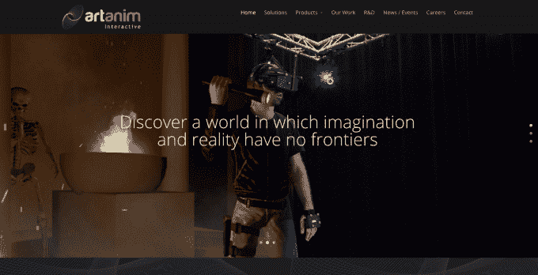
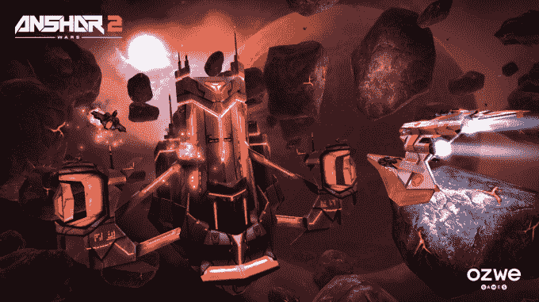

# 钻研虚拟现实的瑞士初创公司

> 原文：<https://web.archive.org/web/http://techcrunch.com/2016/02/22/swiss-startups-delving-into-virtual-reality/>

bérénice magist retti撰稿人

Bérénice Magistretti 是居住在旧金山的瑞士自由撰稿人。她专注于沙特阿拉伯、瑞士和新兴市场的初创企业。

More posts by this contributor

继 [MindMaze](https://web.archive.org/web/20230326115707/http://www.mindmaze.ch/) 轮 1 亿美元融资之后，很明显，瑞士科技正在蓬勃发展，并开始激起国际投资者的好奇心。

这家初创公司已经完成了一轮 1000 万美元的天使融资，最近宣布以 10 亿美元的估值开启了首轮融资。主要投资者是跨国企业集团 Hinduja Group，家族办公室也参与其中，但尚未披露。

MindMaze 是一个神经康复平台，通过 VR/AR 技术“愚弄”大脑，帮助中风患者更快恢复。

这家初创公司由 Tej Tadi 于 2012 年创立，当时他是一名专攻神经科学的博士生，是瑞士洛桑联邦理工学院(EPFL)的一个分支机构。他们的主要关注点是通过开发增强的用户界面来构建下一个直观的技术，包括轻量级、可佩戴的头戴式显示器(HMD)和 3D 运动捕捉相机。这些产品提供沉浸式 VR、手势和多对象/用户识别，以及增强现实功能。

就面积而言，瑞士可能是个小国，但它是欧洲新兴的创新中心。顶级学术机构拥有孵化器并提供加速器项目，初创公司拥有开发顶级技术所需的支持。其他总部位于瑞士的初创公司也在追随 MindMaze 开发自己独特的虚拟现实技术的脚步。

其中之一是 Artanim Interactive，这是日内瓦研究机构 Artanim 的一个分支，该机构专注于围绕动作捕捉和虚拟现实开发尖端的沉浸式交互系统。

Artanim Interactive 于 2015 年推出，旨在将研究所开发的技术商业化。它的两位联合创始人 Caecilia Charbonnier 和 Sylvain Chagué受邀在 2016 年圣丹斯电影节上展示他们的最新产品。该产品名为 Real Virtuality，是一个多用户沉浸式虚拟现实平台，这是罗伯特·雷德福亲自测试的！

“除了 VR 耳机，我们还在人们身上配备了标记，以便将物理世界与虚拟世界相匹配。Artanim Interactive 的另一位联合创始人罗纳德·门泽耳解释说:“这欺骗了大脑，让它认为这是真实的。”。

该团队宣布了两项战略合作伙伴关系，旨在彻底改变娱乐行业沉浸式现实技术的未来。第一个是与[维康](https://web.archive.org/web/20230326115707/http://www.vicon.com/)，光学运动跟踪系统的领导者。第二个是与创意立体 3D 电影和娱乐的领导者 [Vision3](https://web.archive.org/web/20230326115707/http://vision3.tv/) 。这家初创公司目前处于启动阶段，但联合创始人正在与投资者谈判，以开始第一轮融资。

另一家瑞士初创公司通过其沉浸式视频游戏吸引了一些引人注目的注意力，这就是 [OzweGames](https://web.archive.org/web/20230326115707/http://www.ozwe.com/) 。

他们最初的成功是在 2014 年底，当时他们推出了世界上第一款可以用三星 Gear VR 头盔玩的多人游戏:安萨尔战争。

玩家可以通过头部的运动来控制他们的飞船。不需要游戏手柄、操纵杆或 WASD，其背后的技术是由瑞士洛桑的工程师和图形设计师团队开发的革命性控制系统。

现在，一年多一点后，该团队推出了《安萨尔战争 2》。这是与 Oculus Studios 和 SunnySide Games 合作为 Gear VR 开发的。这款视频游戏下载量很大，重达 555.69 MB，是原游戏的两倍多。

“从技术上来说，《安萨尔战争 2》使用了比《安萨尔战争》更强大的渲染引擎。这使我们能够添加更多内容，如多边形和纹理、画外音和更多样的游戏，使其成为迄今为止最完整的 Gear VR 游戏，”Ozwe Games 首席执行官 Stéphane Intissar 表示。

随着头戴式显示器(HMD)现已商业化，Ozwe Games 推出了更符合现代游戏观众需求的综合套装。这家初创公司是自举式的，并没有积极寻求资金。“但我们对任何有趣的提议都持开放态度”，Intissar 说。

2016 年似乎是 VR 将腾飞的一年，即使是在瑞士这样最小的国家，从瑞士这些微小的创业公司可能会成为全球巨头。