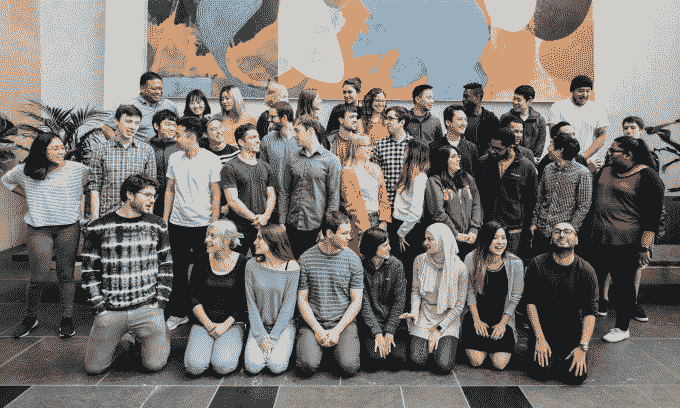

# SynapseFI 筹集 1700 万美元开发其金融科技和银行平台 

> 原文：<https://web.archive.org/web/https://techcrunch.com/2018/09/04/synapsefi-raises-17m/>

帮助银行和金融科技公司合作开发技术的初创公司 SynapseFI 宣布筹集了 1700 万美元的 A 轮融资。

这笔融资实际上在去年年底就结束了，但首席执行官 Sankaet Pathak 表示，该公司一直忙于开发新产品，招聘员工，现在才开始披露这笔交易。这笔投资由 Trinity Ventures 和 Core Innovation Capital 牵头，其他未透露姓名的支持者也参与了投资。

这家总部位于旧金山的初创公司尽管在 2014 年成立，但现在已经低调了一段时间。其核心产品是一个帮助银行和开发商合作的平台。这涉及面向开发者的 API，允许公司与银行连接以提供服务，以及面向银行的 API，允许银行自动化和扩展后端操作。

Pathak 将这一愿景描述为让世界各地的任何人都有可能获得高质量的金融产品。第一个重点是让金融产品“像乐高积木一样”,使银行能够轻松增加新产品和服务。就目前而言，开发是一个痛苦的过程，需要特定的基础设施开发，但 SynapseFI 旨在标准化许多流程和平台，使事情变得更简单。

Pathak 于 2010 年从印度移居美国，由于没有社会保障历史，他无法获得银行账户或贷款，因此感到沮丧，于是产生了创业的想法。他离开了孟菲斯大学，在那里他学习了计算机工程和科学，并在 2014 年 4 月与他的朋友布莱恩·凯特纳一起创立了这家创业公司。

最初，该业务专注于支付，但它逐渐成为金融业的技术推动者。

如今， SynapseFI 拥有 60 多名员工，与 100 多家金融行业客户合作。它的产品包括支付、存款、贷款和投资服务等基础服务，但它也冒险涉足加密服务，包括白色标签钱包 T4。

迄今为止，它声称已经处理了超过 100 亿美元的交易，并通过其技术帮助了超过 150 万人的银行业务。

SynapseFi 团队

Pathak 在一次采访中告诉 TechCrunch，“我们希望解决银行业的三个核心问题。“后台办公室目前仍然主要是手动的，我们希望实现自动化。有必要进行纵向整合……我们希望任何大型或小型金融公司都能来找我们，并以与富国银行和大通银行相同的规模运营。我们还想利用行为科学实现财务建议的自动化。”

Pathak 补充说，这家初创公司还怀有向海外扩张的雄心。这可能意味着首先是欧洲——可能是英国或德国这样的市场——但这将需要相当密集的本地化，因为 SynapseFI 平台是为适应美国 API 和数据管道而定制的，这些都不能在美国以外工作。

虽然 Pathak 强调，他也专注于建立一个可持续的业务，而不是简单地依赖风险投资资金，但扩张可能会发生在公司寻求筹集 B 轮资金的时候。事实上，他说公司很可能在年底达到盈亏平衡。

“我仍然认为这是一种健康的商业行为，”Pathak 说。