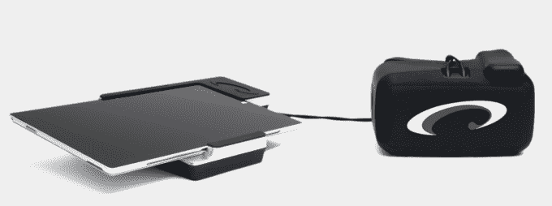

# SyncThink 使用虚拟现实来帮助测试运动员在赛场上的脑震荡情况 

> 原文：<https://web.archive.org/web/https://techcrunch.com/2016/12/13/syncthink-uses-vr-to-help-test-athletes-for-concussions-on-the-field/>

# SyncThink 使用虚拟现实来帮助测试运动员在赛场上的脑震荡

在过去的十年里，像足球这样的高冲击力运动引起的脑震荡引起了人们的极大关注，因为有研究详细描述了反复头部创伤的一些长期影响。

SyncThink 由斯坦福脑震荡和大脑表现中心的负责人 Jamshid Ghajar 博士创建，旨在通过利用虚拟现实，更早地发现脑震荡，比现有的解决方案更准确。

该公司的眼睛同步系统的一个明显优势是它的高度便携性，另一个优势是它非常隐私。多年来，关于脑震荡测试如何被玩家“玩游戏”以便他们能留在游戏中的许多例子已经被披露。对于 SyncThink 的 VR 头戴式设备解决方案来说，这些问题远没有那么普遍，因为它有效地将参加测试的人从他们的环境中分离出来。

该公司使用配备有眼球追踪传感器的 DK2 Oculus Rift 开发套件，为运动员和其他容易脑震荡的人提供了一种快速有效的方法来检测一个人是否遭受脑损伤。

该耳机系统已经在斯坦福大学的运动项目中使用。虽然这项技术最明显的应用可能是在足球比赛或其他高强度运动的场外，但 SyncThink 认为，鉴于该设备的紧凑特性，军方将会对此产生很大兴趣。

今天，这家总部位于波士顿的公司宣布，印第安纳大学将使用这家初创公司的眼动同步技术进行一项关于亚脑震荡头部撞击的研究。

“通过跟踪亚脑震荡冲击并结合各种参数，我们目睹了一瞥，但似乎有希望的是，一些模式可以在脑震荡发生前预测它，”印第安纳大学运动学助理教授 Keisuke Kawata 说。“我的首要任务是建立脑损伤特异性客观标记，以确保士兵和运动员的安全，同时保持最高水平的表现。”