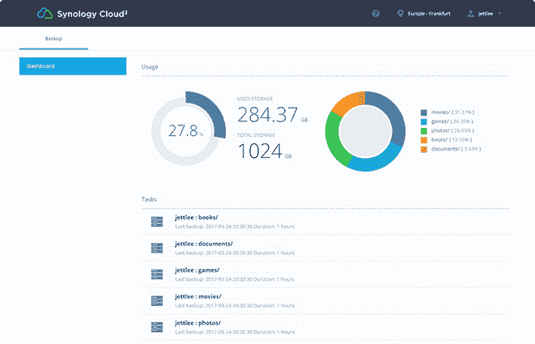

# Synology 的 C2 备份服务向全球用户推出 

> 原文：<https://web.archive.org/web/https://techcrunch.com/2018/03/21/synologys-c2-backup-services-goes-live-to-users-worldwide/>

如果你了解 Synology，你可能知道它的网络连接存储(NAS)硬件。在过去的几年中，该公司成为了消费者和小型企业首选的 NAS 提供商之一，这些消费者和小型企业希望对其数据进行本地备份，或者使办公室中的用户能够轻松共享本地驱动器空间。现在，该公司正在向云领域迈出一大步，在全球范围内推出了针对其 NAS 系统的 [C2 备份服务](https://web.archive.org/web/20221210071434/https://c2.synology.com/en-us/backup)，此前该服务仅在欧洲提供。

需要明确的是，C2 备份就是[在云中备份你的 Synology NAS 系统](https://web.archive.org/web/20221210071434/https://www.synology.com/en-us/knowledgebase/DSM/tutorial/Cloud_Service/How_to_back_up_data_on_your_Synology_NAS_to_Synology_C2_Backup)。它不是 iDrive、Carbonite 或 Backblaze 等在线备份服务的竞争对手。

但是，如果您是 Synology NAS 用户，这项服务会给您带来另一种程度的安全性。毕竟，在本地备份数据是很好的第一步，但是如果灾难袭击了您的办公室，您的备份也会丢失。Synology 长期以来一直提供在云中存储备份的能力(例如，在亚马逊的 S3 服务上)，但它显然也想在这项业务中分一杯羹。

“云备份在低准入门槛和强大的未来可扩展性方面的灵活性在该市场的快速增长中发挥了关键作用。Synology 应用程序组主管刘佳宇表示:“随着异地数据保护需求的不断增长，我们收到了来自 EMEA 以外地区的大量请求，希望扩大我们在 C2 的备份覆盖范围。“我们很高兴地宣布，全球所有用户现在都可以享受专为 Synology NAS 设计的无缝备份体验。”

这项服务的定价似乎相当合理，100 GB 备份数据的计划起价为每年 9.99€。1tb 的价格涨到了€59.99 英镑/年。根据这些计划，您可以存储 11 个备份版本，这些版本在系统中保留 30 天。这里的好处是，只有源数据的大小才与您的存储使用量相关，而不是单个备份。

对于需要更多灵活性的用户，该公司还提供了一个€69.99/TB/年的计划，其中包含灵活的备份计划和可定制的保留策略。该公司还提供 30 天的免费试用。

订阅业务显然是 Synology 的明智之举。迄今为止，该公司的业务主要依赖于硬件销售，但随着 C2 备份和现有的 C2 灾难恢复服务的推出，它现在可以提供两种具有经常性收入的订阅服务。