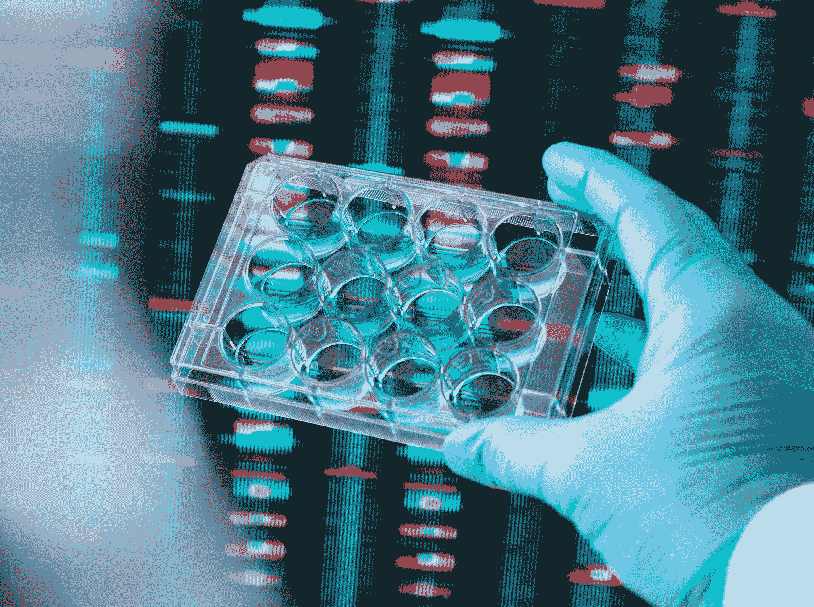

# Synthego 的新产品使科学家能够获得经过编辑的基因材料

> 原文：<https://web.archive.org/web/https://techcrunch.com/2018/06/06/synthegos-new-products-give-scientists-access-to-edited-genetic-material/>

[Synthego](https://web.archive.org/web/20221226055740/https://www.synthego.com/) 是一家为基因组研究和实验提供基因编辑服务的公司，该公司推出了一系列新产品，让研究人员可以访问编辑过的遗传材料，从而更容易地进行可编程生物学的实验。

该公司的新服务将为研究人员提供已经使用 CRISPR 过程编辑过的遗传材料，这样科学家就可以更快地围绕疾病的新疗法或遗传特征的新表达来测试他们的假设。

“像 CRISPR 这样的基因编辑技术极大地改善了研究人员进行基因组修饰的方式。与许多新的生物工具一样，并不是每个人都有机会、时间和能力来有效地学习和使用 CRISPR 以获得他们想要的结果。由于这些障碍，人们对能够让 CRISPR 面向大众、让研究人员能够专注于实验结果而非方法开发的产品有着强烈的需求，”哈佛医学院遗传学教授、哈佛和麻省理工学院健康科学与技术教授乔治·丘奇(George Church)在一份声明中表示。

CRISPR 技术允许科学家编辑遗传物质来抑制或促进某些生物特征，并具有广泛的应用，从材料科学到能源，从农业到健康。

根据该公司首席执行官保罗·达布罗斯基的说法，Synthego 提供的基本上是基因编辑服务。

照片:安德鲁·布鲁克斯/盖蒂影像公司

Dabrowski 说，人们使用 CRISPR 有两个基本功能。第一种是去除基因或功能，第二种是给遗传物质增加功能。

这两个过程都涉及三个(非常复杂的)步骤。首先，科学家必须识别他们想要靶向的基因，然后理解他们想要靶向去除该基因中的什么遗传物质。然后，研究团队将需要识别和采购编辑基因所需的试剂和组件。最后，该团队将需要弄清楚编辑是否成功，并在编辑后的遗传物质得到培育时观察结果。

“有大约 100 种方法可以让它出错，”达布罗斯基说。

Synthego 的第一套产品旨在简化鉴定和设计用于实验的遗传物质的过程。下一组工具应该通过向科学家提供他们想观察或实验的材料来帮助他们。

“告诉我们你想要修改的基因，我们会给你修改后的基因进行全面分析，”达布罗斯基说。

达布罗斯基说，目前，Synthego 的基因材料仅用于研究目的。“总的来说，我们正在努力加快开发过程，让事情变得更好。”

这些新工具意义重大，因为它们是业内第一批保证转基因材料功效的工具。“我们在这方面已经努力了五六年，让所有这些都发挥作用，”他说。“高吞吐量使我们能够以相对前所未有的方式收集数据并了解正在发生的事情。我们能够在进行基因编辑之前预测一些结果。”

最终，目标是降低靶向基因疗法的成本，让每个人都可以获得它们，而不仅仅是 Synthego 的支持者中的亿万富翁(该公司得到了风险投资公司的支持，包括彼得·泰尔的创始人基金和 8VC——由 Palantir 和 Addepar 创始人乔·朗斯代尔创办的投资公司)。

Dabrowski 说:“临床基因疗法不可能是价值百万美元的药物。“这些需要更接近疫苗。未来一两年的潜力是开始治愈数千种疾病，但你可以看到这些产品都是关于获取的……要么这些东西成为百万美元的药物，要么我们需要改变我们的思维方式。”