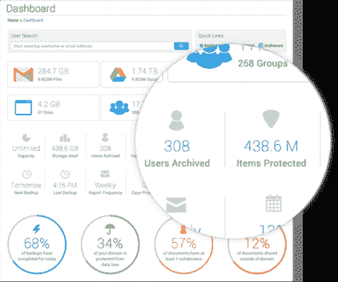

# SysCloud 筹集 250 万美元帮助企业保护其 Google Apps 账户的安全 

> 原文：<https://web.archive.org/web/https://techcrunch.com/2014/11/14/syscloud-raises-2-5m-to-help-you-keep-your-google-apps-accounts-safe/>

# SysCloud 筹集了 250 万美元来帮助企业保护他们的 Google Apps 账户安全

SysCloud 是一家提供全面服务套件的服务公司，旨在确保公司谷歌应用程序账户的安全和备份，该公司今天宣布，它已经筹集了 250 万美元的 A 轮融资，由新投资者 Inventus Capital Partners 和之前的投资者 KAE 资本牵头。

虽然 SysCloud 目前专注于谷歌应用程序，但新的资金意味着该公司可以扩展到其他在线工具，如 Office 365、Salesforce、Dropbox 和 box。

该公司成立于 2010 年，称目前保护着来自 32 个国家的 50 万用户的账户。除了备份功能，SysCloud 还提供了精细管理安全策略的工具，以确保某些敏感数据不能与公司以外的用户共享。

为了简化这一过程，SysCloud 为用户提供了一套模板，这些模板与 PCI、FERPA 和 SOC 2 等标准合规性政策相对应。这项服务还提供了许多审计和报告工具，以及帮助新客户[迁移到 Google Apps](https://web.archive.org/web/20221207013043/https://www.syscloud.com/google-apps-migration/) 的服务。

SysCloud 和其他类似的服务显然面临的一个风险是，随着时间的推移，它所支持的供应商自己也会推出非常相似的服务。毕竟，谷歌已经为其企业 Google Apps 客户提供了一些新的安全和审计功能。SysCloud 还面临着像 [CloudLock](https://web.archive.org/web/20221207013043/http://cloudlock.com/) 、 [Backupify](https://web.archive.org/web/20221207013043/http://backupify.com/) 和其他提供类似服务的公司。

作为对我的担忧的回应，SysCloud 首席执行官 Vijay Krishna 告诉我，他认为“客户需要一个作为单一平台的应用程序，通过在所有云中应用统一的策略和控制来保护他们的数据。否则，必须将策略编程到每个供应商的管理面板中会变得很麻烦。此外，并非每个供应商都支持相同和必需的功能。”