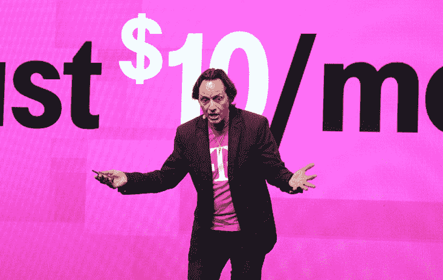

# T-Mobile 不再将网飞、HBO、Hulu 和其他视频流计入您的数据使用量 

> 原文：<https://web.archive.org/web/https://techcrunch.com/2015/11/10/t-mobile-stops-counting-netflix-hbo-hulu-and-other-video-streams-against-your-data-usage/>

# T-Mobile 停止将网飞、HBO、Hulu 和其他视频流计入你的数据使用量

在手机上看《网飞》是打发业余时间的好方法——但也是快速处理每月数据的好方法。

T-Mobile 将此作为竞争优势。从本周日起，T-Mobile 将不再把网飞(以及其他一些视频服务)计入你的数据套餐。

T-Mobile 称这项新功能为“狂看”，其依据是人们通常称一口气看完无数集的节目为“狂看”。

一个警告:在“狂欢”上的流媒体将下降到 480p 的非高清分辨率，比大多数人习惯的疯狂高清流媒体质量低得多。在大多数手掌大小的手机显示屏上，这看起来不会太*可怕——但是你可能会注意到不同。*

以下是不再符合您的数据计划的网站列表:

*   网飞
*   葫芦
*   表演时间
*   斯塔兹
*   裂纹
*   再来一个!
*   ESPN
*   福克斯体育
*   福克斯体育 GO
*   HBO Now
*   HBO GO
*   金属链带(Metallic Link Belt)
*   电影联盟
*   NBC 体育
*   吊带电视
*   吊索箱
*   t-移动电视
*   驱逐大学
*   Ustream
*   船
*   Vevo
*   武杜

我们很想知道其他运营商对此会作何反应。T-Mobile 对 Spotify/Pandora/等音乐服务做出了类似的举动。[回到去年 6 月的](https://web.archive.org/web/20221026005207/https://beta.techcrunch.com/2014/06/18/t-mobile-stops-counting-data-used-with-spotify-pandora-itunes-radio-and-certain-other-music-services/)，没有其他航空公司跟进。

音乐服务不会使用那么多数据，但是视频流媒体网站呢？那是一个完全不同的故事。我想这一举措会产生更大的影响。

但是等等:YouTube 呢？这似乎是相当大的遗漏。