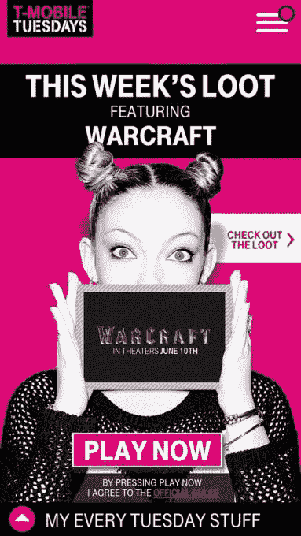
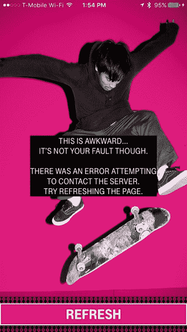

# T-Mobile 用一个新的免费应用程序感谢客户，这个程序一整天都没用

> 原文：<https://web.archive.org/web/https://techcrunch.com/2016/06/07/t-mobile-thanks-customers-with-a-new-freebies-app-that-hasnt-worked-all-day/>

嘿 T-Mobile，这是*而不是*你如何感谢你的客户！昨天，这家移动运营商宣布了其最新的“非运营商”举措——这一次，其最新的噱头包括[向 T-Mobile 客户赠送股票](https://web.archive.org/web/20230326083225/https://techcrunch.com/2016/06/06/t-mobile-is-giving-every-customer-a-share-of-its-stock/)，以及推出一款名为“ [T-Mobile 周二](https://web.archive.org/web/20230326083225/https://www.t-mobiletuesdays.com/Offday)的应用，该应用充满了免费赠品。不幸的是，由于 T-Mobile 的服务器无法处理传入流量的负载，该应用程序已经关闭了一整天。

对于一家希望你依靠它来满足移动语音和数据需求的公司来说，这是一个充满希望的前景，不是吗？

如果你错过了， [T-Mobile Tuesdays](https://web.archive.org/web/20230326083225/https://www.t-mobiletuesdays.com/Offday) 是一个客户奖励应用程序，每周都会推出新的赠品和交易。在 T-Mobile 周一早上发布[公告](https://web.archive.org/web/20230326083225/https://techcrunch.com/2016/06/06/t-mobile-is-giving-every-customer-a-share-of-its-stock/)后，这款应用并没有立即推出，而是在当天晚些时候推出。

当然，它的回报没有奥普拉那么多，而是实用和有趣的东西。例如，通过 Fandango 免费观看《魔兽争霸》的电影票、温蒂餐厅的免费小冰淇淋和达美乐餐厅的免费披萨都在首批之列。(该公司告诉我们，事实上，达美乐与 T-Mobile 有“常青树”协议——这意味着每周都有免费披萨。只是不是今天，我猜)。

未来的奖励合作伙伴包括 Buffalo Wild Wings、Condé Nast、Lyft、MLB、米高梅度假村、三星、StubHub、华纳兄弟、环球影业、JackThreads、HotelTonight、Gilt、Shell 等。

这个想法是 T-Mobile 将会给它的客户一个惊喜，作为 T-Mobile 客户的额外津贴，每周都会收到一份来自合作伙伴的“感谢”礼物。

但是这些客户很快就发现，这个应用程序根本不起作用。虽然你可以在智能手机上下载并安装 T-Mobile Tuesday，然后完成注册过程，但访问交易只会超时。

在屏幕上，一条消息显示:“这是尴尬的…有一个错误试图联系服务器。”

与此同时，T-Mobile 的 Twitter 账户将问题归咎于“大量需求”导致了“同样大量的延迟问题”。然而，它向用户承诺他们仍然会得到感谢。(具体如何不得而知。)

一些用户抱怨他们已经[尝试加载应用程序 6 个小时](https://web.archive.org/web/20230326083225/https://twitter.com/fuzi/status/740236009250664450)，没有任何成功。许多人也对错过免费披萨感到失望。

更糟糕的是，T-Mobile 的 Twitter 账户似乎忽略了用户的担忧，他们在服务器崩溃时无法获得奖品，或者错过了本来可以使用的奖品。

*不客气！*

当被问及鉴于停机问题，公司是否会延长奖励时， [T-Mobile 的 Twitter 愉快地回答](https://web.archive.org/web/20230326083225/https://twitter.com/TMobile/status/740207805739700224)这个计划的伟大之处在于它是一个持续的感谢，未来将会有更多的周二和奖励。

正如一位用户所说(转述): *很抱歉，我们搞砸了发布会，但我们下周会做得更好*——对于一家品牌以顾客至上为宗旨的运营商来说，这样的回应并不合适。

当然，我们有一些希望，客户服务团队可能不知道 T-Mobile 计划如何正式解决这个问题，并在有限的信息下尽可能地做出回应。

然而，当我们向 T-Mobile 询问有关该应用程序宕机的更多信息以及它计划如何处理这些问题时——包括该公司是否会将该计划延长至周三——我们被指示关注 T-Mobile Twitter 账户的更新。

*叹息*。这实际上是一个漂亮的“运营商”移动，T-Mobile。非常感谢。

**更新** : T-Mobile [在美国东部时间 6 月 7 日下午 4 点 25 分宣布](https://web.archive.org/web/20230326083225/https://twitter.com/TMobile/status/740323848743059456)app 再次运行。注册的顾客也会收到短信提醒。