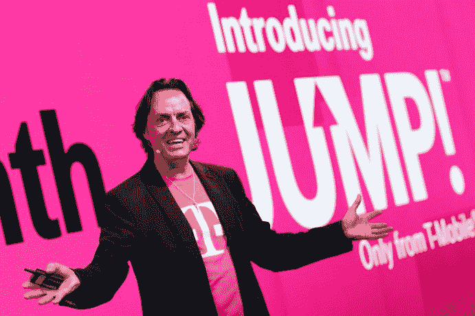

# T-Mobile 的第 7 次“无运营商”发布会将于 9 月 10 日举行 

> 原文：<https://web.archive.org/web/https://techcrunch.com/2014/08/29/t-mobiles-7th-uncarrier-announcement-will-happen-on-september-10th/>

# T-Mobile 的第 7 次“无运营商”公告将于 9 月 10 日发布

又到时间了！T-Mobile 正准备在他们的“Uncarrier”系列中发布另一个公告，就在上一个发布后的几周[。](https://web.archive.org/web/20230131043439/https://techcrunch.com/2014/06/18/t-mobile-stops-counting-data-used-with-spotify-pandora-itunes-radio-and-certain-other-music-services/)

该公司刚刚发出了第七次“无承运人”活动的邀请，每一次都旨在动摇一些行业惯例，并通过解决一些痛点，诱使潜在客户跳上 T-Mo 列车。下一次活动将于太平洋时间 9 月 10 日下午 1 点举行。

到目前为止，我们所知道的是:该活动的口号是“这一次是私人的”，活动本身是在 T-Mobile 自己的一家商店举行的(而不是像剧院或音乐会那样的地方，这些事情通常在那里举行)。)

此时，这些事件变得有点难以跟踪，因此这里是迄今为止的“无载体”历史:

**运营商 1:** T-Mobile 推出 4G LTE 网络， 电信运营商 2: T-Mobile 扩大升级计划，允许客户一年升级两次手机
**电信运营商 3:** T-Mobile 免费提供国际数据/短信服务
**电信运营商 4:** T-Mobile 宣布，他们将为任何愿意转到他们网络的人支付提前终止费用
**电信运营商 5:** T-Mobile 启动“试驾”计划，向潜在客户出借 iPhone

另外，9 月 10 日也是我的生日。也许 T-Mobile 只是给我开个生日派对。那会很酷。