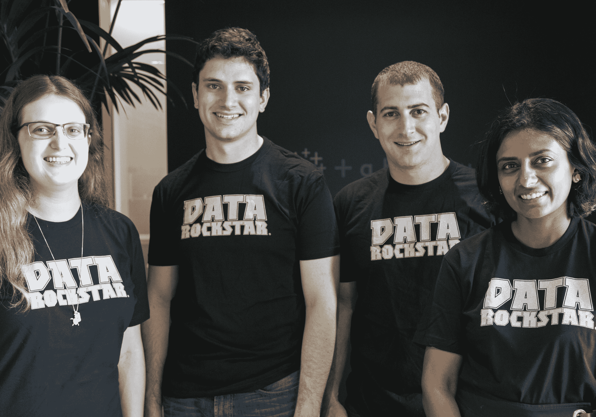

# Tableau 收购了 ClearGraph，这是一家让你使用自然语言 TechCrunch 分析数据的初创公司

> 原文：<https://web.archive.org/web/https://techcrunch.com/2017/08/09/tableau-acquires-cleargraph-a-startup-that-lets-you-analyze-your-data-using-natural-language/>

# Tableau 收购了 ClearGraph，这是一家让你使用自然语言分析数据的初创公司

商业智能和分析公司 [Tableau](https://web.archive.org/web/20230210170746/https://www.tableau.com/) 今天宣布，它已经收购了 [ClearGraph](https://web.archive.org/web/20230210170746/https://cleargraph.io/) ，这是一项让你通过自然语言查询来查询和可视化大量商业数据的服务(想想“本周超过 500 美元的交易”)。Tableau 希望将这项技术与自己的产品相结合，因为它希望让用户更容易使用类似的查询来可视化他们的数据。

通常，您必须了解 SQL 或类似的数据库查询语言，以便从大多数企业数据库中提取信息。自然语言处理和机器学习的最新进展现在允许像 ClearGraph 这样的服务了解更多关于底层数据库的信息，然后提取这些句子，并从本质上将其翻译成数据库查询。鉴于微软的 Power BI 和其他竞争对手已经提供了这一功能，Tableau 也在研究这一功能也就不足为奇了(尽管 Tableau 认为——与微软等公司不同——它可以是中立的一方，因为它在自己的云或内部技术之外没有任何投资)。

事实上，Tableau 的首席产品官 Francois Ajenstat 告诉我，该公司实际上启动了一个内部项目，为其服务建立一个对话界面。然而，要建立这一点，Tableau 必须将许多基础设施到位，而 ClearGraph 已经完成了所有这些工作。

ClearGraph 成立于 2014 年(它之前的[名为 Argo](https://web.archive.org/web/20230210170746/https://techcrunch.com/2015/01/13/small-data/) 和 Arktos ),该公司表示，它目前拥有“几十个”客户，包括一些大型企业。虽然该公司没有透露其客户是谁(这在企业领域并不罕见)，但 Ajenstat 告诉我，他们包括金融机构、零售商和主要的互联网公司。正如 Ajenstat 指出的那样，如今每家公司都在努力让更多的员工能够访问其数据，因此 ClearGraph 的客户遍布各行各业也就不足为奇了。

现有的 ClearGraph 客户不会立即注意到任何变化，但是，随着时间的推移，一旦它集成了这项新技术，Tableau 可能会将他们转移到自己的平台上。

Ajenstat 还认为，这项新技术将帮助他的公司接触到更广泛的用户。“尽管 Tableau 在易用性方面是同类产品中的佼佼者，但它是关于扩大可以在企业中分析数据的用户数量，”他告诉我。他还指出，虽然下一批潜在用户可能是临时用户，但他们的问题并不简单——这就是 Tableau 认为 ClearGraph 的自然语言处理技术将帮助它成功的地方。

ClearGraph 团队将加入 Tableau 的帕洛阿尔托办公室，专注于将其技术与 Tableau 的技术相结合。

该公司拒绝透露收购价格，但在收购之前，ClearGraph 从 Accel Partners 共融资 153 万美元。