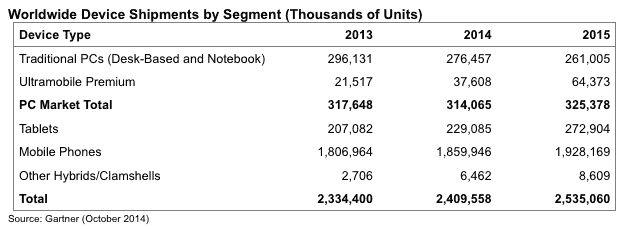
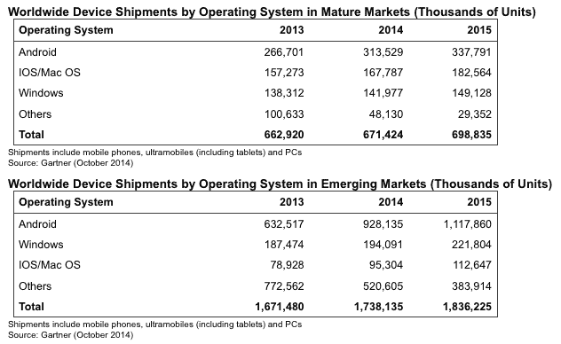

# 随着安卓智能手机销量持续飙升，平板电脑销量在 2014 年大幅下降:Gartner 

> 原文：<https://web.archive.org/web/https://techcrunch.com/2014/10/15/tablet-sales-growth-plummets-in-2014-as-android-smartphones-continue-to-soar-gartner/>

随着苹果准备在周四发布许多人认为是最新的苹果平板电脑和苹果电脑，高德纳今天发布了《T2》数据《T3 》,这些数据强调了这类设备在市场上面临的挑战，以及更便宜、最终更容易更换的智能手机的不可避免的崛起。

高德纳的第三季度和全球设备销售年度数据——涵盖智能手机、平板电脑以及各种尺寸的个人电脑——显示，与去年同期 55%的增长相比，2014 年平板电脑的销售仅增长 11%。预计 2014 年平板电脑销量将达 2.29 亿台，占全球设备总销量的 9.5%，今年将达到 24 亿台，2015 年将达到 25 亿台。

与此同时，个人电脑继续长期下滑:2014 年的销量将从 2013 年的 2.96 亿台下降到 2.76 亿台。

消费电子产品竞赛的获胜者仍然是智能手机，尤其是安卓智能手机。

基于谷歌移动运营系统的设备今年将销售 12 亿台设备，占售出设备(智能手机或其他)的一半以上(51%)。

尽管市场上仍有功能手机的销售(高德纳的调查结果证明了这一点，即功能手机大量使用的诺基亚仍然排在三星和苹果之后的第三位)，高德纳预测它们在这个世界上不会长久。该公司表示，到 2018 年，每 10 部售出的手机中就有 9 部是智能手机。

这一趋势将在新兴市场得到延续，2015 年，Android 在美国、西欧和日本等市场以外的地区的年销售额将突破 10 亿美元。今年，新兴市场的销售额已经是发达国家的近三倍(见下表)。

**超级手机的承诺**

超级手机，不完全是个人电脑，不完全是平板电脑，也不完全是手机，仍将是利基市场，但会继续增长:今年将售出 3760 万部，这是一个快速增长但仍然很小的类别，它将是增长最快的类别。Ultramobiles 在 2015 年的销量基本上会翻一番，而其他类别的销量将继续小幅增长。

但是超级手机实际上也面临着和平板电脑一样的问题(在较小程度上也是个人电脑的问题):人们只是不怎么更换它们。“在平板电脑领域，下降趋势来自基本超级手机的放缓，”高德纳写道。分析师认为，目前平板电脑和超级手机的生命周期约为三年，这意味着今年的买家要到 2018 年才会更换设备。Gartner 表示，预计 2014-2015 年新平板电脑购买者将减少 8300 万人，到 2018 年平板电脑替代者将减少 1.55 亿人。

并不是这些设备让消费者不满意；恰恰相反。“我认为他们可能辜负了太多的期望，”高德纳公司的分析师、该报告的合著者罗伯塔·科扎开玩笑说。“有太多的固态设备，用户没有理由升级到新设备。他们只是对软件升级感到满意。”

她补充说，她认为平板电脑制造商可能已经开始更多地将网站设在新兴市场。“我认为，在成熟市场，这个市场确实刚刚达到一个饱和点。例如，在美国，我们预计到 2014 年底渗透率将达到 50%。随着新用户被吸引到另一个设备类别，即更大显示屏的智能手机，事情不得不放缓。”

**三星领先，但受到缺乏必备新功能的伤害**

Cozza 还向我证实了你们许多人可能已经怀疑的事情:三星目前在销售方面远远超过所有其他原始设备制造商。

她说，如果我们把所有设备都包括在内，包括个人电脑、超级手机和手机，三星仍然是第一名，本季度占有大约 20%的份额。为了强调三星的财富在多大程度上是由 Android 驱动的，她指出三星在个人电脑领域的份额“很小”。

苹果以约 10%的份额位居第二，诺基亚紧随其后，联想在整个类别中排名第四(微软旗下的诺基亚在功能手机方面的交易仍然相当活跃，这支撑了它)，未来几个季度的一些再平衡正在搭建舞台。

“我们已经明确看到三星在 Q2 智能手机市场的放缓，他们一直在失去份额，”科扎指出。“我认为，问题是在高端手机市场，这种情况在第三季度和第四季度会更严重，这将受到苹果的压力，因为现在有了更大显示屏的新选择。”她指的是新款 iPhone 6。

她说，高端设备用户没有足够的理由从三星购买他们的新设备，甚至坚持使用该品牌。“从 Galaxy S4 到 S5，甚至从 s3 到 S4，没有什么真正突破性的东西可以产生大量的替代品。相反，我们将在苹果方面看到大量替代产品，因为更大的屏幕是一个切实的特征。”

**新兴市场的新兴图景**

虽然发达市场在许多方面都主宰着最新最棒的功能和高端手机的销售，但新兴市场将为销量增长设定节奏。

Cozza 指出，另一个快速发展的品牌是中国手机制造商小米，该公司目前正在更大力度地向本国以外的新兴市场进军。“在今年的 Q1 和 Q2 期间，我们确实看到他们的份额增长非常快，但随着中国智能手机市场达到饱和，小米将进入其他地区。”她表示，另一家将这么做的是华为。“现在，所有这些中国品牌都真正进入了其他市场，那里的销量将会更大。”

事实上，当你考虑 Gartner 关于新兴市场和成熟市场在操作系统方面的比较数据时，你可以看到数量发生了巨大变化——这是未来几年注意力和投资将继续转向的一个迹象。

图片: [Flickr](https://web.archive.org/web/20230405200752/https://www.flickr.com/photos/carla777/1039697905/in/photolist-2zSHXX-8zfNZJ-pEWBrU-9zUZhE-9s5VCC-9s36vn-9s5XEG-9s34oc-hBX91g-7BcSDW-hBXcre-bCgeBe-9s5ZyA-9s2uWR-4Hd5BZ-9K5hHN-hVPjQ-a8NebL-nW57e-2xHAZm-58ntgG-8HmFxH-v4jVy-nivC1-cWqYx-8H2thR-8HpNFf-6QoUkp-6GtMYL-2o68im-5aTwhd-6r9NcB-Lwj7H-6re1bw-6r9Rik-6r9Pmv-6r9Kog-6rdYKG-6re1x1-6r9Qav-6rdX5A-6rdVwS-6r9NTi-6rdZvG-cAVPTh-6cBegN-7awuqs-v4iah-3p4Q1w-jjk9w)