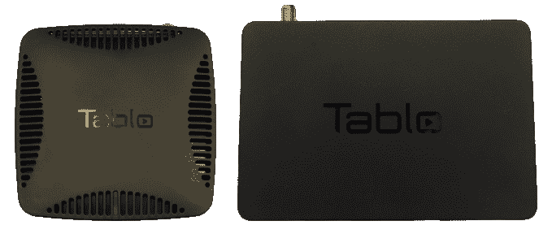
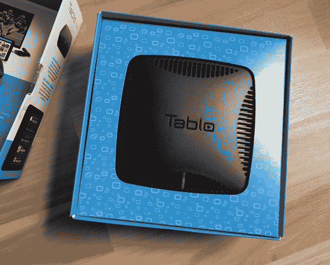
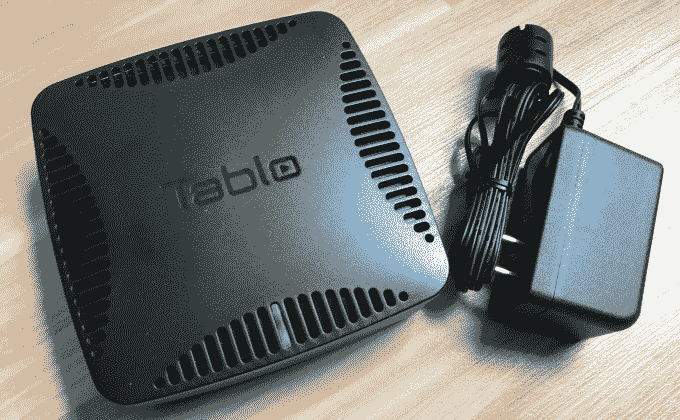
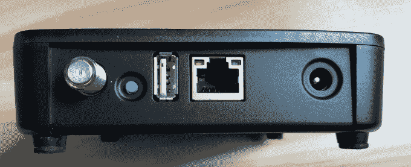
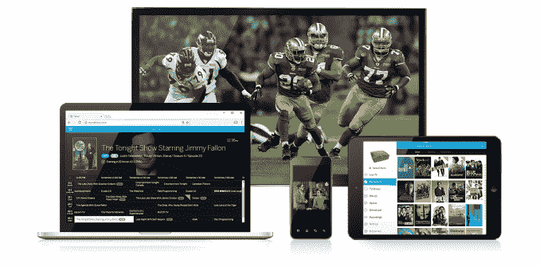

# Tablo 推出用于脐带切割的下一代 DVR，更紧凑的 Tablo DUAL 

> 原文：<https://web.archive.org/web/https://techcrunch.com/2017/05/31/tablo-launches-its-next-gen-dvr-for-cord-cutters-the-more-compact-tablo-dual/>

Nuvyyo 是为那些希望通过数字天线录制免费无线电视节目的脐带切割者制作的 [Tablo DVR](https://web.archive.org/web/20221208190848/https://www.tablotv.com/) 的制造商，今天发布了他们的下一代设备 [Tablo DUAL](https://web.archive.org/web/20221208190848/https://www.tablotv.com/blog/ota-dvr-product-family-growing-meet-tablo-dual/) 。正如您可能从名称中猜到的那样，新的 DVR 支持两个调谐器，因此您可以同时从两个电视频道进行录制。新硬件的外形比其前身小 20%，并增加了 64 GB(约 40 小时)的板载高清录制存储。

此外，脐带切割者可以通过连接自己的 USB 硬盘来扩展板载存储。该公司表示，这样做可以将记录容量提高到 8 TB。

这是对原始 Tablo 设备的一个改进，原始 Tablo 设备需要 USB 硬盘才能工作，因为它没有板载存储。这对 Tablo 的所有者来说是有利也有弊。

一方面，它让消费者能够通过购买符合他们需求的 USB 驱动器来控制他们有兴趣使用的存储空间，但另一方面，它也让你有了一个看起来很垃圾的娱乐中心，在那里你可以堆叠多个设备。

新的 Tablo 至少让你可以选择使用板载存储，尽管重度 DVR 用户可能仍然需要额外的驱动器，除非他们非常擅长删除他们的记录。

要使用该设备，你需要一个家庭 Wi-Fi 网络和自己的无线高清电视天线。

您可以将天线插入 Tablo，而不是直接插入电视。DVR 本身是联网的——它通过以太网插入路由器，或者通过 Wi-Fi 连接到您的家庭网络。这就是它能够通过网络将电视传输到任何设备的方式，除了电视之外，还包括 PC、平板电脑和手机。

然而，与流媒体播放器不同——例如 Roku、Fire TV 或 Apple TV——Tablo 不提供遥控器，也不通过 HDMI 与电视连接。

相反，Tablo 通过 Tablo 应用程序将直播电视和录像传输到网络设备上。

这些应用程序通过网络在 iOS 和 Android 设备、PC 和 Mac 电脑、Xbox One 和 Nvidia Shield 等游戏系统、智能电视(包括 Roku TV、Android TV、LG Web OS 2.0 和 3.0)以及其他流媒体设备(如 Roku、Fire TV/Fire TV Stick、Android TV、Apple TV(通过 AirPlay 的新一代或上一代)和 Chromecast)上得到支持。

在家庭网络带宽允许的情况下，这种设置允许 Tablo 同时传输到多达 6 个设备。

支持新硬件的 Tablo 软件和以前一样工作。有一个节目指南，用于发现要观看或录制的即将到来的节目、电影和体育赛事，以及像在传统 DVR 上一样安排录制的工具。您可以将设备设置为录制单集，包括重播或仅录制新集，并且您可以管理冲突。

回放录像时，除了倒回和快进之外，您还可以暂停、向前跳过 30 秒、倒回 20 秒，您将看到缩略图预览以帮助您找到您的位置。另外，Tablo 的[“连接”功能](https://web.archive.org/web/20221208190848/http://support.tablotv.com/hc/en-us/articles/207684196-Chapter-6-Connecting-to-Tablo-Away-from-Home-Part-1)可以让你在户外观看录像。

用户可以选择通过 4.99 美元/月的订阅升级到扩展的电视指南，提供未来两周的剧集和系列概要、封面艺术和元数据。

对 Tablo 来说，更大的问题是天线连接的 DVR 市场能否长期持续。自从该设备于 2013 年在发布以来，流媒体电视的选择——包括直播电视——已经激增。

消费者现在有多种选择，像网飞一样成为天线和点播服务。如果他们错过了直播电视和有线电视，他们可以从 Sling TV，PlayStation Vue，YouTube TV，DirecTV Now 和 Hulu 的直播电视服务中进行选择。此外，随着[网络](https://web.archive.org/web/20221208190848/https://beta.techcrunch.com/2017/05/01/hulu-scores-deal-with-nbcu-for-its-live-tv-service-will-now-carry-all-four-major-broadcast-networks/)和[分支机构](https://web.archive.org/web/20221208190848/https://www.engadget.com/2017/05/10/cbs-deal-makes-it-easier-to-get-local-tv-via-streaming/)开始削减流媒体服务的新协议，广播电台——没有电缆或天线很难访问——也在这些新服务上稳步变得可用。

Tablo 在一段时间内仍有帮助的一个棘手领域是体育——你可以用这款设备观看和录制当地比赛，这对一些用户来说将是一大吸引力。

但对于其他消费者来说，对 Tablo 的投资似乎没有必要，因为他们花在“看电视”上的大部分时间实际上都是来自网飞或亚马逊 Prime Video，而不是他们通过天线收看的直播游戏。

Tablo DUAL 将于 6 月 4 日开始在美国和加拿大的百思买商店和网上独家销售，售价为 249.99 美元。