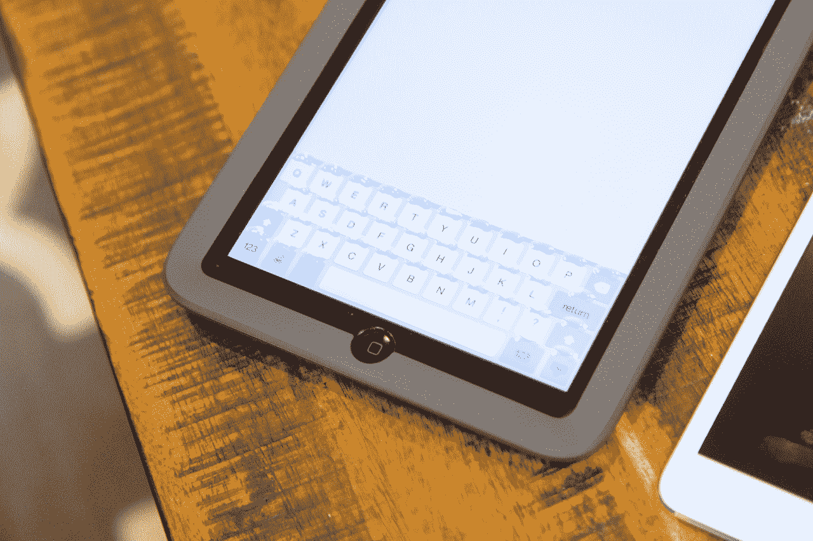

# 观看新款 Phorm iPad Mini 外壳凭空生成物理按键

> 原文：<https://web.archive.org/web/http://techcrunch.com/2015/02/12/tactus-phorm-ipad-mini-case/>

苹果的触摸式设备彻底改变了我们与电脑互动的方式，但这并没有阻止用户偶尔怀念物理键盘主宰的日子。Tactus 已经将这一愿望铭记于心，该初创公司的第一款消费产品 [Phorm](https://web.archive.org/web/20230320092038/http://getphorm.com/) 即将为你的 iPad mini 的软键盘带来触觉体验。

Tactus 的联合创始人 Craig Ciesla 博士和 Micah Yairi 博士一直在研究一种技术，这种技术可以根据需要从一个平坦的表面生成物理按键，为一般的基于触摸的交互提供一个光滑、完整的表面，并在你需要时提供一个物理键盘。该公司的创新使用微流体面板来实现其魔力，通过看不见的通道引导液体来扩展触摸板顶层的特定区域，在以前没有的地方产生突起和凸起。

Phorm 是 Tactus 推出的第一款面向消费市场的产品，现在可以预订，第一批设备的目标上市日期是 2015 年夏季。Phorm 是一个 iPad mini 外壳，将 Tactus 的技术融入到一个薄的前面板中，在大小和应用方法上都类似于标准的屏幕保护器。它像纸一样薄，当你看着 Phorm 里面的 iPad 时，它几乎不会改变你显示器的光学性能。Phorm 本身也没有给 iPad mini 的光滑框架增加那么多额外的尺寸，增加了你可能会从一个相当耐用的保护壳中期待的那么多体积。

[gallery ids="1118505，1118506，1118507，1118508，1118509，1118510，1118511"]

Phorm 外壳本身包含它所实现的转换所需的流体，以及触发密钥生成所需的电路。背面有一个大型开关，可以让你打开和关闭触摸键，外壳的工业设计由弹药公司负责，该公司最初在苹果收购 Beats 之前与 Beats 合作开发硬件。

风格是伟大的，但 Phorm 的杀手级特性是从无到有的按键。当然，这些不是机械按键:它们本质上是可触摸的脊，可以提示设备键盘的位置(纵向)，并在手指按压时有一点点弹性。但是对于仅仅通过触摸打字来说，它们比平板显示器提供了更多的存在，当然，它们在不使用时会完全消失。从本质上来说，由于 Phorm 的定价，除了标准的刮擦保护器之外，您还可以获得一个主要功能，以及一个耐用的保护壳，而无需比优质配件制造商的其他保护壳花费更多的成本。

Phorm 只是 Tactus 的一个开始——他们已经在为 iPhone 6 Plus 和 iPad Air 进行设计，他们甚至使用通用的 Android 平板电脑参考设计制作了一个原型，将他们的触觉键集成到设备的显示屏上，不需要任何额外的部件或用户安装。这是一项仍处于相对初级阶段的技术，但看到它开始走向消费者，人们很容易对它的发展感到兴奋。

一旦 Phorm 广泛上市，其零售价格将为 149 美元，但预购客户可以通过该活动节省 50 美元，将发布价格降至 99 美元。