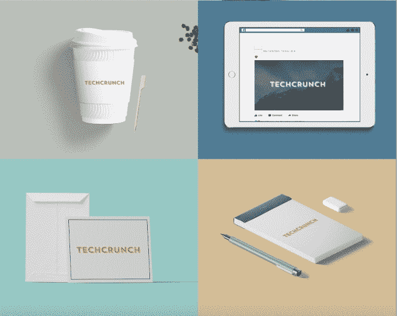

# Tailor Brands 筹集了 1550 万美元用于人工智能驱动的标志创作和其他技术

> 原文：<https://web.archive.org/web/https://techcrunch.com/2018/05/09/tailor-brands-series-b/>

# Tailor Brands 筹集了 1550 万美元用于人工智能驱动的标志创作等

为小企业自动化部分品牌和营销流程的初创公司 Tailor Brands 今天早上宣布，它已经获得了 1550 万美元的 B 轮融资。

首席执行官 Yali Saar 表示，公司[位于设计和机器学习](https://web.archive.org/web/20221210043442/https://techcrunch.com/2016/11/07/tailor-brands-raises-4m-to-have-robots-design-logos-for-you/)的交汇点。这个想法是创造技术，了解标志设计，文案和社会媒体战略的最佳做法。

自动化设计最引人注目，这也是裁缝品牌网站[上突出的一大特色。你需要付费才能获得高质量的图像文件，但在此之前，你可以尝试免费创建一个徽标，只需输入一些关于你公司的基本信息，并确定你喜欢的设计。](https://web.archive.org/web/20221210043442/https://www.tailorbrands.com/)

相关:你们觉得 TechCrunch 的新 logo 怎么样？

2014 年在 TechCrunch 的初创公司战地[推出的 Tailor Brands 表示，这项技术已经被用于创建 4500 万个标志。该公司表示，去年它有 386 万客户，并且每个月都在平台上增加 50 万个新业务。](https://web.archive.org/web/20221210043442/https://techcrunch.com/2014/09/08/tailor-brands-aims-to-bring-small-business-owners-affordable-access-to-professional-design/)

新的资金由 Pitango 风险资本增长基金和英国 Armat 集团牵头，颠覆性技术和红树林资本合作伙伴参与。该公司目前已经筹集了 2060 万美元，并表示将利用这笔资金进行全球扩张，为其完整的品牌套件添加更多语言和引入更多工具。