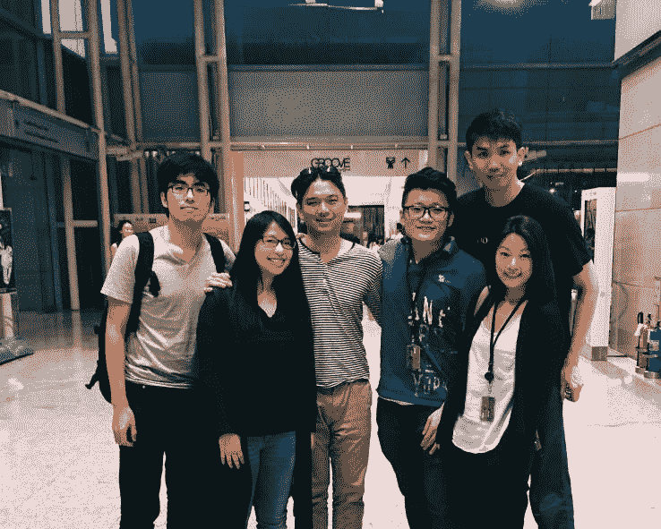

# 总部位于台北的初创公司 Woomoo acqui 被 Priceline TechCrunch 聘用

> 原文：<https://web.archive.org/web/http://techcrunch.com/2016/05/24/taipei-based-startup-woomoo-acqui-hired-by-priceline/>

# Priceline 雇佣的总部位于台北的创业公司 Woomoo acqui

初创公司 Woomoo 团队的六名成员

app 原型制作工具 [POP](https://web.archive.org/web/20230130012119/https://popapp.in/) 背后的初创公司 woomo，已经被 Priceline 收购。该公司的所有六名员工都从 Woomoo 的总部台北搬到了曼谷，为 [Priceline](https://web.archive.org/web/20230130012119/https://www.priceline.com/home/) 旗下的酒店预订网站 [Agoda](https://web.archive.org/web/20230130012119/http://www.agoda.com/) 开发应用程序。该交易的条款没有披露。

POP 于 2012 年推出，让开发人员可以将应用程序的手绘草图转化为工作原型。创始人 Ben Lin 表示，POP 是移动应用程序的头号原型工具，迄今已有 35 万人注册。Woomoo 还为应用开发者提供产品管理服务。

在 Agoda，Woomoo 的团队将致力于该网站的移动应用，专注于改善用户体验。Woomoo 筹集了大约 75 万美元的资金，其支持者包括 ZPark，金门投资公司，500 Startups 和 AVOS。