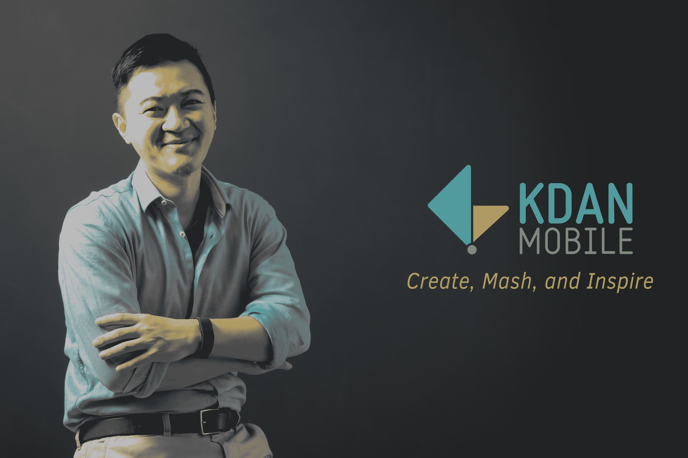

# 台湾初创公司 Kdan Mobile 为其基于云的内容创作工具 TechCrunch 筹集了 500 万美元的 A 轮融资

> 原文：<https://web.archive.org/web/https://techcrunch.com/2018/04/16/taiwanese-startup-kdan-mobile-raises-5m-series-a-for-its-cloud-based-content-creation-tools/>

Kdan Mobile 创始人兼首席执行官 Kenny Su

为内容创作者制作基于云的软件的台湾初创公司 Kdan Mobile 今天宣布了 500 万美元的 A 轮融资，投资者包括 W.I. Harper Group、Darwin Venture Management 和 Accord Ventures。这家成立于 2009 年的台南市初创公司表示，其产品已被下载超过 1.2 亿次，其中约 40%的客户位于美国。

到目前为止，Kdan Mobile 的 A 轮融资总额达到 650 万美元。这笔资金将用于产品开发，包括基于区块链的文档加密和实时协作功能，以吸引企业和教育用户。该公司还计划在美国和中国这两个增长型市场加大用户获取力度。

Kdan Mobile 的产品包括 Creativity 365 和 Document 365，前者是一款软件套件，配有移动动画制作和视频编辑器，后者是去年推出的，旨在吸引企业用户。该公司最近还开始为企业和教育机构提供新的订阅计划，并声称其名为 Kdan Cloud 的云平台现在拥有超过 350 万名成员。

创始人兼首席执行官 Kenny Su 表示，Kdan Mobile 正在寻找新的合作伙伴，以便在日本等市场建立更大的影响力。苏告诉 TechCrunch，Kdan Mobile 的 A 轮投资者之一 Accord Ventures 位于东京，Kdan Mobile 可能会开始向该国的动画产业进行营销。该公司已经与台湾移动服务提供商 GMobi、Jot 手写笔制造商 Adonit 和中国宁波的设计共享平台 LKKER 建立了合作关系。

苏说，Kdan 的产品区别于谷歌、微软、Adobe 和其他主要竞争对手的云软件的一个方面是，它专注于艺术家、设计师和其他创意专业人士。Kdan 的产品还允许用户在移动设备上开始项目，然后再转移到桌面应用程序。正如谷歌文档、Office 365 或 Adobe Creative Cloud 的许多用户所发现的那样，在移动设备上访问它们比在桌面上感觉要尴尬得多。然而，Kdan Mobile 成立时，智能手机和平板电脑的使用正变得越来越普遍，其产品是专门为移动设备开发的。

“我们试图填补这一空白，帮助用户在移动设备上创建内容，然后让他们在桌面环境中完成这些内容，不仅使用我们自己的工具，还可以通过导出到其他地方，包括 Adobe，”苏说。

Kdan Mobile A 轮融资的一部分也将用于研究该公司如何在其产品中增加人工智能的使用。Kdan Mobile 已经通过分析用户在其内容共享平台上上传和推荐的内容，使用机器学习算法来改进其软件。

在一份新闻声明中，W.I. Harper 集团董事总经理 Y.K. Chu 说:“我们对 Kdan 领先的开发技术和全球视野感到震惊。我们很高兴成为他们发展计划的一部分，并期待与他们一起成长。”