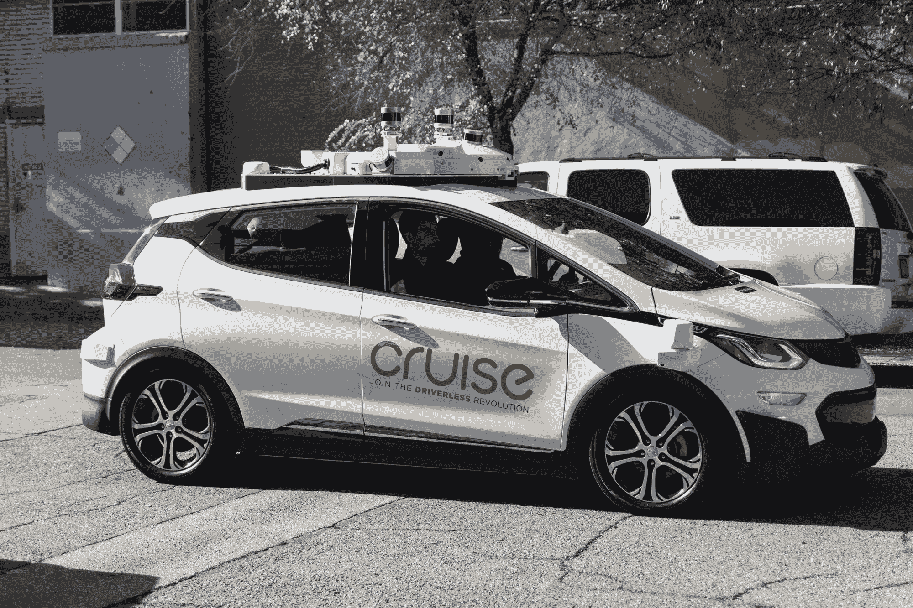
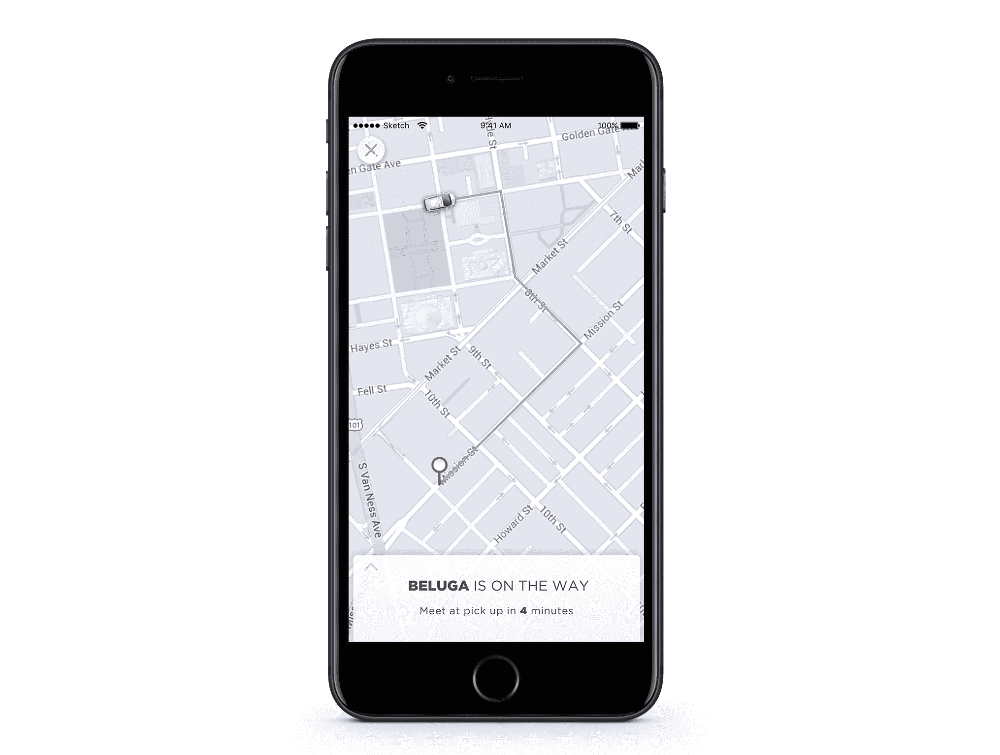

# 乘坐 Cruise 的自动驾驶 Bolt EV  在旧金山兜风

> 原文：<https://web.archive.org/web/https://techcrunch.com/2017/11/29/taking-a-ride-through-sf-in-cruises-self-driving-bolt-ev/>

昨天，我在旧金山叫了一辆车，在没有司机帮助的情况下到达目的地并返回。

通用汽车的 Cruise 拥有一支无人驾驶汽车车队，几乎一直在旧金山的街道上漫游，收集数据并提高其自动驾驶性能，最终目标是支撑该汽车制造商未来的商业无人驾驶产品。到目前为止，员工和投资者都有机会乘坐测试车——但公司以外的人都没有这个机会，直到克鲁斯本周让我和其他几位记者在这座城市里兜风。

改装后的 Bolt EV 是第二代巡航测试车(目前只有少数第三代车上路，计划很快生产更多)，它的旅程包括将车开到旧金山 Dogpatch 社区的一个地方，从三个可用的目的地中选择一个，然后装入车内开始旅程。

Cruise 的应用程序(在员工的 iPhones 上)与你可能遇到过的其他叫车应用程序类似，主要由地图占据，具有简单的界面元素，可以启动呼叫并在车辆到达时通知你。Cruise 的一位用户体验设计师解释说，我们看到的应用程序基本上与 Cruise 员工现在可以用来招呼乘客的应用程序相同，这是一种先到先得的服务。

在车内，相同的基本设计元素用于安装在驾驶员和前排乘客座椅头枕上的两个平板显示器，以及另一个安装在前方中央的平板显示器。它们首先通知你系好安全带，然后还显示由汽车传感器和车载计算机反馈的实时信息，包括检测到的建筑物、路上的其他车辆、行人和骑自行车的人。

车内显示器还会向您显示即将到来的转弯、合并和其他导航细节的信息，以便您了解即将发生的情况，以及汽车在决定其路线方面正在做什么。一条绿色气泡线投射出它的即时路线，颜色让你知道自动驾驶系统正在工作。

其他指示器会根据需要弹出，包括意外暂停的简要说明，以及当你在十字路口停下来时的交通灯状态。这是一个非常简洁的界面，但它回答了你关于汽车正在做什么以及为什么做的大多数问题，没有任何信息过载。

在我大约 15 到 20 分钟和 2.4 英里的驾驶过程中，我肯定会寻找 Cruise 测试车所做的一些驾驶“选择”的额外背景显示。在我们骑行之前，Cruise 创始人凯尔·沃格特(Kyle Vogt)提醒我们，这些汽车首先是为了安全而优化的，而不是为了舒适(他说，迄今为止只有 2%的开发时间专注于舒适，而绝大多数时间都用于安全)，车辆意外减速或停止了几次，比我预计的人类出租车、优步或 Lyft 司机在相同情况下的突然减速更多。

一辆巡航二代自主测试车。

在一个这样的例子中，当一辆樱桃采摘车延伸到右侧的车道时，巡航测试车停下来，后面有一辆车驶来。它选择暂停一会儿，打开闪光灯，让靠近的车辆通过，同时确定如何最好地通过樱桃采摘机，尽管没有任何迎面而来的车辆，左侧也有足够的空间。这辆车似乎非常清楚地在评估它的选择，并决定采取最安全的路线，不做任何事情，直到它确定已经对当前的情况进行了正确的分析。

然而，即使在这种暂停的情况下，自动驾驶系统也没有脱离，安全驾驶员(技术上来说是“自动驾驶车辆训练员”，包括驾驶员和乘客座位上的分析师)从来没有必要采取手动控制。这是这次旅行的决定性和最重要的收获——它在没有人为干预的情况下管理了旧金山市中心，克服了一系列不同的挑战，包括行人在街道中间从我们面前穿过，自行车骑手与我们的道路相交，以及建筑阻挡了车辆的大部分指定车道。

这与我去年在旧金山进行的最后一次“自主”试驾形成了鲜明的对比——去年在优步的自主沃尔沃 SUV 上。这涉及到频繁脱离安全驾驶员，相比之下，Cruise 的演示在技术成熟度方面似乎遥遥领先。

与乘坐 Waymo 的车辆(在封闭的赛道上，在其城堡测试设施中)相比，Cruise 的乘坐感觉更慢，更不稳定，更不“人性化”——但通用汽车和 Cruise 都表示，目前的重点是安全和达到人类水平的主要技术障碍，像“舒适性”这样的考虑因素在“自动驾驶需求层次”中排名更高，因此在开发优先事项方面延伸得更远。

乘坐克鲁斯的车最终让我不再担心我的安全或健康，或我周围人的安全。有一次，当一名行人已经在十字路口的远端进入人行横道时，它确实在十字路口右转，这是我对人类司机的期望，但这可能不[严格符合加利福尼亚州](https://web.archive.org/web/20230324202402/http://www.vititoelawgroup.com/blog/2017/01/do-pedestrians-have-the-right-of-way-in-california.shtml)的道路规则。同样，考虑到汽车和行人之间的距离，这也是我在相同情况下可能会做的事情，但这似乎与该系统一直保持高度谨慎的做法略有不同。

乘坐 Cruise 的测试车是否让我觉得自动驾驶已经接近商业化了？尽管出现了一些小问题，但它确实做到了:毕竟，这是一家初创公司在短短三年内成功建造的——一辆可以在繁忙的路线上导航的汽车，在 2.4 英里的路程中与 114 辆汽车、4 辆自行车和一些行人共享道路(是的，他们真的一直在计算)，同时完全自动运行。如果 Cruise 能在三年内实现这一目标，那么想象一下它在三年内能做什么，让我乐观地看到自动驾驶成为许多人的变革性体验。