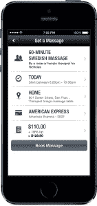
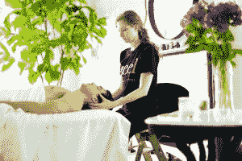

# Zeel 在迈阿密、洛杉矶和旧金山湾推出按需按摩服务 

> 原文：<https://web.archive.org/web/https://techcrunch.com/2014/08/29/taking-massage-on-demand-nationwide-zeel-rolls-out-in-miami-la-and-sf-bay/>

这比他们最初计划的时间晚了一年，但是 Zeel 终于将其按需按摩服务从纽约扩展到了美国更多的城市——在湾区、洛杉矶和迈阿密。

这是创造首席执行官萨梅尔·哈马德所说的至少十亿美元业务的下一步。“我们相信我们正在创造一些独特而有趣的东西，”哈马德说。“我们相信我们可以遍布全球 200 多个城市，这是一个十亿美元以上的收入机会。”

目前，Zeel 的按摩治疗师只在美国四个最大的大都市地区营业。从南湾到东湾、大洛杉矶和南佛罗里达(从迈阿密到棕榈滩)的海湾地区的顾客现在可以在[为自己治疗](https://web.archive.org/web/20221007032124/http://www.youtube.com/watch?v=ZsABTmT1_M0)。

Zeel 于 2013 年 4 月在纽约推出了按需按摩服务，此前它于 2012 年初开始作为替代健康从业者的 ZocDoc。在第一年，Hamadeh 和他的团队注意到有一个类别是迄今为止最受顾客欢迎的——按摩。

“我们最终用旧的 Zeel 预订了 15，000 次按摩，按摩占了预订的一半以上，”Hamadeh 说。通过其婚介和预订服务，Zeel 注意到大多数按摩被安排为更多的冲动购买。“如果按摩预订两天或两天以上，取消率将达到 28%，”Hamadeh 说。“55%的请求在四小时内完成。这个行业并不是为了提供四小时内的按摩服务而建立的。

除了基本的预订物流，行业专业人士对当前的预约系统也有问题，还有提供“在家”按摩的安全问题。Zeel 通过为按摩治疗师(他们必须在 Zeel 运营的每个州获得许可或认证)和客户(他们在建立账户时必须通过 Experian 验证身份)提供审查系统来解决这一问题。

虽然安全是按摩治疗师的一个考虑因素，但补偿是另一个——这也是 Zeel 称其击败传统竞争对手的另一个领域。按摩的费用大约相当于在一个不错的水疗中心进行一次治疗的费用，在曼哈顿，60 分钟的按摩价格(含税和小费)从大约 141 美元到 159 美元不等，在旧金山湾区从 117 美元到 130 美元不等，这取决于客户的家中或公寓中是否有按摩台。Zeel 还提供“Zeelot”会员计划，客户在纽约市每月支付 121.88 美元的按摩费，在迈阿密、洛杉矶或旧金山及周边县每月支付 99.12 美元的按摩费。Hamadeh 说，即使是这样的价格，治疗师也能比在水疗中心多赚 75%。

在过去的一年半时间里，这项服务已经在纽约开展起来，提供了数万次按摩。Zeel 在纽约有 420 名治疗师，在南佛罗里达有 170 名，在洛杉矶有 150 名，在湾区有近 150 名。它在整个夏天开始测试其服务，现在准备在这些地区上线。该公司的应用程序可用于 iOS 和 Android 设备，新客户可以通过特殊代码“LAUNCH”获得 25 美元的首次按摩优惠。

为了支持该公司的持续增长，Zeel 在去年年底悄悄回到市场，在第二轮种子轮融资 175 万美元，投资者包括 Lightbank 和 Corigin Ventures，Prolog Ventures 也与之前支持该公司的几位天使投资者一起投资了该轮融资。

Hamadeh 说，把按摩带到顾客家门口已经打开了以前没有考虑按摩的一个新的顾客范围。该公司大约 72%的订单是在下午 5 点以后收到的。其中大约 26%发生在晚上 9 点到 10 点 30 分之间。

就业信息交换机构 Vault.com*的前首席执行官 Hamadeh 来到 Zeel，他认为该公司可以让替代医疗健康从业者的市场更加透明，就像 Vault 寻求让就业市场更加透明一样。

在未来一年左右的时间里，全国各地的客户应该会看到 Zeel 的服务扩展到更多的地区，因为该公司希望在 2015 年第一或第二季度进行新一轮重大融资。“这将是一个大回合，”哈马德说。“这就是现在世界的本质。如果你试图建立一个全球性的本地服务企业，你需要大量的现金，如果你想领先于所有人的话。”

*为了完全公开起见，我和 Ed Shen 是朋友，他曾是 Vault.com 的员工，现在是 Zeel 的员工。