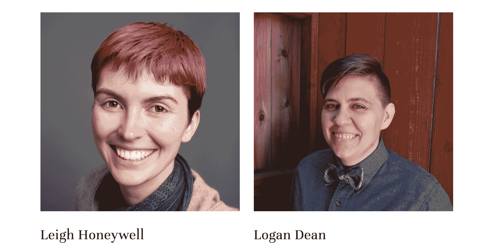

# Tall Poppy 旨在让在线骚扰防护成为员工福利

> 原文：<https://web.archive.org/web/https://techcrunch.com/2018/07/22/tall-poppy-aims-to-make-online-harassment-protection-an-employee-benefit/>

对于近 20%经历过严重网上骚扰的美国人来说，最新一批 Y Combinator 中有一家名为 [Tall Poppy](https://web.archive.org/web/20230324115609/https://tallpoppy.io/) 的新公司正在为他们提供反击的工具。

Tall Poppy 由 Leigh Honeywell 和 Logan Dean 共同创建，源于安全专家 Honeywell 至少自 2008 年以来一直在从事的追捕网络社区中的巨魔的工作。

那一年，霍尼韦尔第一次追踪一个特别有害的人，他花时间向各个 Linux 社区的妇女发送死亡威胁。霍尼韦尔与执法部门合作，试图追踪巨魔，并最终在调查人员访问后将评论者藏了起来。

这一早期的成功让霍尼韦尔白天成为微软(Microsoft)、Salesforce 和 Slack 等公司的安全专家，下班后则成为网络骚扰的捍卫者。

“我从事这项工作是一件偶然的事情，”霍尼韦尔说。"作为网络女权主义者，这是一种职业风险."

霍尼韦尔开始与在线骚扰的受害者进行一对一的工作，这些受害者会被直接转介给她。

霍尼韦尔说:“当人们开始使用#metoo 时，我与一些知名人士一起工作，从根本上做好准备。“当人们感觉失去安全感时，帮助他们找回安全感是一项令人满意的工作。”

随着转诊人数开始攀升(最终达到数百例)，霍尼韦尔开始考虑如何将她的方法系统化，以便尽可能让更多的人受益。

霍尼韦尔表示:“我们这样做的原因是为了帮助扩大规模。“就像计算机安全中的一切一样，这是一场军备竞赛……当你学会打击滥用时，滥用者会采用技术并学习新的策略和方法来绕过它。”

霍尼韦尔说，首先，Tall Poppy 将提供一个教育工具包，帮助人们锁定自己的存在，并妥善应对事件。该公司将与客户合作，以了解如何保护自己，但也要了解每个州的法律，他们可以用来保护自己和惩罚攻击者。

**问题的范围**

根据皮尤基金会进行的研究，仅在美国就有数百万人可以从 Tall Poppy 旨在提供的服务中受益。

根据 2017 年的一项研究，“近五分之一的美国人(18%)在网上遭受过特别严重的骚扰，如身体威胁、持续骚扰、性骚扰或跟踪。”

在这些攻击中首当其冲的妇女和少数民族(让我们明确一点，首当其冲的主要是妇女和少数民族)，面临着这些虚拟攻击带来的非常真实的后果。

以纽约校长[失去工作](https://web.archive.org/web/20230324115609/https://jezebel.com/revenge-porn-took-my-career-the-law-couldnt-get-it-bac-1827572768)为例，她的前男友将她偷拍的照片寄给《纽约邮报》和她的老板。在 Jezebel 的一篇强有力的文章中，她写下了自己被骚扰的后果。

> 结果，城市调查员护送我离开了学校，等待调查。随后的调查很快表明，我是被施虐者陷害的。尽管如此，比尔·白思豪市长的政府还是把我从校长降为教师，把我的工资减半，并把我送到了一个橡胶室，这是能源部臭名昭著的再分配中心，数百名不受欢迎的员工在这里饱受煎熬，直到他们被解雇或被遗忘。
> 
> 2016 年，我向能源部请了一年的病假，以治疗极度的创伤后压力和焦虑。由于假期几乎完全没有工资，我用自己的养老金贷款来维持生活。2017 年初，我的钱用完了，我回到了司法部，在那里我很快被送到了 T2 的一个行政审判。在那里，这座城市试图终结我。我被指控犯有八项不当行为，尽管各方的结论是，我的前伴侣将照片上传到了电脑上，而且没有证据支持他的淫秽故事。我被指控给学校系统带来了“广泛的负面宣传、嘲笑和恶名”,以及“未能保护好教育部的电脑”,免受我虐待的前任的伤害。

她的故事并不独特。网上骚扰的受害者经常面临网上骚扰的严重后果。

根据 2013 年《科学日报》的一项研究，网络跟踪受害者通常需要请假，或者换工作或辞职。研究称，跟踪受害者平均花费 1200 美元来解决骚扰问题。

霍尼韦尔说:“这是一个普遍的问题，平台在很多方面都有失误。

Tall Poppy 的联合创始人

**创造高大的罂粟**

随着霍尼韦尔听到越来越多的网上恐吓和攻击的故事，她开始为最终成为 Tall Poppy 的服务奠定基础。通过一个共同的朋友，她找到了 Dean，一位才华横溢的程序员，在 Ticketfly 收购 Eventbrite 之前一直在 ticket fly 工作，正在寻找新的机会。

那是 2015 年初。但是，由于担心独自创业会影响她的公民身份(霍尼韦尔是加拿大人)，她和迪安在最终创办公司之前一直在等待。

最终说服他们的是唐纳德·特朗普的当选。

霍尼韦尔说:“选举后，我和自己进行了一次坦诚的交流……我决定我可以搬回加拿大，但我想留下来战斗。”

最初，霍尼韦尔与美国公民自由联盟(American Civil Liberties Union)进行了为期一年的合作，以接手由克里斯·索戈伊恩(Chris Soghoian)负责的隐私和安全工作，克里斯·索戈伊恩已离开，在参议员罗恩·怀登的办公室任职。

但是高个波比的想法仍然存在，一旦霍尼韦尔获得绿卡，她就“迫不及待地想要创办这家公司。”

在该公司的几个月里，已经有一些企业注册了它提供的服务和工具，以帮助公司保护员工。

一些平台已经采取了一些措施来应对网络骚扰。例如，[脸书发起了一项倡议，让人们上传他们的裸照](https://web.archive.org/web/20230324115609/https://gizmodo.com/give-your-nudes-to-facebook-1826545511),这样社交网络就可以监控类似的图片何时被发布到网上，并联系用户以查看发布是否是自愿的。

与此同时，Twitter 对其算法进行了一系列修改，以打击在线滥用。

“人们感到震惊和恐惧，人们正在尝试这一点，”霍尼韦尔说。“[但是]骚扰者造成最大伤害的方式是什么？将它们分享给脸书是它们造成最大破坏的方式之一。这是一次有价值的实验。”

为了强调在线骚扰是一个多么普遍的问题，o 在该公司正在开展业务或可能在第一个半月开展业务的四家公司中，已经有一个公司正在解决这个问题。

霍尼韦尔说:“这是一个需要解决的重要问题。"我反复意识到骑兵不会来了。"