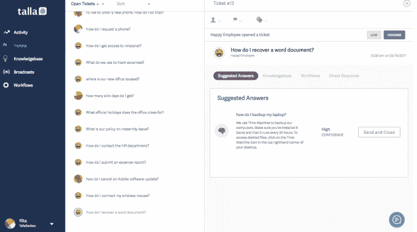

# Talla 服务机器人让它轻松进入 AI 

> 原文：<https://web.archive.org/web/https://techcrunch.com/2017/04/05/talla-service-bot-lets-it-ease-into-ai/>

塔拉，马萨诸塞州剑桥人。初创公司，希望帮助公司轻松进入人工智能，他们已经开发出一种新的服务助理机器人，可以为公司提供他们所寻求的任何程度的智能驱动能力。

该工具名为 ServiceAssistant，作为 Slack 或微软团队内部的 IT 或人力资源服务台，为客户提供一些如何使用它的选项。首先，您可以像传统服务台一样运行它。用户通过 ServiceAssistant 发送请求，请求由人工处理和回答。

在第二种情况下，客户轻松进入自动化，ServiceAssistant 提供自动答案，在发送给提问者之前由人工检查，或者在最高自动化级别，当置信度阈值高于客户设置的特定级别时，系统简单地发送答案。

首席执行官兼联合创始人罗布·梅(Rob May)表示，该公司故意使用内部服务模型，而不是实时客户，因为在审查这项技术后，他觉得当前的自然语言处理(NLP)技术更适合这种方法。

Talla ServiceAssistant 看起来像 Slack 或微软团队中的任何用户。与任何 Slack 或 Teams bot 一样，员工可以通过提问与它进行交互。例如，如果它被调整为人力资源助理，员工可能会问，“我们有劳动节假期吗？”如果系统已经被配置为自动回答，这种问题它可以高度肯定地回答，并且可以简单地告诉员工是或不是。

在 IT 帮助台方法中，问题可能会变得更加棘手，例如，“我如何访问 QuickBooks？”在这种情况下，系统可能会找到多个匹配项，如果它被设置为自动回答，它可以要求提问者选择最相关的一个，或者它可以询问他们是否希望打开帮助台票证，以将问题转到人工处理。

照片:塔拉

该系统被调整为在不理解时提问，并从回答中学习。由于人们以非标准的方式提问，系统也可以学习到“我们是开放劳动节吗？”和“我们有劳动节假期吗？”或者“劳动节办公室关门了吗？”

May 表示，即使在 Slack 或团队使用率很高的公司，也可能有多达 20%的员工不使用该工具，因此他们也建立了一个网络应用程序并允许电子邮件，但最终目标是让人们进入对话工具来提问——并尽可能以自动化的方式进行。

然而，该公司希望不仅仅是一个对话机器人。它希望成为处理 It 和人力资源请求的中心。这意味着要有一个票务系统、一个知识库和向员工广播的能力，例如，当系统停机维护或办公室放假时。

照片:塔拉

May 表示，在他的客户中，Slack 无疑是目前两种产品中更受欢迎的，但他认为，重要的是要看看不同的对话工具，并不断评估市场的发展方向，因为它仍在建立中。

“两年内，(对话市场)的分裂会是什么样子，这是我们最大的战略担忧之一，”梅说。

这家公司很大程度上是一家拥有 16 名员工的初创公司。它已经筹集了 450 万美元。梅之前是云初创公司 Backupify 的联合创始人，该公司于 2014 年被出售给 Datto。