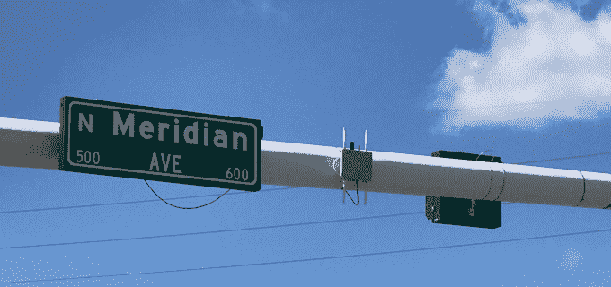
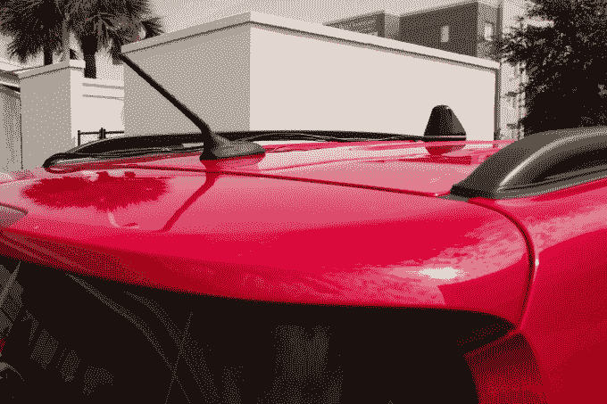
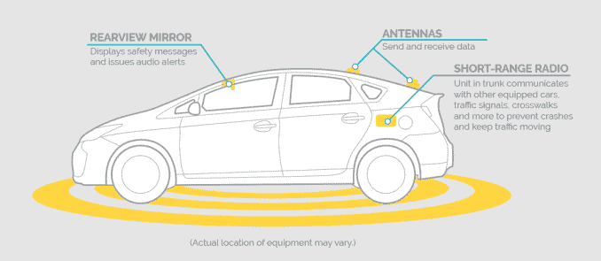

# 坦帕提供其联网汽车技术项目的首次演示，于 2018 年推出 1600 辆汽车 

> 原文：<https://web.archive.org/web/https://techcrunch.com/2017/11/13/tampa-offers-first-demo-of-its-connected-vehicle-technology-project-launching-with-1600-cars-in-2018/>

坦帕成为智能城市的目标在周一得到了展示，坦帕希尔斯堡高速公路管理局举办了联网汽车技术研究项目的首次公开演示，该项目将于 2018 年启动试点测试。该项目涉及为 1600 辆私人拥有的车辆配备与道路和其他汽车通信的技术，以便接收关于道路状况、限速变化、危险等的各种警告和警报。

该项目还将连接该地区的 10 辆公共汽车，与交通信号进行通信，然后将优先考虑公共汽车的运动，以便它们能够按时行驶。十辆有轨电车将使用这项技术来检测另一辆联网车辆何时会越过它们的轨道，以减少碰撞的可能性。

一个为 500 名行人测试者配套的应用程序也将是该项目的一部分，但今天没有展出。该应用程序将在各个十字路口发出“行走”警报，如果附近有公共汽车或电车开始行驶，它将发出声音信号。

*上图:安装在坦帕子午线大道的路边装置*

这项技术的部署是[坦帕联网汽车试点项目的一部分，](https://web.archive.org/web/20221208211211/https://www.tampacvpilot.com/)是全美仅有的三个大规模联网汽车系统实施项目之一。

在美国交通部拨款的资助下，相关的试点项目也正在纽约州的[和怀俄明州的](https://web.archive.org/web/20221208211211/http://www.cvp.nyc/)[进行，每个项目都有不同的目标。](https://web.archive.org/web/20221208211211/https://wydotcvp.wyoroad.info/)

例如，在纽约，目标是在密集的城市环境中测试联网车辆。与此同时，怀俄明州的项目专注于为 I-80 沿线的卡车提供装备，I-80 是一段由于极端天气(如吹雪、大雾和大风)而经常处于危险状态的道路。

然而，坦帕是三个联网汽车项目中唯一一个涉及当地居民驾驶自己汽车的项目。

*上图:联网汽车上的天线*

据我们所知，该市击败了北卡罗来纳州的夏洛特市和宾夕法尼亚州的匹兹堡市，获得了交通部 2100 万美元的拨款。

值得注意的是，该项目代表了坦帕的一大胜利，因为它的目标是成为[智能城市技术的中心。](https://web.archive.org/web/20221208211211/https://www.huffingtonpost.com/entry/tampa-bay-on-the-path-to-becoming-a-smarter-city_us_59761930e4b0f1feb89b4555)

这座城市的规模和白天关闭部分道路的能力已经使其成为举办自动驾驶汽车测试的理想场所。

坦帕最近还与 Dreamit 合作推出了专注于智能城市初创公司的城市技术加速器。这个孵化器是一个更大的 30 亿美元的市中心振兴计划的一部分，该计划由房地产开发商兼坦帕湾闪电所有者杰夫·维尼克和比尔·盖茨的卡斯卡迪亚基金支持。

坦帕独特的交通拥堵问题和中等规模的市中心也帮助它获得了美国交通部的联网车辆拨款。

例如，在坦帕的 Lee Roy Selmon 高速公路的双向车道上，往返的通勤者经常在早上通勤期间经历延误和追尾事故。

坦帕市首席交通管理工程师 Vic Bhide 解释说:“整个想法是让司机意识到他们的环境——什么时候灯要变了，或者前面是否拥挤，或者人行横道上是否有行人。”“这个试点是关于车辆，关于基础设施，关于行人，最终也是关于自行车，”他说。

在坦帕的项目中，志愿者司机将为他们的车辆配备智能后视镜，它可以传达各种警报，包括当车辆检测到前方其他车辆减速或停止时；如果驾驶员在道路上朝着错误的方向行驶；如果速度限制改变；如果有行人挡住了他们的路；和其他信息。

汽车也将有发送和接收数据的天线，一个用于音频警报的扬声器和一个用于与其他汽车、灯和人行横道通信的短程无线电。

西门子正在开发 40 个路边单元，这些单元将使用专用的短程通信技术(DSRC)与联网车辆以及城市交通管理中心进行通信。

[gallery ids="1566794，1566790"]

*上图:西门子路边装置，特写*

我们被告知，路边单元的安装成本约为 11，000 至 12，000 美元，预计可以使用 10 至 20 年，因为随着更新的无线技术的出现，内部的 SIM 卡可以更换。

来自车辆的数据将显示在坦帕交通管理中心的仪表板式界面上，显示旅行时间、速度和拥堵情况等信息。仪表板是西门子音乐会软件的一部分，它也可以整合闭路电视信号，并且可以升级到包括停车位信息。

在此之前，这类流量数据需要手动跨来源收集。新的仪表板将把联网车辆信息引入一个易于阅读的界面。

[gallery ids="1566792，1566791"]

*上图:坦帕的运输管理中心；西门子的音乐会软件*

另一家供应商 Brandmotion 正在与无线电提供商 Savari、Commsignia 和 Sirius XM 合作，提供安装在汽车上的车载单元。

周一，坦帕希尔斯堡高速公路管理局(THEA)允许与会者在封闭的道路上乘坐联网汽车，以展示警报如何应对交通堵塞、错误方向警告和限速变化等情况。

该系统在测试期间如承诺的那样工作，在智能镜上向司机发出警告，并不时发出声音警报。

[https://web.archive.org/web/20221208211211if_/https://www.youtube.com/embed/fTxhaLL5B6A?feature=oembed](https://web.archive.org/web/20221208211211if_/https://www.youtube.com/embed/fTxhaLL5B6A?feature=oembed)

视频

坦帕的项目为期 18 个月，其更大的目标是收集真实世界环境中联网车辆的信息，包括系统与不同供应商的互操作性，司机界面应该是什么样子，城市需要什么样的基础设施，以及它对交通模式和道路事故的影响。

但这也是未来系统将联网汽车技术与自动驾驶汽车相结合的第一步。这将使更智能的汽车不仅能在驾驶时感知周围的事物，还能意识到自己在更大的交通流量中的位置。

当然，总的来说，互联网连接技术总是存在隐私问题。

然而，我们被告知从该项目中收集的数据不包括个人身份信息，如司机姓名、驾照号码、车辆识别号等。取而代之的是，汽车只被分配一个 ID 号来区分彼此。

[gallery ids="1566783，1566788，1566793，1566789，1566787，1566785，1566786"]

*上图:显示在演示装置上的警告信息示例*

除了与这项技术相关的驾驶员安全组件(有朝一日保险公司可能会鼓励使用这种系统的考虑因素)，收集的数据可以帮助城市就基础设施需求做出更好的决策。

“一个简单的例子是，我们根据安全因素设计设施，比如发生了多少起车祸，”Bhide 说。“如果没有足够多的崩溃，我们不建议进行某些改进。但可能会有很多侥幸脱险的情况，”他补充道。“我们真的需要等到崩溃时才会有(改善)发生吗？”

坦帕市仍在招募司机自愿参与该项目，并为部分通行费提供 30%的折扣作为奖励。除了敞篷车(由于天线的安装位置)，任何车龄在 10 年以下的车辆都有资格配备这项技术。

已经有 1300 名司机通过预先筛选程序提出申请，约 800 名司机已经预约由希尔斯堡社区学院贸易学院的技术人员安装该系统。

坦帕互联汽车项目于 2018 年初启动，首先在志愿者的车辆上安装设备。面向行人的应用程序也将于 2018 年春季推出。

[https://web.archive.org/web/20221208211211if_/https://www.youtube.com/embed/Rw4TtGq3HzI?feature=oembed](https://web.archive.org/web/20221208211211if_/https://www.youtube.com/embed/Rw4TtGq3HzI?feature=oembed)

视频