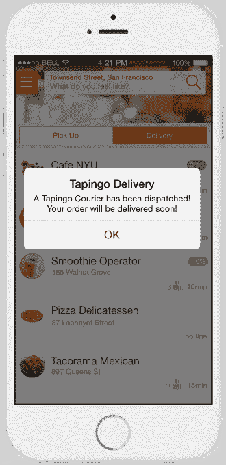

# Tapingo 推出了一项由学生运营的送货服务，以及其他新的订购选项

> 原文：<https://web.archive.org/web/https://techcrunch.com/2015/08/25/tapingo-launches-a-student-run-delivery-service-plus-other-new-ordering-options/>

随着学生们本周重返大学校园，Tapingo 推出了三项新功能，目前在所有 125 所使用手机订餐服务的学校都可以使用。

一个普通的校园咖啡店每天处理 300-500 个 Tapingo 订单，一个繁忙的场所接收超过 800 个订单，这个平台已经发展到在一些大学校园里家喻户晓的地步。

该公司在 4 月份筹集了[2200 万美元的 C 轮](https://web.archive.org/web/20230304000332/https://techcrunch.com/2015/04/02/tapingo-orders-up-22-million-in-series-c-funding-to-grow-beyond-the-college-market/)，现在每天处理超过 25000 笔交易，平均用户每周下 4 个订单。

## Tapingo 交付

第一个功能是 Tapingo Delivery，这是一种按需交付服务，它将使初创公司与经验丰富的竞争对手竞争，如 [GrubHub](https://web.archive.org/web/20230304000332/https://www.grubhub.com/) 和 [Postmates](https://web.archive.org/web/20230304000332/https://postmates.com/) 。

然而，与其他交付应用不同，Tapingo 的服务将完全由学生组成。这项服务还被设计用于校内或校外的餐饮选择，学生将能够使用校园餐费来支付食物。

Tapingo 的首席执行官 Daniel Almog 解释说，在所有竞争对手中，该公司处于独特的地位，可以提供尽可能最低的运费。Almog 说，这是因为在大学校园这样的密集区域送货意味着学生快递员的效率非常高，每小时可以交付 3-4 个订单。

学生快递员将按照自己的时间表工作，并可以选择在任何时候接受快递时打开应用程序。该公司表示，学生甚至可以在为自己挑选食物时打开该应用程序，并最终接受订单带回到宿舍或图书馆。

Almog 解释说，这种灵活的工作时间表将把快递员置于独立承包商地位的极端一边，公司很乐意将快递员归类为 1099 名员工。

Tapingo Delivery 将于今年秋天在几十个校园推出，但该公司预计该服务将于今年年底在所有 125 个校园推出。

## 预定订单和快速挑选

Tapingo 推出的另外两个功能旨在增加平台上一些最繁忙场所的订单数量。

第一个功能是预定订购，允许学生提前 36 小时订购，以便在特定时间取货。虽然这个概念看起来很简单，但阿尔莫格解释说，热门场馆的容量问题使它变得极其复杂。

例如，Tapingo 上一些最受欢迎的咖啡店在高峰时段一分钟就能收到不止一份订单。该公司解释说，它需要在后端仔细排队并区分订单的优先级，以便某些时间段不会完全拥挤。

最后一个功能是快速挑选，让场馆识别出准备时间最少的项目(比如一瓶水)，这样学生就可以立即订购。这意味着学生将能够订购某些商品，并绕过标准等待时间。以前，所有 Tapingo 订单都将保持在同一队列中，无论是劳动密集型饮料还是一瓶苏打水。

这两项功能现已在所有校园上线，并将在整个学年推广到更多学校。

*披露:2013 年秋天，我是 Tapingo 的校园代表。*