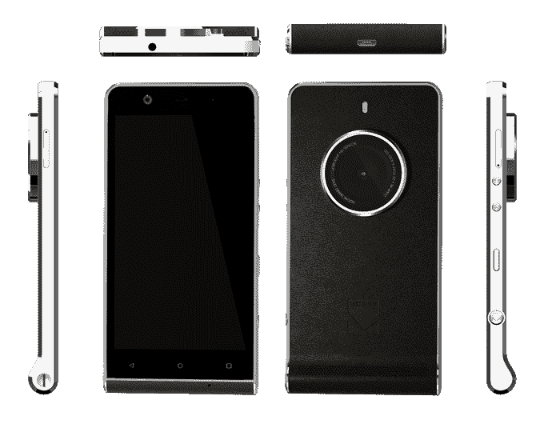
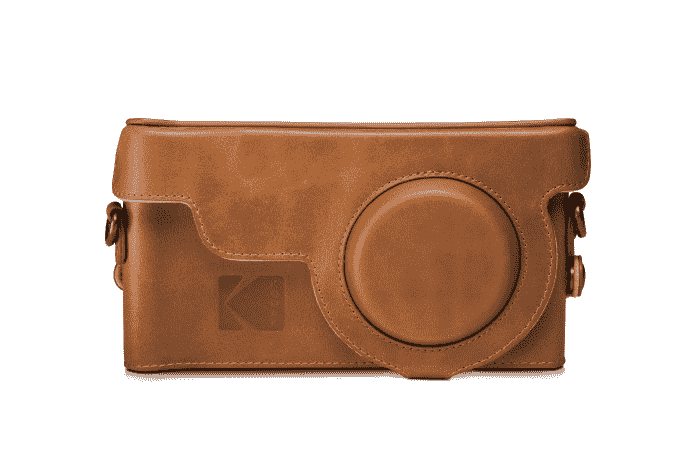

# 挖掘照片历史，449 Kodak Ektra 智能手机将相机机械置于前沿和中心 

> 原文：<https://web.archive.org/web/https://techcrunch.com/2016/10/20/tapping-into-photo-history-the-449-kodak-ektra-smartphone-puts-camera-mechanics-front-and-center/>

一周以来，关于一款新手机争相拥有世界上最好的智能手机相机的讨论一直不绝于耳，另一款专注于照片的设备[柯达 Ektra](https://web.archive.org/web/20221206220826/http://www.kodakphones.com/) 也公开亮相(在本月早些时候被[取笑](https://web.archive.org/web/20221206220826/https://beta.techcrunch.com/2016/10/06/kodak-teases-a-new-phone-for-an-october-20-reveal/)之后)。Ektra 今天在英国推出，最初仅在欧洲销售，售价 449 英镑(550 美元)，希望吸引摄影爱好者——在这种情况下，通过使用更具标志性的媒介品牌之一，[柯达的](https://web.archive.org/web/20221206220826/http://www.kodak.com/)20 世纪 40 年代 Ektra 相机，以及一些更现代的铃铛和哨子。

柯达首席执行官杰夫·克拉克(Jeff Clarke)在一份声明中表示:“柯达在成像技术方面有着丰富的历史，今天推出的柯达智能手机表明，我们一直致力于将摄影技术的最新进展带给消费者。”。“最初的柯达 EKTRA 相机于 1941 年推出，在其最新的轮回中，为所有关心摄影的人打开了一个充满创意机会的世界。”

值得注意的是，与 2015 年推出的前一款[柯达智能手机](https://web.archive.org/web/20221206220826/http://www.techmeme.com/150106/p40#a150106p40)一样，柯达 Ektra 并非由柯达自己制造:它是由一家名为 Bullitt Group 的英国公司制造的，该公司已从柯达获得了该品牌和其他一些知识产权的许可(柯达本身[在 2012 年破产后只专注于知识产权](https://web.archive.org/web/20221206220826/http://www.techmeme.com/150322/p2#a150322p2))。

Bullitt 由前摩托罗拉高管共同创建，员工中有许多来自曾经庞大、现在已经消失的欧洲手机制造商的校友，它在很大程度上是现代模块化手机行业的产物(位于苹果和现在的谷歌等垂直集成设备的另一端)。它为许多品牌生产手机，将各种来源的组件和制造整合在一起来生产每一款手机。在 Ektra 的情况下，它们包括相机中的 2100 万像素索尼传感器和 mediatek mt 6797 Helio X20 Deca-core 以及 ARCSOFT night shot 技术。

*与之前的柯达智能手机 IM5 不同，它有意将自己定位为入门级设备，Ektra 专注于更高的目标(并为自己定价):它将自己描述为“为摄影师设计的智能手机”，并将这一承诺应用于硬件和软件。*

在外观上，这款手机借鉴了老式相机的一些设计选择:镜头很大，位于侧面，并有意突出。当你水平拿着手机时，有一个带有柯达“K”的物理“快门”按钮，按下它可以拍照。

外壳本身有一个弯曲的边缘，类似于基于胶片的相机可能必须持有的胶卷。整个设备还包裹在人造革外壳中，让人想起老式经典 35mm 相机的外壳。它也很大很笨重:147.8 毫米 x 73.35mm 毫米 x 近 10 毫米(9.69 毫米)，在镜头伸出的部分宽度扩大到 14.02 毫米。

该公司还为这款手机制作了一个基本的保护套，我觉得有点僵硬，还有一个夹在脖子上的保护套，再次借鉴了经典的相机设计。两者都是皮革制成的。

在里面，手机把它的照相功能放到了前台。这款手机运行在 Android 6.0 的直接(非伪造)版本上，Bullitt 正在“考虑”如何升级到未来的版本(自从 Android 7.1 昨天在 T2 作为开发者预览版发布以来就很方便)。谷歌的相机应用已经被替换，取而代之的是柯达相机应用。

这种体验的核心是围绕屏幕上的“旋转木马”，当你按下它时，它会放大，并使用触觉反馈给你旋转滚轮的感觉，以选择预先设置，如人像、手动、运动、散景(用于模糊的背景和前景的清晰图像)、夜间、HDR、全景、微距、风景和电影/视频。手动模式具有更全面的设置范围，可以修改照片的拍摄方式，类似于 DSLRs 和老式相机。可以实时预览修改。

相机应用程序的一个好的方面是它现在集成了更多的相机编辑应用程序。例如，一旦您拍摄了一张照片，只需轻触预览窗格中的一个小按钮，您就可以立即开始在 Snapseed 中编辑它。

还有一个“Super 8”视频应用程序，可以给你的视频添加滤镜，让它们有一种复古的感觉，手机预装了一套特殊的“编辑精选”照片应用程序，它认为这些应用程序代表了当今市场上数千种照片应用程序中的精华。(Instagram 不在这些之列；它是谷歌自己的提示的一部分，当你第一次打开并激活手机时，可以下载一组核心的社交应用程序。)

智能手机内部也有几个迎合拍照体验的功能。Bullitt 说，2100 万像素的快速对焦相机传感器具有 f2.0 光圈，1300 万像素的前置相机具有相位检测自动对焦 PDAF 和 f2.2 光圈。

所有这一切都很好，但你不得不怀疑谁会购买这款设备，而不是一个真正的高端相机加上一个真正优质的智能手机，并附带一个高质量的相机。

在这种情况下，我觉得选择 Ektra 品牌有点讽刺:当最初的 Ektra 在 1941 年推出时，“它非常创新，功能丰富，实际上在功能方面超过了当代的徕卡和康泰克，”根据一个历史记录。但它可能太聪明了，没能找到它试图进入的市场。

快进大约 30 年，柯达使用 Ektra [的不仅仅是高端设备。看看这个品牌的最新一代会走哪条路，或者柯达品牌是否仍有足够的影响力来吸引拍照者，这将是一件有趣的事情。](https://web.archive.org/web/20221206220826/http://camera-wiki.org/wiki/Kodak_Ektra_200)

Bullitt 告诉我，这款手机将于“今年晚些时候”发售，他们说肯定会在假日购物季之前，但拒绝透露具体日期。该公司目前还在与一系列零售商和几家运营商就销售该设备进行谈判。后者也可能意味着它将以补贴价格出售。

全部功能:

—安卓 6.0(棉花糖)

21MP 快速对焦摄像头传感器的专业结果，采用 with F2.0 双 LED 闪光灯

—1300 万像素相位检测自动对焦前置摄像头，带 F2.2 PDAF

— Helio X20 2.3GHz 十核处理器，3GB 内存

— 32GB 内存，可通过 MicroSD 卡扩展

—高级手动模式–可调节曝光、ISO、焦距(手动/自动)、白平衡、快门速度、光圈(固定 f2.0 主摄像头)

—熟悉的场景选择拨盘体验—包括场景模式智能自动、人像、手动、运动、散景、夜间、HDR、全景、微距、风景、电影/视频

—集成的高质量打印应用程序

— Super 8 录像机

—集成的社交媒体共享

— 3000mAh，带 USB 3.0 型快速充电器