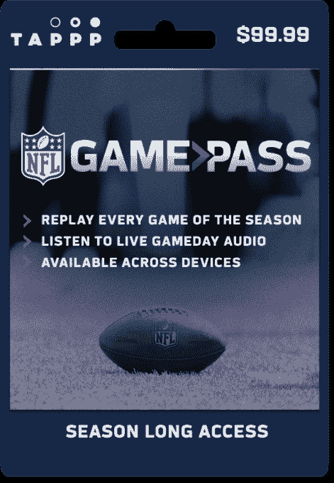

# TAPPP 筹集 500 万美元提供预付费体育直播 

> 原文：<https://web.archive.org/web/https://techcrunch.com/2018/09/05/tappp-raises-5m-to-offer-pre-paid-access-to-live-sports-streaming/>

# TAPPP 筹资 500 万美元，提供预付费体育直播服务

你很可能从未听说过 TAPPP，但你可能知道它的一些客户，如美国职业棒球大联盟(MLB)和美国国家橄榄球联盟(NFL)。如果你曾经在当地超市看到过使用 NFL Game Pass 订阅服务或 MLB 流媒体服务的预付卡，那么你也见过它的产品。TAPPP 的重点是让这些联盟可以通过预付费服务访问这些优质的直播体育内容。

正如该公司今天宣布的那样，它已经筹集了 500 万美元的首轮融资，由 leAD Sports/OurCrowd 的 ADvantage Fund 领投，并获得了帮凶、Elysian Park、Go4it、Courtside VC 和 Sterling.VC 的额外支持

[优势基金](https://web.archive.org/web/20221025222727/https://www.advantagesportsfund.com/)由[领先体育](https://web.archive.org/web/20221025222727/https://www.leadsports.com/)支持，这是一个由阿迪·达斯勒的孙子们发起的体育加速器，你可能知道他是阿迪达斯的创始人。

TAPPP 目前在 5000 多家零售商处有售，包括沃尔玛和 Gamestop。该公司指出，它让无法获得信用卡的无银行账户者和选择不拥有信用卡的消费者都可以参加这些体育赛事。

“TAPPP 非常适合 ADvantage 的首只基金。ADvantage 的合伙人杰里米·普雷斯曼(Jeremy Pressman)表示:“它通过结合传统支付和创新的点播观看体验，为未开发的观众群提供服务，这种方式是独特的，富有创意的。“我们 ADvantage 很高兴有机会利用我们在体育市场的深厚关系，进一步扩大 TAPPP 的覆盖范围。”Pressman 将加入 TAPPP 的董事会。

