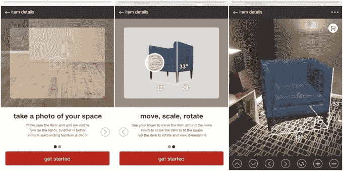

# Target 在其移动网站 TechCrunch 上增加了 AR 购物功能

> 原文：<https://web.archive.org/web/https://techcrunch.com/2017/10/24/target-adds-ar-shopping-to-its-mobile-website/>

Target 正在推出一种使用增强现实技术的新购物方式，最初是在其移动网站上。这项名为“在你的空间看到它”的功能将允许在线购物者通过 Target 的网站使用他们的智能手机摄像头，以查看他们正在考虑购买的家具在他们房间里的外观。

该选项目前仅适用于 Target 的 200 种“Project 62”品牌家居产品，但零售商[表示](https://web.archive.org/web/20221207064229/https://corporate.target.com//article/2017/10/see-it-in-your-space)将在年底前推出数百种产品，包括 Threshold 和 Pillowfort 等其他 Target 家居品牌。到 2018 年，这一数字将达到“数千种”家居装饰产品。

要使用该选项，您需要在目标移动网站的产品详细信息页面中单击“在您的共享空间中查看”按钮。然后，您可以对您的空间拍照，并使用方向箭头和其他控件，或者通过在手机触摸屏上捏和拖动对象来移动、缩放和旋转有问题的产品。

最终结果是产品的照片——如椅子、桌子、架子、橱柜等。在你自己的房间里。

如果您决定立即购买，您可以选择将商品直接添加到出现的图片上的购物车中。

Target 告诉我们，该功能是在过去六个月中内部开发的，并使用 WebGL 技术在浏览器中呈现交互式图形。

未来，零售商可能会考虑将这一技术引入其他平台，如桌面网络和本地移动平台。但这可能取决于该功能的采用和客人的反馈。

“我们首先在移动网络上开发界面，因为我们想更快地接触到更广泛的受众，”Target 发言人向 TechCrunch 解释道。“我们还认为，通过使用移动网络，这是一种简单的体验——客人可以使用手机轻松拍照，他们不必使用任何额外的硬件或应用程序。我们只是觉得这是一次非常简单的经历，”他们说。

当然，Target 不是唯一一家使用 AR 帮助购物的家具零售商。Wayfair 最近还在其移动购物应用程序中添加了增强现实功能。古董和二手家具市场[的 Chairish](https://web.archive.org/web/20221207064229/https://beta.techcrunch.com/2017/03/09/chairish-raises-8-million-to-find-you-furniture/) 也是如此，[的 Housecraft](https://web.archive.org/web/20221207064229/https://beta.techcrunch.com/gallery/here-are-the-best-arkit-apps-for-ios-11-you-should-try-right-now/slide/5/) 也是如此；就在上个月，宜家还是首批采用苹果新 ARKit 技术的公司之一。

此外，家居设计资源 [Houzz 推出了新版本的 View in My Room 3D](https://web.archive.org/web/20221207064229/https://beta.techcrunch.com/2017/09/19/a-new-arkit-app-from-houzz-brings-500000-objects-to-moveable-life/) ，其中包含了 50 万件可以在 AR 中购物的物品。

[亚马逊也有 AR 贴纸](https://web.archive.org/web/20221207064229/https://beta.techcrunch.com/2017/05/24/amazon-adds-shoppable-stickers-to-its-ios-app/)，但它们并不实用或有用——相反，它们是其相机搜索工具的愚蠢附件，并不代表产品的广度。

“在你的空间里看到它”并不是 Target 在其网站上使用增强现实的第一次实验。

这家零售商去年推出了虚拟客厅的 360 度购物体验，看看物品在现实环境中会是什么样子。Target 表示，这一增加利用了 CGI(计算机生成图像),并在发布时与大约 140 种产品合作。

AR 并不是 Target 最近测试的唯一新的移动技术。这家零售商最近还与 Pinterest 合作，将视觉搜索(Pinterest Lens)整合到其应用程序和网站中。这个功能可以让你拍下任何产品的照片，然后与 Target 目录中的其他类似商品进行匹配。