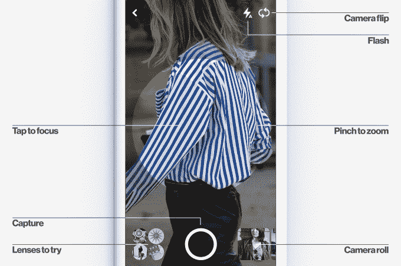

# Target 正在将 Pinterest 的视觉搜索工具添加到其应用程序和网站

> 原文：<https://web.archive.org/web/https://techcrunch.com/2017/09/25/target-is-adding-pinterests-visual-search-tool-to-its-app-and-website/>

Pinterest 今天宣布与 Target 合作，将其名为 Lens 的视觉搜索技术整合到 Target 的应用程序中，并随后整合到其桌面网站中。该交易代表着该公司首次将 Lens 集成到零售商的应用程序中，将允许目标购物者拍摄任何产品的照片，然后在目标网站上找到类似的商品。

该公司表示，这项功能最初将在 Target 的注册表中提供，但未来将更全面地扩展到 Target 的应用程序和桌面网站。

作为这笔交易的结果，Target 还大幅增加了他们在 Pinterest 上的广告购买量，以此推动更多消费者在 Target 的网站上在线购物。

Pinterest 目前在全球有 2 亿人使用，为了将智能手机摄像头变成产品的搜索引擎，该公司在视觉搜索技术上进行了大量投资。

这个想法是，当消费者在现实世界中看到他们喜欢的东西时，他们可以简单地用 Pinterest 的应用程序拍照，然后找到额外的信息，比如在哪里购买该物品，价格多少，或者其他想法——比如如何设计一件衣服。

这项技术的目的是在发现的那一刻抓住用户，然后通过 Pinterest，而不是谷歌，将他们推入购买周期。(作为回应，谷歌推出了自己的顶级 Pinterest 类别视觉搜索工具，如[菜谱](https://web.archive.org/web/20230320195940/https://techcrunch.com/2017/08/01/google-image-search-gets-more-like-pinterest-by-connecting-you-to-recipes-products-and-more/)、[时尚](https://web.archive.org/web/20230320195940/https://techcrunch.com/2017/04/13/google-makes-fashion-image-searches-more-like-pinterest/)等等。)

Pinterest 的最后一轮融资——1.5 亿美元，估值 123 亿美元——也部分用于进一步投资视觉搜索技术的开发。在宣布加薪后不久，该公司[推出了新设计的镜头](https://web.archive.org/web/20230320195940/https://techcrunch.com/2017/06/21/pinterests-camera-search-lens-gets-a-new-look/)，增加了放大和点击对焦等功能，以及从已经拍摄并保存到相机胶卷的照片中进行搜索。

在塔吉特百货的案例中，Lens 将帮助在线和移动购物者联系到塔吉特百货的产品，即使他们拍的照片不是在塔吉特百货找到的。

正如 Target [向](https://web.archive.org/web/20230320195940/https://corporate.target.com/article/2017/09/pinterest-lens)解释的那样，这将在其应用程序中发挥作用的方式是，相机可以代替关键字搜索。

换句话说，你可以拍一张你喜欢的照片，然后收到一组与你的照片相似或互补的精选结果，而不是输入“现代婴儿床”。这家零售商指出，它希望投资视觉搜索，因为这项技术现在正在成为主流。它指出，到 2020 年，图像搜索和语音搜索相结合可能会占到所有搜索的 50%。

“我们已经与 Pinterest 合作多年，这是一种天然的契合，这要归功于我们对创造灵感和发现感的共同热情，”Target 媒体和嘉宾参与高级副总裁 Kristi Argyilan 在一份声明中说。“现在，Target 很高兴能让我们的合作关系更上一层楼。她补充说:“我们将成为第一家——也是唯一一家——将 Pinterest Lens 直接引入我们的应用和体验的美国零售商，为我们的客人在 Target 探索、发现和购买数以百万计的产品创造一种极其丰富和简单的方式。”。

这两家公司拒绝详细说明伴随这项交易的 Target 广告购买的性质，但 Pinterest 会说这是“多年的”，也是该公司“有史以来最大的”该交易是一种推广的 pin 广告购买，这意味着客户在 Pinterest 上进行搜索或浏览主页时，将会看到更多 Target 的 pin。

然而，这并不是 Pinterest 第一次许可其镜头技术——只是第一次在零售环境中。该公司此前允许三星将其视觉发现技术集成到 Galaxy S8 和 Bixby Vision 中，允许 S8 用户通过原生相机应用程序获得产品建议，在三星的浏览器中搜索网络上的图像，并搜索他们照片库中的现有照片。