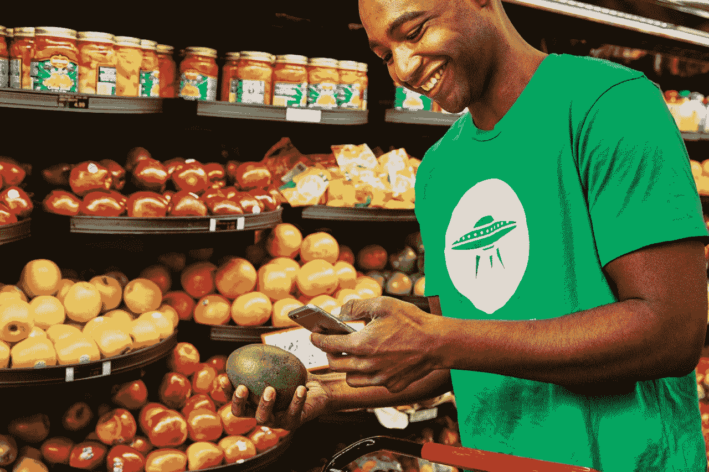

# Target 以 5.5 亿美元收购总部位于阿拉巴马州的当天送达服务 Shipt

> 原文：<https://web.archive.org/web/https://techcrunch.com/2017/12/13/target-is-buying-alabama-based-same-day-delivery-service-shipt-for-550-million/>

美国另一家受欢迎的老牌零售商塔吉特(Target)正在以 5.5 亿美元的全现金交易收购总部位于阿拉巴马州的快递初创公司 [Shipt](https://web.archive.org/web/20230322200007/https://www.shipt.com/) 。

今天宣布的这笔交易是另一个例子，表明美国的每一家商店都在应对一个非常现实的威胁，即亚马逊在 30 分钟或更短时间内将这些东西送到他们的门口后不久，就会喝他们的奶昔，吃他们的午餐。

Shipt 的送货服务与[谷歌快递及其语音购物选项](https://web.archive.org/web/20230322200007/https://techcrunch.com/2017/10/12/target-expands-partnership-with-google-on-voice-shopping-google-express/)相结合，为担心亚马逊巨头的零售商提供了一个颠倒的世界。

这发生在零售业更大范围的剧变中。亚马逊通过收购全食超市巩固了自己的帝国，沃尔玛也采取了自己的措施来扩张和更好地整合传统零售和电子商务。

这笔交易对 Shipt 及其投资者来说是一个不可思议的胜利。这家成立两年的公司已经从投资者那里筹集了超过 6000 万美元，其中包括格雷克罗夫特合伙公司、风险投资公司和公司的种子投资者哈勃克管理公司。

根据一份声明，收购后，Shipt 将作为 Target 的全资子公司运营，但将独立运营其业务。据两家公司的高管称，该公司仍将努力扩大与其他寻求当天送达、最后一公里服务的零售商的合作伙伴关系。

这意味着 Shipt 将继续扩大其交付业务，并成为 Instacart(也是目标合作伙伴)更重要的挑战者。担心 Target 会通过 Shipt 数据访问客户购物行为的零售商可以高枕无忧了——Target 坚持认为数据将保留在 Shipt 内，母公司不会访问除 Target 自己的数据之外的任何客户数据。

首席执行官比尔·史密斯将继续担任目前的职务，并将向 Target 首席运营官约翰·穆里根(John Mulligan)报告。除了当天交付能力，Target 还将利用 Shipt 在其现有供应链中的专业知识，包括与最近收购的运输技术公司 [Grand Junction](https://web.archive.org/web/20230322200007/https://techcrunch.com/2017/08/14/target-acquires-transportation-company-grand-junction-to-expand-same-day-delivery-services/) 的整合，该公司表示。

目标客户仍然需要注册 Shipt 才能享受这项服务的好处。一旦顾客下了订单，Shipt 购物者就发送一条短信与下订单的人联系，以查看当购物者在商店中移动时是否有任何更新或交换需要发生。

Shipt 于 2014 年 11 月由连续创业者史密斯创立(并得到其最初的支持)，在史密斯的家乡伯明翰提供了 1000 人的预注册机会。

史密斯是两个孩子的父亲，2014 年刚有了一个新生儿。他说，当他和妻子处理自己家庭越来越繁琐的后勤工作时，他想到了 Shipt 这个主意。

史密斯说，当他推出自己羽翼未丰的服务时，他还没有听说过 Instacart。

Target 表示，Shipt“显著加快了 Target 的数字履行工作。”收购完成后，塔吉特百货大约一半的门店将享受顾客当天送达服务。到今年年底，所有目标商店都将为顾客提供这项服务。

该公司表示，当天送达的首批产品将包括食品杂货、不易腐烂的必需品、家居用品和电子设备，并将随着时间的推移，到 2019 年扩展到包括塔吉特百货的所有商品。

Target 执行副总裁兼首席运营官 John Mulligan 表示:“我们在 2017 年初制定了一项雄心勃勃的战略议程，其中包括专注于为我们的客人提供多种便捷的购物方式，无论是在线订购还是在我们的商店提货，开车去取订单还是利用我们新的补货计划等服务。”。“借助 Shipt 的本地购物者网络及其目前的市场渗透率，我们将从数天缩短至数小时，大幅提升我们为全国各地的客人提供价格合理的当天送达服务的能力，”

Shipt 拥有超过 20，000 名个人购物者，在全国超过 72 个市场提供商品。与其他专注于东海岸和西海岸大城市的快递服务不同，Shipt 从中部开始。

在东南部的家中，Shipt 用一种忽略美国许多最大的沿海城市(如纽约和洛杉矶)而青睐东南部和中西部大城市的策略来挑战 Instacart、亚马逊和谷歌(T3)等[公司。](https://web.archive.org/web/20230322200007/https://techcrunch.com/2016/07/27/shipt-raises-20-million-to-challenge-instacart-and-plants-a-flag-for-alabamas-startup-ecosystem/)

Shipt 没有向顾客收取每次递送的费用，而是采用了模仿亚马逊的年度会员模式，顾客每年支付 99 美元。Shipt 也不关注按需交付，而是为客户提供几个交付窗口供其选择。

通过设置这些交付窗口，公司可以更好地管理物流，提高整个交付系统的效率。

根据该公司的一份声明，Shipt 已经与大型杂货连锁店合作，包括 H-E-B，Miejer，Costco，Publix，Whole Foods 和 ABC Fine Wine and Spirits。每份订单的平均购物篮大小为 110 美元，是店内平均购买量的三倍多。

史密斯在一份声明中说:“与 Target 的合作以及他们提供的全国规模使 Shipt 能够进一步加快我们的增长，将我们的服务带给全国更多市场的更多人。”“我们将继续扩大我们的市场和会员基础，与各种零售商合作，提高规模和效率。我们期待着向目标客人介绍我们当天送货服务的便利，只有 Shipt 才能提供这种个性化的关注。”

虽然像 Instacart 这样的公司在客户服务方面存在一些问题，但 Shipt 的可用性被视为另一个卖点——也是 Target 决定收购该公司的原因。

在关于此次收购的问答环节中，Target 强调 Shipt 以客户为中心的方法是此次收购的关键组成部分。同样重要的是 Shipt 继续作为许多不同零售商的平台的能力。

“我们相信，通过购买它，我们可以为比尔和他的团队提供额外的资源，以更快地扩大他的市场，”穆里根说。“市场非常重要。我们认为当天送达是规模对效率至关重要的一种方式。事实上，我们可以确保为这些零售商提供出色的顾客体验，这是 Bill 和他的团队的一大卖点。”

两家公司之间的讨论自夏季以来一直在继续，为了确保 Shipt 的现有客户在船上，史密斯在交易宣布前与他的现有客户讨论了收购事宜。史密斯说，事实上，许多供应商在最近几个月扩大了与 Shipt 的合作关系。

这对 Instacart 来说无疑不是什么好消息。Target 的规模以及 Shipt 的技术和平台，使其相对于规模更大、资金更充足的旧金山竞争对手拥有巨大优势。