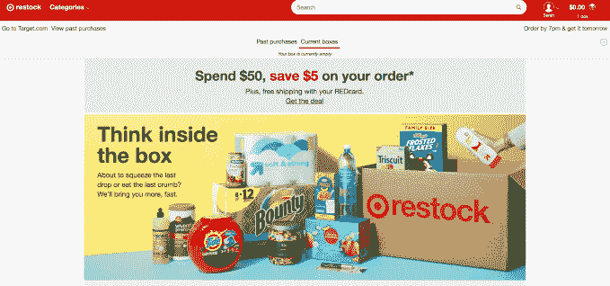

# Target 的次日送达服务 Target Restock 在全国范围内推出，费用更低 

> 原文：<https://web.archive.org/web/https://techcrunch.com/2018/05/15/targets-next-day-delivery-service-target-restock-launches-nationwide-with-lower-fees/>

# Target 的次日送达服务 Target Restock 以更低的费用在全国范围内推出

随着这项服务在全国范围内的扩展，Target 正在降低其家庭必需品次日送达服务的价格， [Target Restock](https://web.archive.org/web/20221205173653/https://www.target.com/c/target-restock/-/N-amb4n) 现在对 Target REDcard 购买免费，对所有其他订单收费 2.99 美元。此前，这项服务的每单费用为 4.99 美元——这一价格旨在与[亚马逊的 Prime Pantry、](https://web.archive.org/web/20221205173653/https://www.amazon.com/gp/pantry/info/ref=pntry_wayfind_about)竞争，后者今天对订单收取 7.99 美元的统一运费，如果客户没有 4.99 美元的月订阅，订单超过 40 美元免运费。

价格变化发生在[仅一年前，塔吉特百货开始在有限的市场测试](https://web.archive.org/web/20221205173653/https://techcrunch.com/2017/05/08/target-begins-testing-next-day-delivery-with-target-restock-service/)补货服务，此前该零售商[最近为其移动应用用户推出了免费免下车服务](https://web.archive.org/web/20221205173653/https://techcrunch.com/2018/04/17/target-expands-its-drive-up-service-to-270-stores-across-florida-texas-and-the-southeast/)。该公司还对数十万份目标订单提供免费的两天送货服务，并通过 Shipt 服务扩大当天杂货交付，作为其挑战零售巨头沃尔玛和亚马逊的进一步努力的一部分。

与亚马逊 Prime 不同，Target Restock 不需要会员费——这也是沃尔玛在免费送货项目中采用的一个角度。

有了 Restock，顾客可以从 35，000 种家庭必需品中购物，比如婴儿食品、尿布、纸巾、洗涤剂、健康和美容产品，以及花生酱或零食等其他包装商品。

为了使用 Restock，客户在网上购物，将他们选择的商品装满他们的箱子——最多 45 磅，大约相当于一个购物车的大小。他们可以在周一到周五晚上 7 点之前下订单，然后第二天箱子就会送到他们家门口。(周日没有送货。因此，如果客人在周五晚上 7 点后或周六晚上 7 点前下单，订单会在周一送到他们家。周六晚上 7 点以后或者周日任何时间，发货是在周二。)

或者，顾客可以使用他们的 Google Home 智能音箱或安装了 Google Assistant 应用程序的智能手机进行语音购物，因为 Target 与 Google 在语音激活购物方面的合作[。](https://web.archive.org/web/20221205173653/https://techcrunch.com/2017/10/12/target-expands-partnership-with-google-on-voice-shopping-google-express/)

Target 能够快速完成订单，因为它将零售店作为履行中心，直接从商店货架上进货。

该公司在 9 月份表示，当时[的重新进货覆盖了全美 7000 多万顾客，约占美国人口的五分之一。今天早上，](https://web.archive.org/web/20221205173653/https://techcrunch.com/2017/09/22/target-expands-its-next-day-delivery-service-now-reaches-70-million-customers/)[零售商称](https://web.archive.org/web/20221205173653/https://corporate.target.com/article/2018/05/nationwide-restock-rollout)从东海岸到西海岸都可以买到，超过 75%的美国人都可以买到。