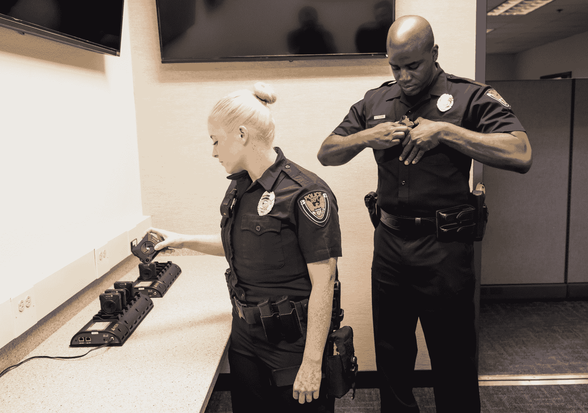

# 泰瑟枪更名为 Axon，并向任何警察部门免费提供人体摄像机 

> 原文：<https://web.archive.org/web/https://techcrunch.com/2017/04/05/taser-rebrands-as-axon-and-offers-free-body-cameras-to-any-police-department/>

泰瑟枪现在是[轴突](https://web.archive.org/web/20230213110735/http://axon.com/)。该品牌多年来一直是一个家喻户晓的词，但该公司认为是时候放弃这一身份，转而专注于身体相机和数字证据管理业务。作为这一举措的一部分，T2 向任何提出要求的警察部门提供免费的人体摄像机和软件。是的，免费的啤酒，是的，任何的。

我与该公司的创始人里克·史密斯(Rick Smith)讨论了这一重大变化，以及促使这一变化的政策和技术的转变。

“23 年前，我们在一个车库里创办了这家公司，努力让子弹过时，”他说。“但泰瑟枪品牌的力量集中在一件事上。现在我们用摄像机做这些事情。有怀旧情绪，有很多内部阻力。但最终组织必须改变。”

泰瑟枪品牌仍将是我们都知道的眩晕枪，但母公司现在将是 Axon，股票代码为 AAXN。

你可能还记得，Axon 是 Taser 几年前创建的一个部门，专注于可穿戴相机领域；技术正在接近那里，泰瑟枪是在正确的位置把它带到执法部门。这是一个巨大的成功，但是考虑到部署的好处(有些是显而易见的，有些是有争议的)，采用的速度没有任何人希望的那么快。现在大约 20%的警察可以使用人体摄像机。

“这真的只是惯性，”史密斯说。监管障碍、预算限制和纯粹的怀疑已经拖慢了进度。所以 Axon 的解决方案是直接把产品送出去。至少在有限的时间内。

交易非常简单:ask 和 ye 将为每名警官提供一台 Axon Body 2 相机、处理所有镜头的软件和基础设施，以及如何使用它的在线培训。一切都是免费的，一年内没有任何义务。

 “年底时，他们可以退货，一分钱也不用付给我们，”史密斯说。"我们认为这是双赢。"

怀疑他们能处理需求吗？他指出，该公司“货架上有数万台相机”。“我们已经计划了一段时间——去年我们增加了很多支持人员。”

现在，几乎不需要提及的是，这并不是出于轴突公司的善良之心。该公司将因成为警方摄像系统的事实违约而获得巨大利润。值得一提的是，免费提供让各部门很难抗拒，一旦福利公开，就更难放弃。

但是，尽管在某些情况下我会将其描述为一种特洛伊木马，但我的观点(显然是史密斯的观点)是，人体摄像机可能是我们今天为提高警务质量所能采取的最有益的一步。

人体摄像机不仅为每一次互动提供了无价的记录，还节省了大量的时间和金钱。

“警察花三分之二的时间做数据录入员，”史密斯说。“归根结底，没有人会相信那些报告！我们从摄像头得到了更好的信息。它包含了你要写进报告的所有内容。”

“我们相信我们可以减少官僚负担，如果我们能做到这一点，我们将有效地将世界警力增加两倍。”

夸夸其谈，但至少他是说到做到的。这个项目一开始对 Axon 来说会很昂贵，但是从长远来看，除了积极的一面，我想不出它会有什么结果。与此同时，许多警察部门将获得他们应得的技术，但紧张的预算意味着他们在未来几年内不会获得。如果这样做的代价是一家公司目前主导这个领域，我认为这是一个合理的权衡。

当然，为了取代报告，Axon 的软件必须变得更加复杂。现在人体照相机是一种备份证据，而费力填写的报告仍然是标准。但是计划是自动从视频中提取信息以加速事情的进展。

例如，该系统可以自动转录视频中的任何语音，并用 GPS 和其他统计数据标记事件。因此，当警察想检查一个人在交通堵塞期间说了什么时，他们不必浏览 2 小时的视频——他们只需搜索互动或车牌。人工智能系统还可以智能地编辑视频，模糊旁观者的脸，以便视频可以公开发布或在法庭上展示。

这种数据挖掘会变得非常令人毛骨悚然，史密斯很快淡化了 Axon 将通过数百万小时的镜头组装一种元监控数据库的想法。

“我们正在与公司外部的专家组建一个人工智能道德委员会，”他说。“我们以正确的考虑来构建技术，这一点很重要。”

对于新更名的公司来说，这应该是重要的一年，让我们希望对于它打算装备的警察部门来说，这也是重要的一年。