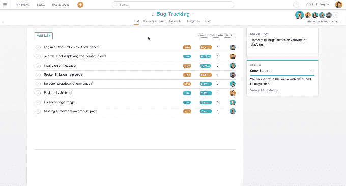

# 任务管理应用 Asana 使用“自定义字段”来处理电子表格

> 原文：<https://web.archive.org/web/https://techcrunch.com/2016/09/15/task-management-app-asana-takes-on-the-spreadsheet-with-custom-fields/>

由脸书联合创始人[达斯汀·莫斯科维茨](https://web.archive.org/web/20230406161932/https://www.crunchbase.com/person/dustin-moskovitz)和脸书早期员工[贾斯汀·罗森斯坦](https://web.archive.org/web/20230406161932/https://www.crunchbase.com/person/justin-rosenstein)创办的企业 SaaS Asana 已经成为一款工作流和任务管理应用，旨在通过更容易地找出需要完成的工作来帮助团队提高效率。但是今天，该公司推出了一项新的服务，不仅可以帮助你确定你需要做什么，而且可以实际去做。

Asana 正在推出一款名为 custom fields 的新产品，这是一种界面和架构，可以让您定制 Asana 的信息管理，以涵盖各种结构化数据点。

那么这到底意味着什么呢？正如 Asana 所描述的，一个公司，例如，可能一直在进行招聘活动，现在可以使用 Asana 创建一个表单来跟踪实际候选人的更多细节；营销团队现在可以深入到一个更大的计划中来跟踪特定的活动；工程团队可以用它来记录和监控 bug 跟踪；设计团队可以使用它来提供更详细的外观和更大项目的更新。

虽然该界面的目的是帮助用户合并和整合信息，然后以更结构化的方式进行查询，但新架构的引入也标志着 Asana 正在努力成为您更大工作生活中的一个更中心的平台，不仅涵盖生产力，还涵盖信息摄取和管理，本质上是一种更动态和更好的方式来查看信息，超越今天的电子表格的基本使用。

自定义字段今天将作为 Asana 的高级层的一部分上线，下个月 Asana 将通过引入许多针对不同类型的垂直行业和业务流程的预制模板来进一步推动它。(至于高级层，Asana 现在可以由多达 15 人的团队免费使用，付费用户每月收费 8.33 美元，根据总人数浮动。)

该公司还将把自定义字段集成到其 API 中。对我来说，这可能是这条新闻更有趣的方面之一:这意味着，从理论上讲，你可以提出新的应用程序，将 Asana 暴露为一种面向客户的工具，以立即收集并开始构建信息，Asana 对现有产品如 Google Forms 的超级响应。

今天宣布的新功能可能是 Asana 迄今为止最大的更新，紧接着 3 月份的一轮重要融资，当时公司[以 6 亿美元的估值](https://web.archive.org/web/20230406161932/https://techcrunch.com/2016/03/30/task-management-app-asana-raises-50m-at-a-600m-valuation-led-by-ycs-sam-altman/)筹集了 5000 万美元，使其业务更上一层楼。有趣的是，当时它正在测试这项新服务的[方面](https://web.archive.org/web/20230406161932/https://go.redirectingat.com/?id=72705X1553005&site=beta.techcrunch.com&xs=1&isjs=1&url=https%3A%2F%2Fvimeo.com%2F141968362&xguid=1e33984cb8ee2b48dcd71e3de4d25b69&xuuid=12064394c4b149a79250264240ad7cd9&xsessid=1462b7348eab1c7adf873e5060254b6b&xcreo=0&xed=0&sref=https%3A%2F%2Fbeta.techcrunch.com%2F2016%2F03%2F30%2Ftask-management-app-asana-raises-50m-at-a-600m-valuation-led-by-ycs-sam-altman%2F&pref=https%3A%2F%2Fwww.google.com%2F&xtz=420)。

具有讽刺意味的是，鉴于 Asana 自 2009 年以来一直没有定制表单，本周我在 Asana 位于旧金山的办公室见到罗森斯坦，他说这是客户的“头号功能需求”,这很有趣。“他们都要求拥有追踪特定事物的能力，这正是我们所创造的。”

他继续解释说，虽然这实际上是“从一开始就有的愿景”的一部分，但它花了更长的时间来添加，因为做出良好的任务管理的更基本的挑战比他们想象的要大。

虽然自定义字段的引入是这家初创公司的一个重大扩展，但它也标志着与 Salesforce、微软、谷歌等公司基于云的企业信息管理产品的完全不同的层次的竞争更加激烈。

鉴于自定义字段将只对付费用户开放(至少最初是这样)，这标志着 Asana 希望将其更多的商业客户转化为创收者的一种方式。(今天，Asana 有 13，000 个付费用户，但还有数千个免费用户。)

该公司还将目光瞄准了另一类用户。今天，有许多较小的团队和整个小企业使用 Asana 的平台来管理他们的项目。但该公司正在寻求将更多的大型企业纳入其中，这些企业拥有数千而不是数十名用户。Asana 没有透露目前有多少大型企业在使用它，只是指出在过去的六个月中，1000 多个部署的总数翻了一番。