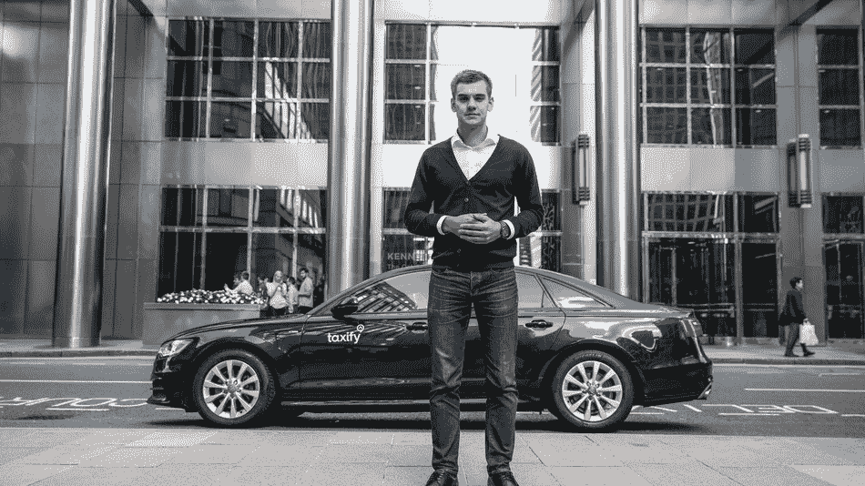

# 优步的欧洲竞争对手 Taxify 融资 1.75 亿美元，以 1B 估值领先于戴姆勒

> 原文：<https://web.archive.org/web/https://techcrunch.com/2018/05/29/taxify-raises-175m-led-by-daimler-at-a-1b-valuation/>

全球打车领域出现了一只新的独角兽，诞生于爱沙尼亚的初创公司 taxi fy T1 获得了 1.75 亿美元的新融资，使其估值达到 10 亿美元。

拥有梅赛德斯-奔驰和其他汽车的德国汽车巨头戴姆勒在这一轮中领先。这项投资还吸引了欧洲的 Korelya Capital 和价值数十亿美元的爱沙尼亚金融科技初创公司 Transferwise 的创始人 Taavet Hinrikus 的参与。Taxify 表示，[中国的滴滴出行是回归投资者](https://web.archive.org/web/20230307150545/https://techcrunch.com/2017/08/01/chinas-didi-invests-in-taxify/)之一。

该公司表示，计划投入资金开发其技术，并在欧洲和非洲进一步扩张。

除了汽车业务，戴姆勒已经在打车业务中扮演了角色。它在这个领域的投资包括[收购汽车共享业务 car2Go](https://web.archive.org/web/20230307150545/https://techcrunch.com/2018/03/01/daimler-buys-remaining-25-stake-of-car-sharing-startup-car2go-from-europcar-for-85m/) 和[德国拼车初创公司 Flinc](https://web.archive.org/web/20230307150545/https://techcrunch.com/2017/09/28/daimler-acquires-german-p2p-carpooling-startup-flinc/) ，同时它还通过和 [Turo](https://web.archive.org/web/20230307150545/https://techcrunch.com/2017/09/06/turo-raises-92m-and-acquires-daimlers-croove-car-sharing-business/) 向总部位于欧洲的拼车公司投资，后者是另一家汽车共享服务公司，与戴姆勒的竞争对手 Croove 竞争。更广泛地说，[戴姆勒和宝马在今年 3 月的一次整合行动中整合了他们的移动业务](https://web.archive.org/web/20230307150545/https://techcrunch.com/2018/03/28/bmw-and-daimler-agree-to-merge-mobility-service-businesses/)——包括停车应用、充电解决方案、打车服务等。现在，除此之外，戴姆勒将在 Taxify 董事会占有一席之地。

鉴于戴姆勒对移动性的广泛兴趣，它支持 Taxify 是有道理的，taxi fy 已成为在欧洲和非洲与优步竞争的主要竞争者，同时它也进军了澳大利亚。令人惊讶的是，这一轮融资是 Taxify 的第一个重大融资时刻，在滴滴去年进行未披露投资之前，taxi fy 仅筹集了€200 万英镑(240 万美元)。

首席执行官兼联合创始人马库斯·维利格(Markus Villig)在一份声明中表示:“我们的使命是打造移动的未来，很高兴得到戴姆勒和滴滴这样的投资者的支持。”“随着越来越多的人放弃汽车所有权，选择按需交通，这只是一个开始。”

近年来，拼车领域有些同质化，大多数公司都提供相同的服务，因此在这种背景下，Taxify 有一个独特的故事。这家初创公司于 2013 年在爱沙尼亚成立，爱沙尼亚是科技巨头 Skype 的故乡，但当时 19 岁的马库斯·维利格(Markus Villig)和他曾为 Skype 工作的兄弟马丁(Martin)是兄弟。

Villig junior 现在只有 24 岁，这使他成为世界上最年轻的十亿美元公司的负责人之一。OYO 的创始人 Ritesh Agarwal 比他大一个月，尽管他在更小的时候就领导过一只独角兽。尽管如此，无论你如何搭配，这都是一个不小的成就。

他最初的愿景是利用从父母那里借来的钱为他的祖国爱沙尼亚建立一项服务，但这一愿景得到了扩展，现在这项服务已覆盖超过 25 个国家，主要是欧洲和非洲。Markus Villig 今天表示，该公司拥有超过 50 万名司机和超过 1000 万名用户，比 8 月份声称的 250 万名用户有了很大的增长。维利格补充说，Taxify 的乘坐量去年增长了 10 倍，尽管他没有提供一个原始数据。

Taxify 首席执行官兼联合创始人马库斯·维利格

马库斯过去解释过，Taxify 的战略重点是成为第二个行动者，通常落后于优步。

“我们进入拼车已经是一个成熟概念的市场……我们进入这个市场，并通过降低佣金和给乘客和司机更多回报来改善这个市场。他在去年的一次采访中告诉彭博，我们不想陷入监管困境，不想在游说战中浪费数百万美元。

Taxify 的一个关键时刻是吸引了滴滴出行的投资，这家中国公司收购了优步的中国业务，并将其从中国移除。

去年 8 月，滴滴通过一笔未披露的“八位数美元金额”支持了 Taxify，但除了资本之外，还让它获得了其知识和经验网络，尤其是在运营方面。

这种交易对滴滴来说很常见，去年年底滴滴筹集了 40 亿美元用于扩张，并为优步在世界各地的竞争对手提供资金和指导。滴滴的投资包括美国的 Lyft、东南亚的 Grab([最近收购了优步的本地业务](https://web.archive.org/web/20230307150545/https://techcrunch.com/2018/03/25/gruber-official/))、印度的[Ola](https://web.archive.org/web/20230307150545/https://techcrunch.com/2015/09/27/chinas-didi-kuaidi-confirms-its-invested-in-indias-ola-as-uber-car-rivalry-heats-up/)、中东的[Careem](https://web.archive.org/web/20230307150545/https://techcrunch.com/2017/08/07/didi-backs-careem/)和巴西的[99](https://web.archive.org/web/20230307150545/https://techcrunch.com/2017/01/04/chinas-didi-looks-to-latin-america-with-100m-investment-in-brazil-based-uber-rival-99/)，后者是[滴滴自己在 2018 年 1 月收购的，作为其首次国际扩张行动](https://web.archive.org/web/20230307150545/https://techcrunch.com/2018/01/03/didi-confirms-it-has-acquired-99-in-brazil-to-expand-in-latin-america/)。

*注意:这篇文章的原始版本被更新以更正出租车司机的数量和 Ritesh Agarwal 的年龄。*