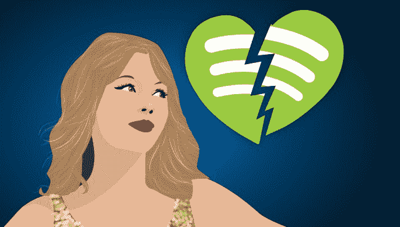

# 泰勒·斯威夫特拥抱流媒体，为 Spotify 带来完整的目录等等 

> 原文：<https://web.archive.org/web/https://techcrunch.com/2017/06/08/taylor-swift-spotify/>

在 2014 年分手后，泰勒·斯威夫特和 Spotify 又复合了。为了庆祝她的专辑 *1989* 创下 1000 万张唱片销量和 1 亿首歌曲总销量，今天流行歌手[宣布](https://web.archive.org/web/20221205204113/https://twitter.com/taylornation13/status/872958066119016448)她将从今晚午夜开始在所有流媒体服务上提供她的完整备份目录。

斯威夫特已经在苹果音乐上，但现在她开放了 Spotify，亚马逊音乐无限，亚马逊 Prime 音乐，Tidal，Pandora Premium 等。行业消息人士告诉我，Swift 的歌曲将在 Spotify 的免费广告支持和付费两个层面上提供。

流媒体最大的抵制者之一的举动可能标志着艺术家们对这项技术的看法发生了巨大变化，这项技术一直被批评为向内容创作者支付过低的报酬。随着 Spotify 最近达到 5000 万付费用户，Apple Music 现在有 2700 万，支出正在增长，并开始弥补实体唱片销售的大幅下降。

早在 2014 年，斯威夫特就与 Spotify 发生了一场巨大的争吵，因为她的音乐可以在其广告支持的免费层上获得，并告诉 [Time](https://web.archive.org/web/20221205204113/http://time.com/3578249/taylor-swift-interview/) “我认为艺术应该有内在的价值”，这与“Beats Music 和 Rhapsody 你必须支付高级套餐才能访问我的专辑”形成了对比。这让我对自己创造的东西有了一种价值感。”

泰勒·斯威夫特将与 Spotify 复合

当时，Spotify 拒绝让任何音乐只出现在它的付费层，而不是它的广告支持层，以避免混淆听众，所以斯威夫特撤下了她几乎所有的音乐。(2017 年 7 月， [Spotify 达成协议，向一些唱片公司支付更低的版税](https://web.archive.org/web/20221205204113/https://beta.techcrunch.com/2017/04/04/spotify-for-windowing/)，以换取将一些顶级专辑的发布推迟两周在其免费层出现。)

然而，一位熟悉 Spotify 的消息人士告诉我，这一媒体奇观最终为 Spotify 带来了大量新用户，因为人们听到的信息是，“除了泰勒·斯威夫特，我可以在 Spotify 上免费听任何音乐？我加入。”

Swift next [与 Apple Music](https://web.archive.org/web/20221205204113/https://beta.techcrunch.com/2015/06/21/apple-music-free-trial/) 开战，Apple Music 为其服务提供三个月的免费试用，但最初拒绝在试用期间向艺术家支付版税。斯威夫特理所当然地认为这种策略迫使音乐人为了苹果的营销利益而赔钱。苹果最终让步了，甚至在试用期间也开始向艺术家支付版税。因为它没有广告支持层，Swift 在 Apple Music 上的应用成为了这项服务的一个话题。

但现在，艺术家们开始意识到，流媒体本质上是一种宣传他们真正赚钱方式的工具——演唱会门票和商品。在 Spotify 上听音乐可以让那些在收音机上听过 TayTay tay 单曲的人变成铁杆粉丝，为她的节目和 t 恤支付大量现金。按照目前的增长速度，流媒体服务的支出将接近音乐人在过去那个时代的巅峰时期从 CD 销售中获得的收入。

流媒体不会消失。艺术家要么需要加入，要么放弃现有的和潜在的听众。