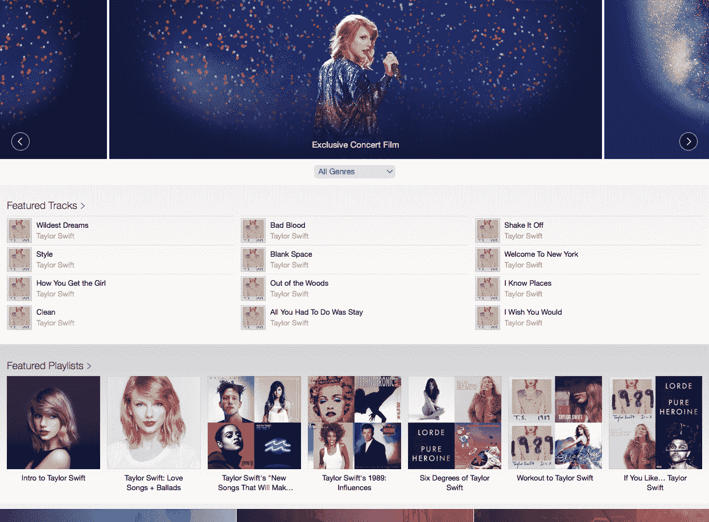

# 泰勒·斯威夫特 1989 年的世界巡演电影是苹果音乐的秘密武器

> 原文：<https://web.archive.org/web/https://techcrunch.com/2015/12/21/taylor-swifts-1989-world-tour-film-is-apple-musics-secret-weapon/>

那没花多长时间。就在[宣布](https://web.archive.org/web/20230318123231/https://techcrunch.com/2015/12/13/taylor-swift-will-launch-a-concert-documentary-exclusively-on-apple-music/)泰勒·斯威夫特将在苹果音乐上发布她 1989 年的世界巡演电影的一周之后，这部电影现在只对苹果音乐的订户开放。这不仅仅是苹果音乐订阅者的一个不错的奖励，如果你看看流媒体服务，它现在都是关于泰勒斯威夫特的。

提醒一下，这部 1989 年的世界巡回电影展示了斯威夫特在悉尼 ANZ 体育场的演唱会，以及斯威夫特的随行人员和嘉宾艺术家在后台的许多片段。这是一部免费电影，但你必须是苹果音乐的订户。

这是理解苹果战略的关键。根据上周的 [Beats 1 采访](https://web.archive.org/web/20230318123231/https://www.youtube.com/watch?v=t6JSAPYy0fw)，苹果最早有了这部电影的想法。斯威夫特在采访中说，“他们来找我，说我们想成为捕捉这次旅行的人。”。

这部电影对苹果来说是一部重要的戏剧，原因有三。首先，苹果希望向其 Apple Music 订户提供独家内容。你不会在 Apple Music 最直接的竞争对手 Spotify 上找到这部 1989 年的电影。但是你也不会在苹果的另一个音乐竞争对手*YouTube 上看到这部电影。*

无论你是否觉得 YouTube 的界面很麻烦，YouTube 都是音乐流媒体领域的主导者。数百万人依靠视频平台来满足他们的音乐需求。YouTube 上排名前 10 的视频都是音乐视频。他们都有超过 10 亿的浏览量。相比之下，Spotify 似乎是一个小竞争对手。

这就是苹果如此重视视频内容的原因。谈到在网上发布音乐视频，YouTube 是一个显而易见的平台。但如果苹果能抢到一些像今天这样的独家视频，那就是一大胜利。

至于 Spotify，自 Apple Music 推出以来，苹果一直试图让自己与众不同。苹果公司正押注于其互联网广播 [Beats 1](https://web.archive.org/web/20230318123231/https://techcrunch.com/2015/06/08/apple-launches-beats1-a-247-worldwide-radio-station/) 、[人工管理的播放列表](https://web.archive.org/web/20230318123231/https://techcrunch.com/2015/06/30/mainstreaming-music/)、原生 iOS 和 iTunes 集成以及迷你社交网络连接。Spotify 押注于[探索周刊](https://web.archive.org/web/20230318123231/https://techcrunch.com/2015/07/20/why-browse-when-you-can-play/)、 [Spotify Party](https://web.archive.org/web/20230318123231/https://techcrunch.com/2015/12/16/spotify-party/) 、[数据和人类生成的播放列表](https://web.archive.org/web/20230318123231/https://techcrunch.com/2015/12/16/spotify-party/)等等。

然而，它不仅仅停留在特性上。苹果和 Spotify 也在努力提供最好的流媒体库。这两种服务之间几乎没有区别，但泰勒·斯威夫特就是其中之一——你可以在 Apple Music 上播放 1989，而不是在 Spotify 上。把她的巡演电影放在前面和中间是一个很好的方式来提醒每个人，是的，你可以在苹果音乐上播放泰勒·斯威夫特。

这就是现在“新”标签的外观——始终都很快捷:

第二，假期快到了！短短几天后，数百万人将首次获得 iPhone。许多开发者会告诉你，圣诞节那天会有一个大的下载高峰。而苹果自己的服务和应用也是如此。

很多人会打开音乐应用，了解苹果音乐。在假期的时候推出泰勒·斯威夫特的独家视频是让人们订阅三个月试用版的好方法。

第三，泰勒·斯威夫特和苹果至今关系复杂。在[得知](https://web.archive.org/web/20230318123231/https://techcrunch.com/2015/06/21/free-are-never-getting-back-together/)苹果不会在试用期内支付版税后，她写了一篇博客。帖子发布几小时后，苹果[撤销了决定](https://web.archive.org/web/20230318123231/https://techcrunch.com/2015/06/21/apple-music-free-trial/)。然后她同意在苹果音乐上发行 1989。

通过与 Swift 保持良好关系，苹果正在向音乐社区发表声明。她一直公开支持公平的版税支付。苹果希望与 Swift 合作，以改善其与艺术家和唱片公司的关系。现在要是阿黛尔也能改变主意就好了。