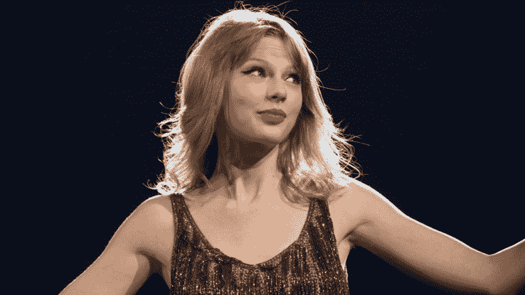

# 泰勒·斯威夫特的新应用“斯威夫特生活”现已发布 

> 原文：<https://web.archive.org/web/https://techcrunch.com/2017/12/14/taylor-swifts-new-app-the-swift-life-is-out-now/>

# 泰勒·斯威夫特的新应用“迅捷生活”已经发布

在名誉改造的过程中，泰勒·斯威夫特推出了一款名为[斯威夫特生活](https://web.archive.org/web/20221206105334/https://itunes.apple.com/nz/app/the-swift-life/id1205727849?mt=8)的全新应用。

该应用是斯威夫特粉丝的专用社交网络[，让他们相互交流，并直接从 T-斯威夫特本人那里获得独家图片、视频、新闻等。](https://web.archive.org/web/20221206105334/https://beta.techcrunch.com/2017/10/11/taylor-swifts-new-glu-mobile-app-is-a-dedicated-social-network-for-her-fans/)

他们也可以和 Swift 交流。根据 Glu 的说法，使用“极其罕见和有价值的 Taymoji”，人们可以有效地删除其他用户的帖子，以提醒 Taylor 她应该看看这些帖子。

用户还将获得动画“Taymoji”图片和贴纸，他们可以通过喜欢和分享其他帖子来访问这些图片和贴纸。

如果你想买贴纸包或听音乐而不喜欢别人的东西，你可以使用应用程序中的虚拟货币 picks。(比如，吉他拨片。)

这款游戏由游戏公司 Glu Mobile 开发，该公司曾推出《金·卡戴珊:好莱坞》(Kim Kardashian: Hollywood)和《餐馆破折号:戈登·拉姆齐》(Restaurant Dash:Beijing)等热门游戏，也推出过《妮琪·米娜:帝国》等不太成功的游戏。