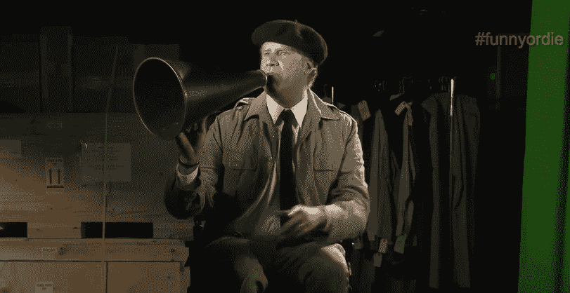

# TC Cribs:滑稽或死亡带我们到幕后和两株蕨类植物之间 

> 原文：<https://web.archive.org/web/https://techcrunch.com/2015/10/13/tc-cribs-funny-or-die-takes-us-behind-the-scenes-and-between-two-ferns/>

# TC 婴儿床:滑稽或死亡带我们到幕后和两个蕨类植物之间

本周在《婴儿床》节目中，我们将继续在加州洛杉矶的[搞笑或死亡](https://web.archive.org/web/20221206133317/http://www.funnyordie.com/)总部讲述好莱坞的创业故事。

这是这家数字内容公司自 2007 年成立以来的第四个办公室。由于某种原因，这一次墙没有完工。《滑稽或死亡》的首席执行官迪克·格洛弗告诉我们，就像它所做的一切一样，这是故意的。我们不确定我们是否完全同意这一点，但也许它暗示了喜剧演员为了有趣的时光而必须达到的原始状态。

家具也不是永久放置的——所有的家具都放在轮子上，以便 100 多名员工在 26000 平方英尺的空间内进行拍摄。

比利在街上采访克里斯·帕拉特。

这家数字内容初创公司与业内大多数其他公司相比，有着罕见的名人效应。威尔·法瑞尔与亚当·麦凯和克里斯·亨奇一起创办了《滑稽或死亡》，以创造高质量的喜剧内容和政治评论。因《40 岁的处女》和 HBO 的《女孩》等作品而闻名的贾德·阿帕图也是该公司的主要合伙人。

据该公司称，滑稽或死亡现在拥有超过 7000 万观众的全球观众，并为超过 15 个平台制作内容，如街上的比利(truTV)、@ Comedy Central 的午夜以及 HBO 的喜剧特别节目，如最近的“费雷尔上场了”。

搞笑或死亡的新地方是在一个工作室很多，与自己的三明治，奥普拉的网络。但是这座建筑的历史可以追溯到查理·卓别林的时代。米高梅公司一度从联合艺术家公司购买了这块地产。此后，一家房地产信托公司接管并开发了这座大楼，为《滑稽或死亡》和其他媒体公司提供办公场所。

我们摆脱了常规训练，采访了新公司的所有人员，包括社交内容负责人格洛弗(Glover)和数字内容负责人克里斯·布鲁斯(Chris Bruss)。

看看上面的视频，看看《滑稽或死亡》在两株蕨类植物和 Yeezus 2020 运动之间创造了如此伟大的场景。另外，注意浴室。你可以以后再谢我。