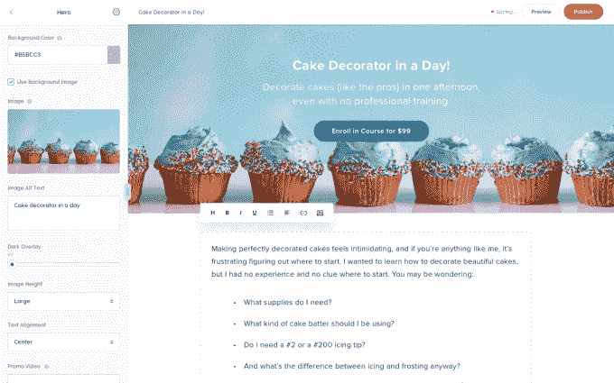
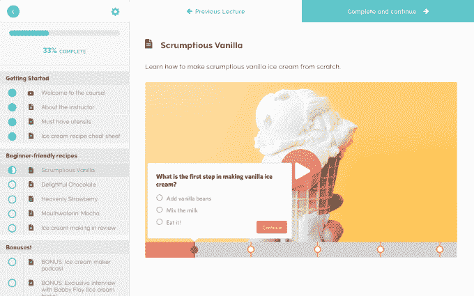

# Teachable 筹集了 400 万美元来创建一个工具，将任何在线课程转变为真正的业务 

> 原文：<https://web.archive.org/web/https://techcrunch.com/2018/04/16/teachable-raises-4m-to-create-a-tool-to-turn-any-online-class-into-a-true-business/>

在线课程在各种垂直行业和专业领域都呈爆炸式增长——但这些课程不可避免地会出现在 Udemy 这样的平台上，对于 Ankur Nagpal 来说，这真的不是建立真正业务的方式。

这就是为什么 Nagpal 创办了 [Teachable](https://web.archive.org/web/20230109064503/https://teachable.com/) ，这是一个为专家提供的平台，这些专家希望围绕他们的课程创建一个业务，帮助他们建立一个完整的在线教育套件，而不仅仅是像 Coursera 或 Udemy 这样的平台。Nagpal 说，利基专业知识对于 Coursera 这样的简单市场来说太有价值了，这些领域的专家——甚至是关于正念或风水的研讨会——应该能够从这些课程中每年赚取几千美元。Nagpal 表示，该公司已从现有投资者 conventi on Ventures 和 AngelList 联合创始人 Naval Ravikant 那里额外筹集了 400 万美元的股权。

“在过去，如果你想教授课程，你可以把它放在市场上，或者放在你自己的网站上——用你的品牌和域名，完全控制一切——但没有简单的方法来做到这一点，”纳格帕尔说。“这就是在亚马逊上列出实物商品和拥有自己店面的区别。虽然你可以在 Udemy 上赚几千美元，但你无法建立一个以 10 至 15 美元出售课程的可持续业务。”

然而，这次融资最终带来了高达 1.34 亿美元的估值，因为该公司预计今年第四季度末将实现盈利。Teachable 拥有约 1000 万名学生，开设了 125，000 门课程，平台上有 12，000 名付费客户。Nagpal 表示，其目标是今年的销售额超过 2 亿美元，鉴于其从 2015 年的 500 万美元增长到 2017 年的 9000 万美元左右的速度，这可能不会太远。

在 Teachable 的早期，讲师们专注于市场营销或编程，当 Ruby 或 Python 等知识技能的价值飙升时，许多在线课程就是从这两个领域开始的。但从那时起，Teachable 已经发展成为一个平台，拥有利基技能的用户可以创建强大的课程，如果他们已经有了视频等现成的内容，可以在几个小时内建立并运行他们的域。Teachable 有一个多层次的定价结构，从收取小额交易费到每月近 299 美元的付费订阅，以管理其在线域名，旨在吸引各种各样寻求起步的潜在教师。

纳格帕尔说:“如果你看看我们排名前 10 或 20 的导师，几乎没有成功的垂直模式。”“[受欢迎的课程是基于]专业技能，或学习演奏一种乐器，或驾驶无人机，甚至是财务授权。几乎有一种反模式。”

再说一次，这些课程不应该打包成每月 49 美元的订阅费。非常具体的垂直领域的课程——像风水之类的——可能要花费 100 美元甚至更多。但这个想法是，这些研讨会有如此大的价值，以至于希望深入其中的学生愿意超越仅仅是一个 Udemy 的成本，以便获得最有价值的内容。Teachable 的目标是让教师可以轻松地在这些市场中的一个上发布内容，从而快速启动并运行他们自己的独立在线课程。

这种收取交易费的免费计划最终至少激起了潜在教师的兴趣，Teachable 还举办研讨会，试图让他们对这个机会更加兴奋——然后让他们开始付费，因为他们希望吸引越来越多的学生，需要更强大的工具包，如高级报告。或优先产品支持。该公司并没有真正专注于付费营销，因为 Nagpal 说它“不太擅长”，因为它主要依靠口碑和附属机构。

“市场上的课程实际上已经商品化了，”他说。“我会购买顶级课程，但第一门课程与第二门或第三门课程一样有价值。在我们的平台上，如果人们购买了 Ruby on Rails 课程，很可能是因为他们已经跟随这方面的专家一年了。我买的东西不是商品化的，我和那个人有关系。它们的内容更有价值。所有的销售都是通过讲师产生的。”

Nagpal 说，在 Facebook 平台的早期，他开始开发一系列糟糕的脸书应用程序，比如性格测验和非常简单的 flash 游戏。在政治研究公司剑桥分析公司(Cambridge Analytica)通过 Facebook 平台上的一个简单应用程序获得了多达 8700 万人的个人数据后，脸书面临着巨大的隐私丑闻，因此在 Facebook 平台上这么早就看到这种行为是非常有争议的。然而，Nagpal 说，现在看起来像是一个数据宝库的东西在当时对那个行业并不真正有用。

“我们得到了一些数据，但对我们来说是垃圾，我们从来没有存储它，”他说。“它看起来就像噪音。”

纳格帕尔说,“可教”面临的最大挑战是确保教师真的想继续当教师。免费层可能会吸引他们开始学习，但一般来说，讲师可能会厌倦当讲师——无论是在 Teachable 还是像 Udemy 这样的市场。他说，真正的竞争是像 YouTube 这样的平台和其他内容创作者的时间接收器。为了留住他们，Teachable 希望扩展到教练和服务等其他垂直内容领域。这也可能使其领先于 Coursera 等市场，并最终赢得教师的机会，在 Teachable 上建立一个完整的在线业务。

“每个月，我们都有 50 人获得比 Skillshare 这样的平台上薪酬最高的讲师更多的收入，”他说。“业务的可持续性非常不同。卖 10 美元的课程真的很难谋生。在我们的平台上，平均价格点接近 100 美元，这反过来又得到再投资，以创造真正好的内容。我们发现大多数教师不仅仅销售课程，他们还有多种收入来源。我们正在尝试看看我们的结账产品是否能支持这一切。这就造成了网络锁定。”

Teachable 还投资了一些小投资者，包括 Shopify 创始人 Tobias Lutke、Weebly 创始人 Chris Fanini、Lynda.com 首席执行官 Eric Robison 和 Getty Images 创始人 Jonathan Klein。