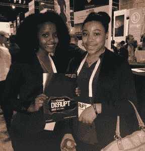

# 教师、导师和青年倡导者:申请让你的学生青年参加 Disrupt NY 

> 原文：<https://web.archive.org/web/https://techcrunch.com/2016/07/12/teachers-and-mentors-apply-to-have-your-students-attend-disrupt-sf/>

# 老师、导师和青年倡导者:申请让你的学生青年参加 Disrupt NY

学生团体参加 5 月 16 日(星期二)或 5 月 17 日(星期三)在曼哈顿 36 号码头举行的[扰乱纽约](https://web.archive.org/web/20221006043506/https://beta.techcrunch.com/event-info/disrupt-ny-2017/)的申请[现已开放](https://web.archive.org/web/20221006043506/https://docs.google.com/a/beta.techcrunch.com/forms/d/e/1FAIpQLScs8n0MPOGSh6youJgg-UtDIlxFNC1HeST8VDIHuBKHZqw2eg/viewform)。

该计划是 TechCrunch 的多样性和包容性计划【T4 包含】的一部分，旨在为技术领域中未被充分代表的群体提供更多机会，以更好地进入初创企业。在过去的几次中断中，TC 与[BUILD.org](https://web.archive.org/web/20221006043506/http://www.build.org/)、[创业教育网络(NFTE)](https://web.archive.org/web/20221006043506/https://www.nfte.com/) 、[软件工程学院](https://web.archive.org/web/20221006043506/http://afsenyc.org/)、[纽约计算机科学教育基金会](https://web.archive.org/web/20221006043506/https://csnyc.org/)、布朗克斯&阿斯托里亚、[红钩计划](https://web.archive.org/web/20221006043506/http://rhicenter.org/)、 [Mission Bit](https://web.archive.org/web/20221006043506/https://www.missionbit.com/) 、[城市装配制造商](https://web.archive.org/web/20221006043506/http://www.uamaker.nyc/)[进行了非正式和正式的合作](https://web.archive.org/web/20221006043506/http://www.tywls-astoria.org/)

*来自软件工程学院的两名学生在 2015 年纽约 Disrupt 大会的创业路上—*

*图片鸣谢:@afsenyc*

作为该计划的一部分，年轻人将有机会与 TechCrunch 的一名编辑人员一起参观创业胡同，静坐参与主舞台上的讨论，并与演讲者进行一对一的问答。

要获得资格，青少年必须是初中或高中年龄，在纽约的合理通勤距离内，并有一名成年监管人能够与他们一起参加。教师或从事技术领域人口统计数据不足工作的组织将优先考虑。传统班级、替代教育、导师项目、非专业项目等。欢迎所有人参与。

申请将于 2017 年 4 月 17 日截止。我们将在 2017 年 4 月 21 日之前通知各组的参与状态。如果你有任何问题，你可以发电子邮件给 include@beta.techcrunch.com。

[申请这里](https://web.archive.org/web/20221006043506/https://docs.google.com/a/beta.techcrunch.com/forms/d/e/1FAIpQLScs8n0MPOGSh6youJgg-UtDIlxFNC1HeST8VDIHuBKHZqw2eg/viewform)！

*Sam Altman 与来自扰乱 SF 2015* 创业教育网络(NTFT)的学生在一起