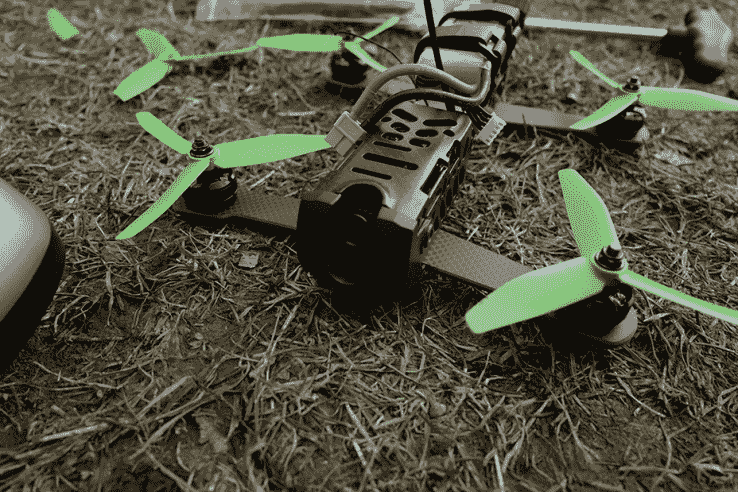
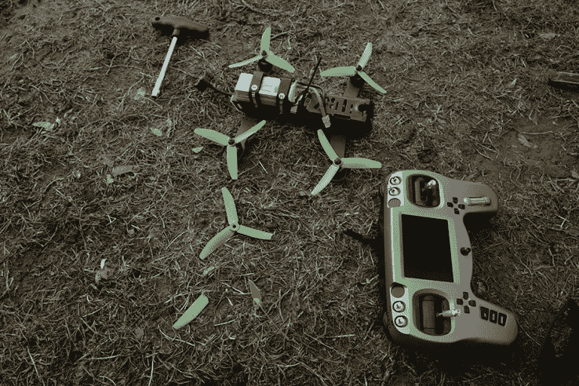
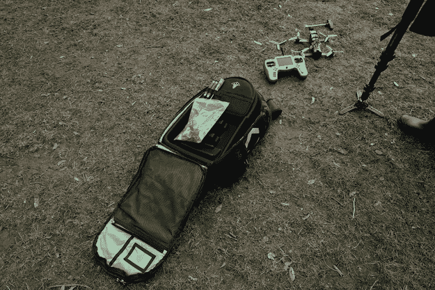

# 黑羊队的宿怨是一种快速竞赛无人机，具有很高的学习曲线 

> 原文：<https://web.archive.org/web/https://techcrunch.com/2017/02/02/team-blacksheeps-vendetta-is-a-fast-racing-drone-with-high-learning-curve/>

无人机比赛作为一项运动正在兴起，团队、赞助商和电视网络都在参与这一发展中的场景。有专业的无人机竞赛联盟、直播和 T2，甚至还有无人机竞赛模拟器，希望成为无人机飞行员的人可以尝试模仿真实的东西。

但是如果你真的想用一架赛车无人机飞向天空呢？BlackSheep 团队的无人机套件名为 Vendetta，是一款第一人称视角的无人机，可能是你的最佳选择之一。

*价格已审核:套件价格为 899 美元 [899 美元](https://web.archive.org/web/20221207181113/https://www.bhphotovideo.com/c/product/1268104-REG/team_blacksheep_a_vend_cmbo1_vendetta_racing_drone_full.html)，无人机价格为 499 美元 [499 美元](https://web.archive.org/web/20221207181113/http://www.team-blacksheep.com/products/prod:vendetta)仅 TBS*

## 录像

## 拥有一架无人驾驶赛车的好处

这款无人机不像大多数消费级无人机，原因有二:首先，它的最高速度接近 70 英里/小时；其次，它可以通过一个耳机来操作，从本质上给你一个鸟瞰世界的视角，通过 Vendetta 的前部和底部摄像头来看。

除了拥有一架普通的快速无人机之外，不要搞不清楚你会在这里遇到什么。仇杀是为了比赛，而不是记录漂亮的飞越；除非安装了 GoPro，否则它的机载相机无法完成这些事情。

还有一件事:[一个价值 249 美元的第一人称视角控制器为复仇女神](https://web.archive.org/web/20221207181113/https://www.bhphotovideo.com/c/product/1268107-REG/team_blacksheep_a_tango_tan1_tango_all_in_one_remote_control.html)而存在——把它变成一架 FPV 无人机，在高速飞行中你可以看到无人机看到的任何东西。只有当你想要完整的无人机飞行经验时，我才会推荐这种昂贵但酷的购买。

## 驾驶它…在纽约的某个地方

在纽约驾驶无人驾驶飞机是非法的，但是如果你看过这个城市的著名 vlogger 在他们的视频中使用无人驾驶飞机，他们很可能会不顾一切地使用。然而，深仇大恨不是普通的无人驾驶飞机——在联盟中赛车速度高达 70 英里/小时——我肯定会去一个开阔的空间练习。

> “关于我个人的无人机飞行经验:我曾在高空轻松驾驶过 DJI、鹦鹉和戈普罗无人机。但深仇大恨和那些机器完全不一样。”

关于我个人的无人机飞行经验:我曾在高空轻松驾驶过 DJI、鹦鹉和 GoPro 无人机。但是深仇大恨一点也不像那些机器。控制是敏感的，需要掌握平衡四个转子之间的间距和功率。

这不容易。经过早期试飞的修复后，电池的大部分寿命都花在了飞行 50 英尺的高空，然后在瞬间后突然着陆。TBS 称赞深仇大恨非常耐用，因为它有碳纤维机身，但是螺旋桨和天线仍然很敏感，在几次硬着陆后就坏掉了。

对于其职业比赛，BlackSheep 团队为其无人机飞行员创建了定制的飞行配置文件，以及一个包括背包、工具、备用刀片、电池充电器等的工具包。然而，默认情况下，TBS 包括三种飞行模式:水平、垂直和特技——完全按照描述在飞行中使用。在杂技模式下翻了几个跟头，在垂直模式下勘察了这个区域，最后，在水平模式下让一只狗追着无人机跑，这就是我所需要知道的，仇杀真的成功了。

电池寿命是深仇大恨必须弥合的差距:飞行 4-5 分钟后，我必须给电池充电，并使用快速充电器，这需要大约一个小时。

## 结果

如果你想认真对待飞行无人机，超越将它们用于电影摄影(或监视)的趋势，仇杀可能会很有趣。它有一个学习曲线，所以它将需要实践，可能意味着，因为你也将打破高速螺旋桨。

经过足够的练习，我确信你有可能使用这架无人机成为一名职业飞行员——加入一个赛车队是另一回事。