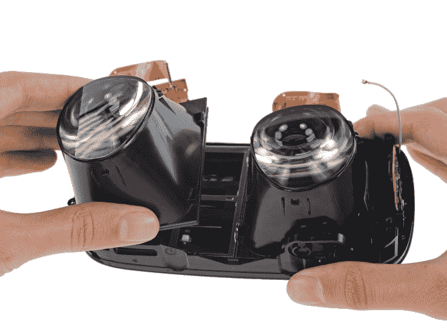

# 拆除 Oculus Rift 找到了相对容易修复的优秀设计 

> 原文：<https://web.archive.org/web/https://techcrunch.com/2016/03/30/teardown-of-oculus-rift-finds-good-design-thats-somehow-relatively-easy-to-repair/>

# Oculus Rift 的拆卸找到了相对容易修复的好设计

当一个新类别的小工具出现时，先锋设备不是设计最好的，或者不容易拆卸和维修，这是可以理解的。幸运的是，Oculus — [的](https://web.archive.org/web/20221202061350/https://www.ifixit.com/Teardown/Oculus+Rift+CV1+Teardown/60612)[第一款量产 VR 头戴设备似乎并非如此，在拆卸过程中，iFixit 发现该设备](https://web.archive.org/web/20221202061350/https://beta.techcrunch.com/2016/03/28/review-the-oculus-rift/)是一件优雅的工程作品，不会用奇特的螺钉类型或显窃启密封来惩罚用户。

Oculus Rift CV1(消费者版本一，你不知道吗)是我尝试过的版本的巨大改进——几年前的早期原型(用 gaff 胶带包裹)和 Crystal Cove milestone 设备。拆除在许多方面证明了这一点。

重要的是，用户最有可能想要更换的部件——耳机和 face pad——很容易拆卸，这使得定制更换成为一种明显的可能性。

在更深处，Oculus 创造的定制显示器和光学设置展示给所有人欣赏。非球面菲涅尔透镜和双 456ppi 有机发光二极管显示器经过巧妙设计，让您感觉到距离您面部仅几厘米的图像是一幅具有无限深度的无尽风景。好吧，不管怎么说，这是一个想法——由软件工程师和环境设计师来完成这项工作。

 有很多小方案可以适应不同尺寸的头部，容纳不完美的眼球，一般来说让尽可能多的人尽可能舒服。工业设计师在观察到这些精心设计的机械装置和节省空间的技巧时，肯定会点头并抚摸他们的胡须或无胡须的下巴。

iFixit 的可修复性得分为 7，这反映了一个事实，即不是每个零件都可以轻松更换或维修，尽管最容易损坏或磨损的零件是这样。Oculus 推出了一款兼具人体工程学和易用性的设备，值得称赞。